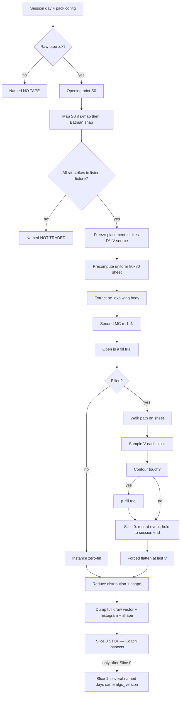

# Architecture 31 — Structure Surface Replay (SSR)

**Status:** **DRAFT / THESIS** — not as-built. Coach has not given GO.  
**Date:** 2026-08-13  
**Normative method:** [`Specs/FatTail-Labs-Structure-Surface-Replay-Spec-v0_1.md`](../Specs/FatTail-Labs-Structure-Surface-Replay-Spec-v0_1.md)  
**Human explainer:** [`docs/Options-Backtest-Forward-Walk-Method.md`](../docs/Options-Backtest-Forward-Walk-Method.md)  
**Parents:** Arch **30** (OPF packs) · Arch **28** (Market Bus) · Arch **26** (Design+Curate lock) · DL-309 · DL-317  

This document is **how Labs would execute** the SSR method in this repo. Product law lives in the Spec. Do not implement from this file alone.

**Coach sequencing:** single RTH day + Monte Carlo **distribution** first → several named days → learn dial ranges → **then** Development stub replacement and **forward walk** (same engine, holdout days).

**Named consumer (DL-410 / DL-411):** once the Options Lab 3D Surface ships,
this plane **is** that sheet’s time machine. Mini tape-walk graphic during a
run is the day walking, never the MC result. Fold into the Backtest bench
plan when Juliet seeds it. **Not GO.**

---

# Execution design


## B0. How this executes **in this repo**

SSR is a **batch / research plane**, not a request-path pull.

### B0.1 Single-day first / learn then dials (execution)

**SSR17 is the build order.** First mergeable *method* slice is not a year runner and not Strategy Lab.

```text
PR 1 merge   →  fixture day CLI dump (AT-SSR-19). Does NOT close I-40.
Slice 0 inspect (AT-SSR-21) → one complete .ok RTH day after OD-SSR8
             Coach examines zero-fill / bimodal / skew / tails
Slice 1 (PR 3) → several named days, same algo_version
                 GATE: AT-SSR-21 + Coach inspect
PR 4 learn   → implement periodic / proximity rebuild (SSR6 / AT-SSR-5/6)
             then bump dial_set_id
Later        → persist catalog, OPF pack (after inspect), Development stub,
             forward walk, naive year
```

| Must exist in Slice 0 | Must **not** block Slice 0 |
|-----------------------|----------------------------|
| `replay-day` CLI + listed fixture/archive | MySQL `ssr_run` migration |
| Sheet + path + place + MC (`signed_qty`) | OPF registry mutation |
| Full vector + histogram dump | Strategy Lab `run_backtest` swap |
| Triad flags, `--listed-source`, `--iv`, seed, N | Year job, VP bins, CRR budget claim |
| One Batman **or** one single fly | Multi-day driver |
| `sticky_entry` eval | Member UI |

**SSR6 adaptive rebuild** is **PR 4** (after several days, before year / Strategy Lab). Slice 0 `sticky_entry` is a lawful first freeze; leaving rebuild until the year PR is forbidden.

Dials in env are **starting discussion values**. After learning, persist `dial_set_id` + bump `LABS_SSR_ALGO_VERSION`. Do not overwrite Slice 0 artifacts in place.

**OD-SSR8:** `--day --series --product --engine` all required. No hidden default day or triad.

```text
Raw parquet (VP19)                 OPF L2/L3
  SPY trades → S(t)                  BSM / CRR / τ / MarketStaticFacts
  optional quotes → spread           PackagePricer only if a generation exists
        \                          /
         \                        /
          └── server/ssr  (NEW) ──
                    │
                    │  CLI / job (not Next.js, not Massive)
                    ▼
          artifacts + MySQL catalog
                    │
                    ▼
     Strategy Lab run_backtest  (LATER)
     provenance = backtest_distribution
```

**Forbidden:** Next.js calling Massive; per-widget sockets; new Redis market schemas; importing MSC; writing production `vp_bins_v3` from SSR.

Config (fail-loud when the SSR plane is **enabled**, same posture as `LABS_MARKET_DATA_MOUNTS` — API boot does **not** require SSR env):

| Env | Role |
|-----|------|
| `LABS_SSR=1` | Enable **Development** plane (env fail-loud). Research CLI **does not** require this. |
| `LABS_MARKET_DATA_MOUNTS` | Raw tape (existing) |
| `LABS_SSR_ALGO_VERSION` | e.g. `ssr_v0` |
| `LABS_SSR_CLOCK` | Slice 0: **`1m`** |
| `LABS_SSR_N` | Ensemble size — starting **200**, not frozen (OD-SSR2) |
| `LABS_SSR_SEED` | Default seed for unattended jobs |
| `LABS_SSR_PFILL_P0` | Base p_fill (starting 0.4) |
| `LABS_SSR_PFILL_MODEL` | `thesis_v0` \| later |
| `LABS_SSR_FRICTION` | Slice 0: `const` \| `coach_2_of_5` |
| `LABS_SSR_IV_POLICY` | Slice 0: `sticky_entry` |
| `LABS_SSR_GRID_NS` | Slice 0: **80** (fail-loud if missing when plane on) |
| `LABS_SSR_GRID_NTAU` | Slice 0: **80** |
| `LABS_SSR_PAD_WINGS` | Slice 0: **1** (pad = this × wing width) |
| `LABS_SSR_HIST_BINS` | Slice 0: **21** |
| `LABS_SSR_ARTIFACT_ROOT` | **Optional override.** Default: `{mapped_mount}/fattail-market-data/ssr/` on role `staging` if present else `raw-primary`. One SoR: if env set, use it; else that default. No laptop fallback. |

---

## B1. Module map (proposed)

New package **`server/ssr/`** (Labs-owned; depends **down** on `opf` + `market_data`, never the reverse).

| Module | Responsibility |
|--------|----------------|
| `ssr/types.py` | Placement, Sheet, Event, Instance, Distribution, Residual |
| `ssr/value.py` | \(V=\sum q_i u_i\) via BSM/CRR; `signed_qty()`; Batman = two flies |
| `ssr/sheet.py` | Grid allocate, densify near contours, bilinear eval, `sheet_gen` |
| `ssr/contours.py` | `be_exp_*` / optional `be_t0` / wing / body (Slice 0: no target/stop exit) |
| `ssr/path.py` | `day_part_path` + projected parquet → \(S(t)\); `tau_meta["tau"]` |
| `ssr/placement.py` | Opening print + width; **`listed_source` fixture/archive only**; Batman above/below |
| `ssr/fill.py` | Seeded RNG, \(p_{\mathrm{fill}}\), friction shapes, open-as-fill |
| `ssr/mc.py` | Day ensemble; distribution + shape |
| `ssr/vol.py` | IV policy; named sources; rebuild trigger |
| `ssr/persist.py` | Run catalog + day artifacts |
| `ssr/cli.py` / `server/scripts/ssr_replay_day.py` | Research CLI |
| `ssr/pack.py` | OPF pack runner `run_structure_surface_replay` |

**Reuse, do not fork:**

| Existing | Use |
|----------|-----|
| `opf.engines.bsm.bsm_european_price` | European \(u_i\) |
| `opf.engines.crr.crr_american_price` | American \(u_i\) |
| `opf.tau.tau` / `expiry_instant` | **Use `tau_meta["tau"]`** (dict). AM/PM, 1-minute floor |
| `opf.static_facts.MarketStaticFacts` / `default_static_facts` | \(r\), \(q\), settlement. SPX/SPXW only as European defaults |
| `opf.package.StrategyIntent` / `LegIntent` / `PackagePricer` | Intent IR; Slice 0 \(D^*\) is model-at-fill, not a generation mid |
| `opf.leg.LegPricer._cascade_iv` | **Do not import from `ssr/` in Slice 0.** Later, public wrapper if needed |
| `opf.archive.archive_get` | `listed_source=archive` only |
| `market_data.raw_store.day_part_path` / `.ok` | **Normative clock.** `open_day` = complete check only |
| `opf.packs.registry` | Register richer pack (PR after GO) |
| `market_data.parquet_schema.TRADES_COLUMNS` | `sip_timestamp`, `price`, `size` |
| `strategy_packs.packs.butterfly.construct` | Width **candidates** only after I-9; **never** `_mid` / stub chain |
| `strategy_lab_domain.run_backtest` | Later swap stub → SSR job enqueue |

---

## B2. Relationship to OPF backtest packs

Arch 30 / registry today:

| Pack | Role today | SSR thesis |
|------|------------|------------|
| `backtest.chain_replay@1.0.0` | **Default** when cold archive exists (OPF16) | **Remains default** when generations exist. Minute-by-minute **listed** marks + fill model. Not replaced. |
| `backtest.surface_reconstruct@1.0.0` | Alternate; VIX-flat single-spot BSM; `weak_reconstruct`; **silent `vix or 20.0`** | **Too thin.** SSR is the **richer named pack**. **Do not inherit `vix or 20`** — missing IV is a named state (SSR11). |
| *(new)* `backtest.structure_surface_replay@0.1.0` | — | **SSR pack id.** Alternate (or successor of surface_reconstruct) — **labeled** `historical` + `model_t0` sheet. |

**Law:** If a day has a **complete** dual-side generation archive for the placement expiration, tools **may** choose `chain_replay` (truer prints). SSR is for the Coach method (sheet + path + MC) and for the long SPY tape **without** pretending we have OPRA. Do not silently mix: a run is one pack_id.

**[Reviewer]** Recommend **not** silently overwriting `run_surface_reconstruct`. Keep the weak function until a version bump retires it (`@1.1.0` or new id) so golden tests do not lie.

---

## B3. Underlier clock from raw parquet

Campaign layout (VP §4.2, DL-317):

```text
/Volumes/sabrant2tb/fattail-market-data/raw/SPY/trades/year=YYYY/month=MM/day=DD/part-000.parquet
```

`path.py` algorithm (normative):

1. **Complete check only:** `day_ok_path(day_part_path(series, "trades", day))` exists (`open_day(...)["complete"]` is OK as a boolean). Else **NO TAPE**. `open_day` is a **catalog/preview** helper — it reads the full table for metadata/`preview` and **does not** return an RTH clock. A real SPY day is large (P2-3 evidence: **468,425 prints** on 2024-06-03). **Do not** use `open_day` as the iterator.
2. **Clock read:** `pyarrow.parquet.read_table(day_part_path(...), columns=["sip_timestamp", "price", "size"])`. **PR 1 must declare `pyarrow` in `server/requirements.txt`** if still absent (existing hole; do not add a second undeclared import).
3. Filter RTH 09:30–16:00 America/New_York (early-close calendar = VP session calendar when present).
4. **[Reviewer]** Condition filter: SSR path may include all prints (P2-3 is OPEN). Record `trade_filter=all_prints`. This is a **price clock**, not a volume measurement.
5. Resample to `LABS_SSR_CLOCK` (`1m` Slice 0): last print in each bucket → \(S(t)\).
6. Pair each \(t\) with `tau_meta = opf.tau.tau(expiration, t, settlement=…); τ = tau_meta["tau"]`.

Minute resample keeps AT-SSR-15 honest.

---

## B4. Sheet grid and rebuild

```text
# Slice 0: uniform grid — no densify (PR 4 / SSR6)
build_sheet(placement, facts, sigma[leg], tau_grid, S_grid) -> Sheet
  for each (S, τ):          # 80 × 80
      V[S,τ] = sum signed_qty * engine(S, K, tau_meta["tau"], r, q, σ, side)
  contours = extract be_exp_* / wing / body
```

Later (`periodic` / proximity, PR 4): `densify(S_grid, τ_grid, contours)` + second pass.

**Rebuild triggers:**

| Trigger | Action |
|---------|--------|
| Periodic (e.g. every 5 minutes of **session** time) | If IV policy is `periodic` and a named vol sample arrived |
| Approach | \(\mathrm{dist}(S, C) < \delta\) for exit contour \(C\) |
| Policy `sticky_entry` | **No** vol rebuild; sheet still valid as τ decreases (eval only) |

Even under sticky IV, \(\tau\) changes every clock step — that is **eval**, not rebuild. Rebuild is for **σ** (and for adaptive densify).

---

## B5. Day loop (normative sequence)



**Slice 0 stops at T/U.** The dashed Slice 1 edge is **not** in the first CLI. Multi-day enqueue is a later binary/flag.

---

## B6. Persistence

**Catalog (MySQL)** — research/Development, not multi-TB tape:

```text
ssr_run (
  run_id CHAR(32) PK,           -- Labs public id (hex/ulid-shaped string). No ULID dep in this repo — do not add one for Slice 0.
  algo_version VARCHAR(32),     -- ssr_v0
  pack_id VARCHAR(64),
  seed BIGINT,
  n INT,
  friction_id VARCHAR(32),
  iv_policy VARCHAR(32),
  p_fill_model VARCHAR(32),
  series_ticker VARCHAR(16),
  proxy_of VARCHAR(16) NULL,
  price_space ENUM('series','product'),
  strategy_public_id VARCHAR(32) NULL,  -- when wired to Lab
  identity_id BIGINT NULL,
  created_at DATETIME,
  status ENUM('running','ok','fail','named_state'),
  named_state VARCHAR(32) NULL
)

ssr_day (
  run_id, session_date DATE,
  placement_json JSON,          -- frozen legs
  shape_json JSON,              -- required descriptors
  artifact_uri VARCHAR(512),    -- parquet/json on mount
  PRIMARY KEY (run_id, session_date)
)
```

**Bulk:** `{artifact_root}/{algo_version}/{run_id}/day=YYYY-MM-DD.parquet` where `artifact_root` is `LABS_SSR_ARTIFACT_ROOT` if set, else `{mount}/fattail-market-data/ssr/` on existing role **`staging`** if present else **`raw-primary`**. There is **no** `ssr` mount role in `storage.VALID_ROLES` — do not invent one. Sibling of `raw/` and `binned/`, not inside `binned/`.

Migration only after GO: **repo-root** `migrations/123_ssr_run.sql` (or next free after `122_campaigns_unique_lesson_slugs.sql`). `server/migrate.py` runs **root** `migrations/`. Do **not** add `server/migrations/`. **Slice 0 does not need this table** — CLI file dump is enough for Coach to inspect the distribution.

---

## B7. What replaces the stub — and what the UI must say

| Phase | Engine | UI / API |
|-------|--------|----------|
| **Now (as-built)** | `_stub_backtest_metrics` | `source=stub`; amber “Data proxy… not live market” (`DevelopmentValidation.tsx` L121–124) |
| **Thesis / until GO** | Unchanged | **Additionally** (small honesty PR, optional): copy that stub **must not** be used to judge pack design (SSR14). Do **not** remove stub. |
| **Research CLI (Slice 0 — first ship)** | `scripts/ssr_replay_day.py` / `python -m ssr.cli replay-day` | **One day only.** No member UI. Dumps **full draw vector + histogram** + shape + residuals. Coach inspects before any second day. |
| **Development wiring** | `run_backtest` enqueues / runs SSR when `LABS_SSR=1` **and** tape exists | `source=backtest_distribution`; show shape, IV policy, SPY/SPX label; **never** look like stub’s single PnL tile |
| **Tape missing** | Do not fall back to stub silently | Named **WAITING** / **NO TAPE**; stub remains only if SSR plane **off** and still labeled stub |
| **Forward walk** | Same engine, holdout days | Same provenance; folds are **day groups**, not stub folds |

**[Reviewer]** A dangerous failure mode is “SSR mean $75” in the same tile that used to show stub `$75` (0.15×500). Layout must change (distribution spark / percentiles / zero-fill mass) so the member cannot mistake it for the old theater.

Curation gate (`validation_gaps`) stays: pass/fail is **process** (e.g. mass_below_stop vs capital-at-risk), **not** “mean PnL > 0.”

---

## B8. API / interface changes

### B8.1 Research CLI (Slice 0 — first mergeable method ship)

Required (fail-loud if any missing): `--day --series --product --engine --listed-source --iv`. `--expiration` defaults to `--day` (0DTE). No implicit “latest session,” no silent strike step, no silent 20% IV. **Does not require `LABS_SSR=1`.** `--engine crr_american` is a usage error.

`--listed-source fixture --listed-file path.json` **or** `--listed-source archive`. `--family` is `batman` **or** `single`. `--friction` only `coach_2_of_5` | `const`. `--width` in **product** points.

When `--product` ≠ `--series`, also required: `--s-map` `--proxy-of` `--price-space`.

Worked **default triad (2)**:

```text
python -m ssr.cli replay-day \
  --day YYYY-MM-DD \
  --series SPY \
  --product SPY \
  --engine bsm_european \
  --listed-source fixture \
  --listed-file tests/fixtures/ssr/spy_listed_0dte.json \
  --family batman \
  --width 4 \
  --seed 42 --n 200 \
  --friction coach_2_of_5 \
  --iv-policy sticky_entry \
  --iv 0.12 \
  --packages 1 \
  --dump-vector out/slice0.draws.json \
  --dump-histogram out/slice0.hist.json
```

Meta: `quality=research_euro_approx`, `pnl_shape=two_point_open_vs_eod`. Optional triad (1) adds `--product SPX --s-map ratio_10 --proxy-of SPX --price-space product --width 40` and an **SPX** listed fixture.

Exit 0 only if named state is `ok` and AT-local checks pass (AT-SSR-19 / AT-SSR-2 / AT-SSR-20). `--iv` is `iv_source=cli`.

The CLI **refuses** a day list / `--from --to` until Slice 1.

**Fixture vs inspect:** a green AT-SSR-19 on the tiny checked-in parquet is **mergeable**. **I-40 / AT-SSR-21** requires a complete `.ok` campaign day after OD-SSR8. PR 3 (several days) is **blocked** until that inspect artifact exists.

### B8.2 OPF resolve (later)

```text
resolve_pricing(use_case="backtest",
                pack_id="backtest.structure_surface_replay@0.1.0",
                intent=..., store=..., as_of=...)
```

Returns `complete=false` if used as a **single-instant** quote without a run (SSR is a **job**). Optional: resolve may attach `meta.ssr_run_id` if a run was already persisted.

**Do not** compute a year of MC inside `POST /api/me/pricing/resolve`.

### B8.3 Strategy Lab (later)

`POST /api/me/strategy-lab/strategies/{id}/backtest` stays. Server becomes:

1. If `LABS_SSR` off → stub + stub provenance (today).
2. If on → enqueue job; response either `202` + `status=running` or block until day-window done (OD: prefer **async** so the request path stays thin).
3. Stamp `validation@1` only from persisted distribution.

Auth: **identical** to today’s Strategy Lab session (identity-scoped). No new public surface.

---

## B9. Data model changes

- New MySQL tables §B6 (after GO) — root `migrations/123_ssr_run.sql` or next free. `run_id CHAR(32)`.
- No change to `market_symbol_universe`.
- No VP bin schema change. No new mount role.
- `validation@1.metrics` grows a `shape` object (backward compatible; stub ignores it).
- Artifacts: one root rule (§B6 / `LABS_SSR_ARTIFACT_ROOT`).

Storage estimate: N=200 instances × 252 days × ~80 bytes ≈ **4 MB** vectors/year/placement; minute heights 390 × 32 B × 252 ≈ **3 MB** if stored. Negligible vs raw tape.

---

## B10. Alternatives considered

| Alternative | What it is | Why not v1 default |
|-------------|------------|--------------------|
| **A. Full chain replay** | OPF `backtest.chain_replay` — archived generations every step | **Keep as default when archive exists.** We do **not** have multi-year minute OPRA. Coach deferred the vicinity movie. |
| **B. Indicator cross** | Price vs TV rails / a study; no tent | Coach: P&L is the tent, not the index. Rails without \(V\) are the **current** `bm1.png` gap. |
| **C. Stub** | `_stub_backtest_metrics` | Theater. Forbidden as measurement (SSR14). Keep only as named pipeline proof. |
| **D. Mid-only fill** | Every touch fills at mid; one path | Produces **one** line; denies Coach’s 2-of-5 friction and the zero-fill spike. May exist as `friction_id=fill_all` for debugging, **labeled**, not SoR. |
| **D′. Curate `mark_mid_v1`** | `server/strategy_runtime/fill_simulator.py` — immediate fill at `entry_price` (`FILL_MODEL = "mark_mid_v1"`) | **Do not import** into `server/ssr/`. Existing Curate live-sim theater; orthogonal to SSR MC. Reusing it would delete the zero-fill spike. |
| **E. Invent option prints from SPY** | Fit a fantasy chain from underlier only, call it market | Explicitly forbidden (SSR13). SSR **names** the model. |
| **F. Wait for VP bins / POC** | Place flies on VP nodes | Coach: VP is the other purpose. P2-3 OPEN. Placement = opening print + width. |
| **G. Year / multi-day first** | Prove the engine on 252 sessions before looking at one distribution | **Forbidden by Coach I-40 / SSR17.** First proof is one day + the MC shape. |

---

## B11. Security & privacy

| Topic | Law |
|-------|------|
| Auth | Same as Strategy Lab / pricing: member session, identity_id ownership. Research CLI is operator/admin on the host. |
| Secrets | No new vendor keys. Massive stays in feed/campaign jobs only. |
| Profit claims | UI must not headline “+$X expected.” Process: drawdown mass, zero-fill, fill counts, shape. Tango/Hotel on any member copy. |
| Data | Tape is already on the mount; SSR artifacts inherit mount ACLs. No PII in `ssr_day` beyond `identity_id`. |
| Threat | Member cannot trigger a Massive pull via backtest (409 / no-op) — same as VP HTTP law. |
| Capital-risk | Invented strikes or silent false package prices = **severity high** (DL-309). SSR fails named instead. |

---

## B12. Observability

| Signal | Where |
|--------|-------|
| Job start/end, day, run_id, elapsed_ms | Structured log `ssr.replay` |
| `sheet_ms`, `path_ms`, `mc_ms`, `rebuild_count` | Per day row |
| Named states counts | Counter |
| AT-SSR-5 / 15 budget breaches | Warn + `status=fail` if hard cap configured |
| Residual flags | `meta.residuals` always present |

Alerting: research plane — no pager until Development wiring. Then: job fail-loud in the validation panel, not a silent stub fallback.

---

## B13. Rollout

```text
0. This thesis (no GO)
1. Coach GO on method law (optional docs land)
2. PR 1 — fixture-day CLI + MC dump (AT-SSR-19). Then OD-SSR8 + AT-SSR-21 real-day inspect
   Coach examines distribution shape (zero-fill, bimodal, skew, tails)
3. SLICE 1 — several named days, same algo_version
4. PR 4 — implement SSR6 rebuild; learn / refine dials → new algo_version or dial_set_id
5. Persist catalog; India/Delta gate on ATs
6. Development opt-in (LABS_SSR=1) — stub replacement is AFTER Slice 0/1
7. Member Design validation — new tiles, new provenance
8. Forward walk / naive year = same engine, later
9. NEVER: ship numbers that look like stub without source=backtest_distribution
```

Rollback: set `LABS_SSR=0` → stub path returns (still labeled). Do not delete `validation@1` SSR evidence; a new stub run would **overwrite** — prefer retaining last SSR bag if plane disabled mid-strategy (**OD**). Thesis: overwrite only on an explicit new run.

---

## B14. Risks

| Risk | Sev | Mitigation |
|------|-----|------------|
| Members treat distribution mean as expected profit | High | UI + copy; process metrics primary |
| Independent fill coins ≠ real books (Coach I-32) | Med | Residual disclosure; later clustered model **FLAGGED** |
| SPY/SPX silent 10× | High | SSR15 fail-loud |
| Sticky IV misses a vol event | Med | Named policy; OD-SSR1 |
| 1s clock blows budget | Med | Default 1m; fail loud if over cap |
| Stub/SSR confusion | High | Provenance enum + different chrome |
| As-built Batman same-body vs Coach above/below | Med | Follow Coach in `ssr/placement.py`; pack construct later |
| Request-path year job | High | Batch only |
| Skipping Slice 0 to “just run a year” | High | SSR17; CLI refuses date ranges until Slice 1 |

---

## B15. Test plan (Kilo)

- Golden sheet: 3-leg 0DTE fly, fixed \(r,q,\sigma\), tent BEs away from \(S_0\).
- Batman additivity: \(V_{\mathrm{BM}} = V_c + V_p\) after `signed_qty`.
- Seed lock: AT-SSR-8 via SHA-256 mix (not `hash()`).
- Path fixture: synthetic parquet (tiny) + **listed fixture** in `server/tests/fixtures/ssr/`.
- Named-state fixtures: missing tape, missing listed source, missing IV, missing triad flag.
- **AT-SSR-19:** fixture-day CLI dump; multi-day flag refused. **AT-SSR-21** is research, not pytest-on-laptop unless the `.ok` day is mounted.
- **Do not** hit Massive in pytest.
- Do not require production VP bins.
- Do not import `fill_simulator` or `construct._mid`.

---

# Key Decisions

| # | Decision | Rationale |
|---|----------|-----------|
| KD1 | **Two purposes stay split.** SSR does not consume or produce VP bins. Placement uses opening print + width, not P2-3. | Coach I-1–I-4; P2-3 still OPEN (DL-317). |
| KD2 | **v1 method is the easier overlay** (frozen legs + precomputed sheet + path on sheet), not the vicinity OPRA movie. | Coach I-7 vs I-6. |
| KD3 | **SSR is the richer named realization of `backtest.surface_reconstruct`.** `chain_replay` remains OPF default when archive exists. New pack id `backtest.structure_surface_replay@0.1.0`. **Do not inherit silent `vix or 20`.** | Arch 30 slot was “spot path + parametric surface (weaker).” Coach’s sheet **is** that idea done honestly. Do not steal chain_replay. SSR11. |
| KD4 | **SoR output is the seeded MC distribution + shape**, never a single unseeded line. | Coach I-24–I-27, I-37. |
| KD5 | **Reuse OPF engines, τ, MarketStaticFacts, raw_store.** New code lives in `server/ssr/`. | First-principles: build on what exists; no second pricer. |
| KD6 | **Batch / CLI first;** no resolve-path year replay; no Next.js Massive. | OPF1, VP6, request-path hygiene. |
| KD7 | **Open is a fill; touch ≠ fill; friction shapes are inputs.** | Coach I-22, I-25, I-31. |
| KD8 | **IV always named; default thesis policy `sticky_entry` until OD-SSR1.** Independent per-leg vols until OD-SSR4. | Fail loud; Coach residuals. |
| KD9 | **Stub stays until SSR is labeled `backtest_distribution`.** Stub must not judge designs. UI chrome must change when SSR lands. | SSR14; Development Spec §8. |
| KD10 | **SPY tape / SPX chart honesty is fail-loud.** Series-space default until OD-SSR5. | VP5, OC2, Coach I-33. |
| KD11 | **Batman placement follows Coach (call above, put below),** not as-built same-body construct. | Coach Content Law; I-9. |
| KD12 | **Status remains DRAFT/THESIS.** No registry edit, no migration, no stub deletion in this pass. | Coach has not given GO. |
| KD13 | **Same \(V\) sum for 1-leg through Batman.** | SSR16; one engine path. |
| KD14 | **Budgets are acceptance tests** (ms rebuild, few seconds/day). | Coach I-18, I-21. |
| KD15 | **First proof is one RTH day + the MC distribution**, not a year backtest. Fixture merge (AT-SSR-19) ≠ I-40 inspect (AT-SSR-21). Then several named days; then **implement SSR6 rebuild (PR 4)**; then learn dials. Stub replacement and year jobs come later. | Coach I-40 · SSR17 · A1.8 |
| KD16 | **Slice 0 default triad is (2):** SPY+SPY+`bsm_european` + `research_euro_approx`. Triad (1) SPX+SPY allowed only with `--s-map` on open and every path sample. CLI rejects CRR. | Issue 15 · OD-SSR5/8 · OPF-L0-R3 |
| KD18 | **Slice 0 P&L MC is two-point** (unfilled vs hold-to-close \(\Pi\)). That is the first shape. Intraday touches do not change `pnl_dollars`. `n_in`/`n_out`/stop masses = `null`. | Issue 17 · I-40 |
| KD17 | **Slice 0 P&L conventions:** \(D^*=V_{\mathrm{fill}}\) `model_t0`; `hold_to_session_end` forced flatten; open-fail = zero_fill + no walk; tent BEs are `be_exp_*` not \(V=0\). | Issues 3–4 · OD-SSR7 later |

---

# Open Questions

See **§A12 OD-SSR1–8**. Additional product questions (not method):


| Q | Question | Default until Coach |
|---|----------|---------------------|
| **OD-SSR8** | **Which calendar day** for Slice 0 inspect? | **Undecided.** Default triad is (2) SPY+SPY+BSM. Need a complete raw `.ok` SPY session. |
| Q-UI | How does the Design panel show a distribution without looking like a P&L promise? | Echo + Tango **after Slice 0/1** — not before |
| Q-async | Sync vs 202-enqueue for `POST .../backtest` | Enqueue (post–Slice 1) |
| Q-disable | If `LABS_SSR` flips off, keep last SSR bag or allow stub overwrite? | Keep last SSR bag |

---

# References

- Coach lock 2026-08-13 (this document §A1 including **§A1.8 single-day-first sequence**) — visuals `bm1.png`, `3d1.png`, `3d2.png` (conversation artifacts; not in repo)
- `Specs/FatTail-Labs-Options-Pricing-Foundation-Spec-v0_2.md` (v0.2.1)
- `Specs/FatTail-Labs-Options-Lab-OPF-Truth-and-Elegant-Failure-Doctrine-v1.0.md` (DL-309)
- `Specs/FatTail-Labs-Volume-Profile-Histogram-Spec-v0_4.md`
- `Specs/Strategy-Lab-Development-Phase-Spec-v1.0.md`
- `Specs/Strategy-Lab-Strategy-Pack-Architecture-v1.0.md`
- `Architecture/30-options-pricing-foundation.md`
- `Architecture/28-massive-market-bus.md`
- `Architecture/26-strategy-lab-member-timeline.md`
- `Architecture/00-decision-log.md` (DL-317 VP campaign; P2-3 OPEN)
- Code: `server/opf/package.py`, `packs/backtest.py`, `engines/bsm.py`, `engines/crr.py`, `archive.py`, `tau.py`, `static_facts.py`, `leg.py`
- Code: `server/strategy_lab_domain.py` `_stub_backtest_metrics`
- Code: `server/market_data/raw_store.py`, `vp_bins.py`, `parquet_schema.py`
- Code: `server/strategy_packs/packs/butterfly/construct.py`
- UI: `web/components/strategy-lab/DevelopmentValidation.tsx`

---

# PR Plan

Incremental, independently reviewable. **None of these merge on thesis authority.** Order follows **SSR17 / Coach I-40**: **one day + distribution first.**

Docs may land in parallel after Coach GO (**PR 0**). They are **not** the first method slice.

### PR 0 — Land Spec + Arch 31 + DL (docs only, parallel)

- **Title:** `docs: SSR Spec v0.1 + Arch 31 thesis land (Coach GO)`
- **Files:** `Specs/FatTail-Labs-Structure-Surface-Replay-Spec-v0_1.md`, `Architecture/31-structure-surface-replay.md`, `Architecture/README.md` index row, `Architecture/00-decision-log.md` (new DL), optional `AGENTS.md` pointer
- **Depends on:** Coach GO (not this scratch file)
- **Description:** Fold this combined thesis into landing paths. No code. Does **not** satisfy Slice 0.

### PR 1 — Slice 0: single-day CLI + full MC + distribution dump **(first mergeable method slice)**

- **Title:** `feat(ssr): Slice 0 one-day replay CLI and MC distribution dump`
- **Files / components:** `server/ssr/{__init__,types,value,sheet,contours,path,placement,fill,mc,cli}.py` (or `server/scripts/ssr_replay_day.py`), `server/tests/fixtures/ssr/` (tiny parquet + **`spy_listed_0dte.json`** schema), `server/tests/test_ssr_slice0.py`, `server/requirements.txt` (`pyarrow` if still missing)
- **Depends on:** Coach GO or explicit code-ahead. **Not** blocked on OD-SSR8, MySQL, OPF registry, or Strategy Lab. Fixture day is enough to **merge**.
- **Description:** Vertical slice: **default triad (2)** SPY+SPY+BSM. Fixture schema + Batman snap. `--width` in product points. `--expiration` defaults to `--day`. Uniform 80×80, no densify. Two-point P&L dump (`pnl_shape=two_point_open_vs_eod`). Histogram on filled PnLs only. CLI works without `LABS_SSR=1`; rejects CRR. `--s-map` required if product≠series. **AT-SSR-19 green does not close I-40** (AT-SSR-21).

### PR 2 — Slice 0 characterization hardening (same one day)

- **Title:** `test(ssr): Slice 0 ATs (seed lock, 2-of-5, Batman additivity, NO TAPE)`
- **Files:** `server/tests/test_ssr_sheet.py`, `test_ssr_path.py`, `test_ssr_placement.py`, `test_ssr_mc.py` (split from PR 1 if needed)
- **Depends on:** PR 1
- **Description:** Extract/expand ATs without adding a second calendar day. Still no multi-day driver.

### PR 3 — Slice 1: several named days, same `algo_version`

- **Title:** `feat(ssr): replay several named days (Slice 1)`
- **Files:** `server/ssr/cli.py` (`replay-days` or `--allow-slice1`), day-name table (trend / chop / gap), tests
- **Depends on:** PR 1 · **AT-SSR-21 + Coach sign-off that the real-day distribution was examined** (I-40). Fixture-only PR 1 is **not** enough.
- **Description:** Same dials / `algo_version`. Compare shapes across named days. Still no year loop, no stub replacement.

### PR 4 — Adaptive rebuild (SSR6) + labeled dial-set after learning

- **Title:** `feat(ssr): periodic/proximity sheet rebuild and dial_set_id`
- **Files:** `server/ssr/vol.py`, `sheet.py` rebuild hooks, CLI `--iv-policy periodic`, tests AT-SSR-5/6, artifact meta
- **Depends on:** PR 3 (several days examined). **Does not** depend on Strategy Lab or a year runner.
- **Description:** **Implement** labeled `periodic` and contour-proximity rebuild (Coach I-20 / SSR6; millisecond BSM budget). Then changing \(p_{\mathrm{fill}}\), friction, \(N\), vol-rebuild threshold, \(\delta\), or fill lag \(\Delta\) writes a new `algo_version` or `dial_set_id`. Does not mutate Slice 0 artifacts in place.

### PR 5 — Persist run catalog + mount artifacts

- **Title:** `feat(ssr): run catalog migration and artifact writer`
- **Files:** `migrations/123_ssr_run.sql` (or next free at root), `server/ssr/persist.py`, tests
- **Depends on:** PR 1 (can follow PR 1 immediately for operator convenience; **must not** delay Slice 0 dump)
- **Description:** MySQL catalog (`run_id CHAR(32)`) + artifacts under the one artifact-root rule. No new mount role. No Strategy Lab stamp.

### PR 6 — Register OPF pack `backtest.structure_surface_replay`

- **Title:** `feat(opf): register structure_surface_replay pack (alternate)`
- **Files:** `server/opf/packs/backtest.py`, `server/opf/packs/registry.py`, `server/tests/test_opf_foundation.py`
- **Depends on:** **PR 3 / AT-SSR-21** (same gate as several days: Coach has seen a real-day shape). Preferably PR 5.
- **Description:** New pack id **only after** Slice 0 inspect. Until then, if a registry stub is needed for tests, use prefix `research.structure_surface_replay@0.1.0` — not a `backtest.*` tool default. Do **not** change `backtest` default away from `chain_replay`. Instant resolve returns `complete=false` with pointer to job semantics. Leave `run_surface_reconstruct` in place (weak, labeled; do not copy `vix or 20`).

### PR 7 — Strategy Lab Development wiring + UI honesty **(after Slice 0/1)**

- **Title:** `feat(strategy-lab): SSR backtest provenance backtest_distribution`
- **Files:** `server/strategy_lab_domain.py` (`run_backtest` branch), `server/routes/strategy_lab.py` (optional 202), `web/components/strategy-lab/DevelopmentValidation.tsx`, `web/lib/strategyLabApi.ts`, `server/tests/test_strategy_lab.py`
- **Depends on:** PR 3–6 · Coach: method refined enough to replace stub **as measurement**
- **Description:** If plane on and tape present, stamp SSR bag; **never** silent stub. UI shows shape + proxy labels + IV policy. Stub path remains when plane off. **Do not** use stub numbers in the same chrome as SSR. **Not** the first PR.

### PR 8 — Naive year + forward walk (SSR6 already in PR 4)

- **Title:** `feat(ssr): multi-day year job and forward-walk reuse`
- **Files:** job runner, `run_forward_walk` branch, tests
- **Depends on:** PR 4 (rebuild already shipped) · PR 7
- **Description:** Serial year loop with budget; walk-forward = holdout days. **Does not implement SSR6** — that is PR 4. Parallel days only if OD-SSR6 accepted. **Explicitly after** dial learning.

### PR 9 (optional, flagged) — Pack construct Batman above/below

- **Title:** `fix(packs): Batman placement call-above put-below (Coach I-9)`
- **Files:** `server/strategy_packs/packs/butterfly/construct.py`, `server/tests/test_strategy_packs_butterfly.py`
- **Depends on:** Coach confirm (as-built same-body is a real divergence)
- **Description:** Align live construct with SSR placement so Design preview and replay are the same geometry. Labeled **[Reviewer]** until Coach accepts. Independent of Slice 0 (Slice 0 uses `ssr/placement.py`).

---

*End of combined SSR thesis. Status: DRAFT / THESIS — not BUILD AUTHORITY. Coach content preserved (including **single-day-first** sequencing lock I-40 / SSR17); reviewer notes labeled. Suggested landings cited, not written.*
