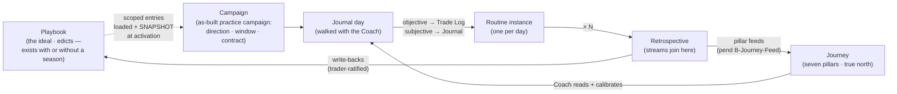
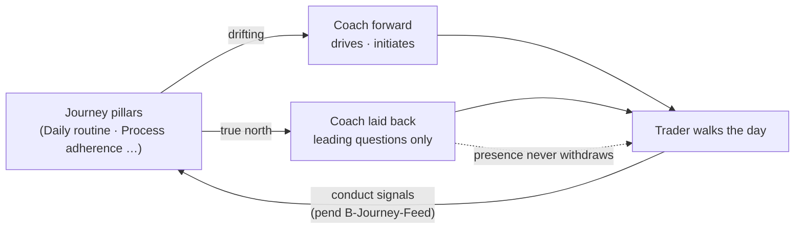
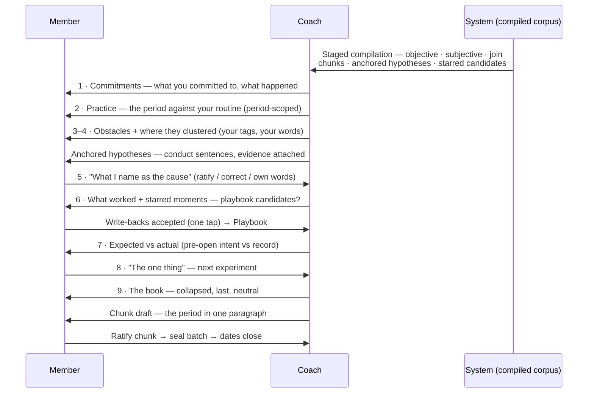

# FatTail Labs — The Practice: Coach Design Architecture v0.3

**Status:** DRAFT — advisor artifact for Coach review. Not build authority. **B-Agent is
RULED (Coach override, 2026-08-13 — see §17 and the companion DL entry draft).** Remaining
open rulings in §17 must be ruled and decision-logged before any spec fold or
implementation planning.

**Date:** 2026-08-13
**Supersedes:** Practice-Coach Design Architecture v0.2 (same day; v0.2 superseded v0.1).
v0.3 folds the 2026-08-13 advisor review (Grok) — verified against as-built specs — and is
**self-contained**: the v0.1 memory/analysis/ceremony detail is inlined; no prior version
is required to validate this document.
**Type:** Design architecture — Practice suite redesign (Journal · Retrospective ·
Playbook · Campaign binding · Journey integration · the Coach agent)
**Audience:** Coach (Ernie) · bench reviewers (India, Tango, Hotel, Echo, Victor, Mike) · Lima
**Family:** B (member-private) throughout, except where noted

**Parents (as-built substrate this design builds on — not replaced):**

| Doc | Consumed for |
|---|---|
| Journal Session Spec v0.6 | One conversation per date · timestamps · market phase · closure · agent rules (§8.2/§9/§1.3 — now overridden per §17 B-Agent; v0.6 remains authority until v0.7 lands) |
| Journal Retrospective Spec v0.6 (as-built) / v0.7.1 (DRAFT frame) | Lifecycle, gather, dual report DTO, habit plans, ceremony sequence, §2 "what it is not" |
| Trade Log Spec v1.1 | **Owner of the objective stream**; badge host (§17 passive participant) |
| Member Campaign Spec v1.3 (+ Top-Level-Is-The-Account amendment, DRAFT) | As-built practice campaign: contract, window, direction, registry, L1–L8 |
| Trader Development Phase 1 — Own Spine v1.1 | Playbook entries · campaign-scoped playbook · trade links · manual adherence |
| Continuous Journaling Direction (DL-191) | Capture-in-the-moment doctrine · notification pattern |
| Tag Manager v0.3 | Lexicon · Behavior category · tags record, never behave |
| Journey Experience Spec v1.0 / DL-190 / DL-067 | Meters §4.1 · `/home` login-landing §2.2 · idle timeout §2.3b · tenure-weighted grades §4.3 |
| Journey Gamification Spec v1.0 | Meter math source |
| Member Profile Journey Visibility v1.0 | Share pillars · surfacing patterns |
| Process Integrity Scoring & Guidance v0.4 | Adherence dual-empty semantics · scoring doctrine |
| North Star Member Ethos v1.2 | Secular enlightenment · capacity over dependency |
| Agent Identity Spec v1.0 | Agent attribution substrate |
| Member Wiki v0.1 · Wiki Interface v0.1 | Wikilink/backlink/graph components · "In your practice" rail |
| Member Data Privacy v0.1 · Practice Portability | Isolation · export · purge obligations |

**Idea provenance:** Every structural idea in this document is Coach's, stated across the
two 2026-08-13 advisor sessions (desk + walk) and ruled where noted. The advisor
contribution is arrangement, reconciliation against shipped specs, and the flagged
decision points. Nothing of Coach's has been removed or de-scoped; where an idea collided
with shipped doctrine, the collision is carried as an open ruling (§17) or has been ruled
by Coach (B-Agent). Errata from v0.2 corrected here are noted inline (§10.2, §11).

---

## 1. Context and lineage — the Four Noble Truths spine

The suite is named **The Practice** because the practice *is* the Fourth Noble Truth made
executable. The mapping is structurally exact, not decorative:

| Truth | In trading | In the platform |
|---|---|---|
| **There is suffering** | The fear around trading — chasing, revenge, oversizing, holding through pain | Named honestly in the journal; never diagnosed by the machine |
| **Suffering has a cause** | Needing the outcome to go your way — attachment to a result you don't control | The product thesis in one line |
| **Suffering can end** | Fear can end even though risk cannot — **avoidable loss is the addressable target** | The cessation is real and specific; via negativa is the mechanism |
| **There is a path** | It ends through practice — not courage, not insight, not reading your way out | The daily routine, the retro, the accumulating playbook: the path rendered as a trading operating system |

The **Coach is the guide on the path** — a teacher of *procedure*, never someone who hands
over the answer. On this path, the walking is the mechanism. **Capacity over dependency is
the raft you leave behind once you've crossed** — not a business principle bolted on, but
the point. (North Star v1.2's secular-enlightenment framing is the member-facing register;
the Noble Truths vocabulary stays **architecture-internal** unless Coach rules otherwise.
Victor gates any lineage sentence — Taleb or Buddhist — that leaves this file.)

**The measurement layer — records, charts, slice-and-dice — is the instrument, not the
point.** Internal positioning only, never member-facing copy. Most platforms stop at
measurement and call it the product; that is the trap this design refuses. The Practice is
what the measurement was always for.

Via negativa and "the path, not the outcome" are the same idea in two vocabularies — §13
(antifragility) is §1 restated in the Taleb frame.

---

## 2. The path — five pieces, one walk

The four Practice pieces plus the Journey are not features; they are the path:

| Piece | Role on the path | Binding |
|---|---|---|
| **Campaign** | The direction you commit to walk — the program, the season, the intent | **Binds to the as-built practice campaign** (`member_practice_campaigns`, Member Campaign v1.3 L1–L8; Own Spine "a season of practicing that identity"). No new object, no third table — carried as ruling **B-Campaign-bind** (§17) so the binding is logged, not implied |
| **Playbook** | The ideal — the edicts, the ideal trade, the ideal conduct you are trying to enact | Own Spine playbook SoR; freely written, always (§5) |
| **Journal** | The walking of the path each day — the day-as-conversation with the Coach, capturing everything **subjective** that leads to and buttons up the objective trade. One routine instance per day | Journal Session (v0.7 to land per B-Agent) |
| **Retrospective** | The looking-back — compiles the routine instances, objective beside subjective, evaluates the trader against their edicts and against their past retros, feeds it forward | Retro spec (conversation frame to land) |
| **Journey** | The seven-pillar rendering of whether the walking holds true north (§10) | Journey Experience (feed mechanics pend B-Journey-Feed) |

The Coach is the guide across all five; every bit of internal machinery exists only so the
Coach can walk the trader through the day and the review without dropping a thread.

### 2.1 Objective and subjective, precisely drawn

- **Objective** = the actual trade. The **Trade Log owns it fully** — structure, fills,
  timestamps, the record (Trade Log Spec v1.1).
- **Subjective** = the journey the trader took with the Coach to arrive at and close the
  trade. The **Journal owns it** — the plan, the hesitation, the adherence marks, the
  exhale.
- A **routine instance** = objective + subjective **fused for one day**. The trader's day
  is an act of adherence: they walk in with a plan, a campaign, the loaded playbook, and
  the day is the attempt to enact those edicts.
- **The two streams stay distinct all the way up and join at the retro evaluation** —
  objective aggregates on one side, the trader's own words on the other, and
  felt-vs-measured divergence is the punchline the join surfaces (§8.3).

*(Arrow semantics corrected from v0.2: the campaign does not produce the playbook; the
playbook exists independently and the campaign **loads and snapshots** its scoped
entries.)*

---

## 3. Design bets — stated plainly

Two architectural bets sit under everything else, plus the personalization principle.

### 3.1 Conversation, not forms — with extract-and-confirm

**Nobody fills out forms — but people want to be told what to say and when.** The Journal
and the Retrospective are conversations, not forms or wizards. The interaction law for the
entire Practice:

> **You talk. The Coach presents and asks. You confirm.**

The third verb is load-bearing and now ruled (**B-Agent retained rail 2 —
extract-and-confirm**):

- The **conversation is the source of record.** The machine-side structured pass files
  fields *from* the member's words — and every filed field gets a **member-visible
  confirmation**. Silent invent-and-store remains forbidden; anything the member did not
  say and confirm stays absent ("never inferred" survives for exactly that class).
- In the Journal: the Coach prompts the day open, receives the trader's words, files with
  confirmation.
- In the Retro: the Coach **pre-compiles everything and presents it**, then talks the
  trader through. Naming the cause, picking the one thing, promoting a starred moment —
  all land as **one-tap confirmations inside the conversation.**
- Form-shaped fallback surfaces survive as accessibility, never as the primary path.

### 3.2 Lean on the model

AI models advance at an incredible rate; they carry reasoning and a breadth of knowledge
that reads like intuition, and they can pick up on a user's need very quickly once they
learn the user. **Building something less when that capability is right in front of us
would be the mistake.** Stated as design law:

- **The Coach leans on the model's reasoning and breadth as a primary feature,**
  constrained only by fixed doctrinal rails, and designed to improve as the models do.
- **The model is an expressor, not a doer.** The Coach brings its judgment, its read of
  the person, its connections — and is trusted to.
- **The rails are what license the freedom.** The doctrine corpus — Invariant 8, no
  diagnosis, no state-naming, mirror-not-verdict, fail-loud, Family B — is what makes
  maximum expression *safe*. The rails are deliberately narrow and non-negotiable; inside
  them the model gets maximum room.
- **Don't build what the model can do — but the safety rails are code, always.** No
  scripted prompt sets, no hard-coded obstacle-to-lesson mappings, no decision trees for
  conversational judgment. Two trees are explicitly **exempt and mandatory as code**: the
  live-position heat gate (§6.2) and the extract-and-confirm gate (§3.1). Those two trees
  are what make the rest of the freedom safe.
- **Intuition-like, but earned.** The Coach's fast read is pattern recognition across
  breadth meeting the accumulated context of one trader — journal trace, retros, pillar
  bearing. Every read traces to something the trader actually said or did. The smarter
  the Coach seems, the more tempting diagnosis becomes, and the rail holds: it gets
  better at asking the question that lets *the trader* see, never at handing down a
  verdict.
- **Effort matched to the moment.** Reasoning-effort tiers (including multi-agent
  ensemble tiers on the current Grok runtime) are spent deliberately: maximum effort
  where judgment carries weight — the retro compile, the read of the trader, courseware
  routing — lighter tiers for mechanical turns. Vendor parameter names and tier semantics
  **must be verified against current vendor docs at implementation time and configured
  fail-loud.** (Per current xAI docs: on the multi-agent model, `reasoning.effort`
  governs agent collaboration up to a ceiling — low/medium ≈ 4, high/x-high ≈ 16 — with
  allocation dynamic beneath the cap. Verify before wiring.)

### 3.3 Personalization — the Coach learns the trader (open ruling B-Personalize)

Deep per-user learning and adaptation is a **primary feature**: the Coach genuinely
learns the individual trader over time and adapts. Carried as ruling **B-Personalize**
(§17) with a **hostile schema** as the rail:

- **Allowed store:** vocabulary the member used · questions answered vs. skipped · pace
  (turn length) · causes the member ratified in their own words · playbook entries they
  keep breaking **by their own marks**.
- **Forbidden store:** inferred emotion · personality · diagnosis · "what they need
  psychologically." "Recurring obstacles" is one paraphrase from a psychological
  profile — the schema is the rail, not the prose.
- **Acceptance criterion:** every learned row cites a member utterance or conduct event
  and is showable to the member as *"I remember you said X on DATE."* If it cannot be
  shown that way, it does not belong.
- Family B, identity-scoped, export-and-purge obligated, purged with the rest.

---

## 4. The experiment model

The analytical unit of The Practice is the **routine-day**: one small experiment.

- **Hypothesis** — pre-open: plan, levels, regime, invalidation. Stated intent.
- **Execution** — the session: trades (Trade Log holds structure), decisions, tags,
  adherence marks, timestamped turns in the thread.
- **Reflection** — post-close exhale: what held, what broke, what is released.

Higher tiers are the same method at scale:

| Tier | Unit | What it is |
|---|---|---|
| **Day** | Routine-day | One experiment |
| **Week retro** (trader-cadenced) | Batch | Evaluates N routine-days; N varies (5, 10 on a catch-up, 3 on a heavy week) — all trend math normalizes **per routine-day** |
| **Month** | Rollup | Evaluates the period's week-chunks — did the commitments hold across batches? |
| **Quarter** | Arc | Evaluates the month-chunks — the season-scale story; where campaigns naturally ratify |

- **A retro closes the batch it evaluates.** An evaluated experiment is sealed — the
  record a review examined cannot be revised afterward (Journal Session §7 closure,
  grounded in the experiment frame).
- **Elastic scope survives.** A ten-day batch because the trader forgot isn't a violated
  cadence; it's a bigger sample. The interruption statement names it plainly; the
  analysis does not degrade.
- **A day without a hypothesis is an unrun experiment, not a failed one.** Loop
  completeness is counted separately; copy is shame-free: *"three of eight days ran
  without a hypothesis — nothing to compare actual against."* Empty ≠ zero holds.

---

## 5. The memory architecture

| Component | Memory role | Behavior |
|---|---|---|
| **Journal thread** | Execution trace | Raw, timestamped, phase-labeled; sealed on retro completion |
| **Playbook** | RAM — working memory | The notebook where the trader cooks ideal trades, ideal analysis, ideal routines. **Freely edited, always.** No versioning ceremony, no amendment events — a notebook you must formally amend stops being written in |
| **Campaign** | Program load | A season loads a scope of playbook entries; **the load point snapshots the entry text** (B4, settled) |
| **Chunks** | Consolidated memory | Each retro sitting compresses its batch into a member-ratified chunk (§7) |
| **Trajectory digest** | Coach's working context | The most recent chunks + active commitments + live campaign scope — one mechanism, not a separate store |
| **Personalization store** | How to guide *this* trader | §3.3 (B-Personalize); Family B; thin spec required |
| **Wiki (shared)** | Library / ROM | Shared knowledge; bridged read-only via the existing "In your practice" rail |

### 5.1 Snapshot-at-load (settled — B4)

The playbook stays free precisely because **honest analysis anchors to load points, not
edits**:

- **Campaign activation** snapshots the scoped entries — adherence for that season is
  measured against *the playbook as loaded*, not whatever the notebook says today.
- **Retro gather** captures the playbook state it reviewed.
- Mid-period rewrites never corrupt trend math; where a load boundary falls inside an
  analysis window, the analysis **segments and says so**.
- The trader never sees or performs versioning. The system quietly remembers what was
  loaded when it matters. Daily-load snapshots deferred (adds volume without analytical
  gain).

### 5.2 Starred journals — promotion from trace to program

Some journal moments are reference material for who the trader is becoming. **Starring**
is the deliberate, member-authored mark (one tap, mid-session, no ceremony):

- Capture-cheap, consistent with capture-in-the-moment (CJ-1).
- The **retro is the refinery**: starred entries in scope (plus insight-tagged ones) are
  staged as write-back candidates — *"You starred four moments this period — do any
  belong in your playbook?"* Promotion is trader-authored: quote, cite, or rewrite, with
  a wikilink back to the source entry.
- Playbook entries gain **references into the member's own journal**; backlinks show the
  lived moments that forged each rule. Sealed entries make ideal citations — immutable,
  so references never drift.
- **Star is not a tag.** Tags record and never behave (TM doctrine; the retrospective
  routing tag is the sole defended exception). A star feeds staging and creates links —
  that is behavior — so it is its own lightweight mark plus a reference table **outside
  the sealed record**. Citing a closed entry never amends it.
- The automatic wiki rail ("this might relate") and the deliberate star ("this **is**
  reference material") coexist; the retro trusts the star.

---

## 6. The Coach — the guide **[B-Agent: RULED — Coach override, 2026-08-13]**

The Coach's charter is **guide**, ruled by explicit Coach override of Journal Session
v0.6's witness posture (§8.2) and response mechanics (§9 one-question-per-turn and
no-field-filling as absolutes; §1.3 Interviewer posture). The override lands in law via
**Journal Session v0.7**; the companion DL entry draft records scope and retained rails.
**Proactive surfacing is the primary interaction model of The Practice.**

### 6.1 Proactive surfacing

The Coach **bubbles up off the screen** — an animation, an entrance: *"Hey, it's Coach —
we're getting started. What's the plan today?"* It initiates engagement; the trader does
not have to remember to go to it. A trader who doesn't yet have the routine needs to be
led into it — told what to say and when — and the Coach's forwardness is what makes the
routine happen at all.

- The **character of the entrance is Tango-gated**: welcome, never nag.
- The member-facing greeting text is **blocked pending B-Name** — "Hey, it's Coach" is
  the design intent, not shippable copy.
- Surfacing rides the platform's notification machinery (`member_notify` pattern,
  DL-191) — a new notification kind plus the front-end presence/animation layer; thin
  spec required (§17).

### 6.2 Boundary-proactive, heat-restrained — **as code** (retained rail 1)

Proactivity does not dissolve the protection the shipped doctrine actually encoded. That
protection was never "don't speak first" — it was **"don't put heavy reflection in front
of someone holding risk."**

- The Coach surfaces at **open moments**: pre-open, post-close, retro-ready.
- **While the member has a live open position, the Coach stays quiet and non-analytic** —
  receives, acknowledges briefly or not at all, answers if asked. No unprompted
  questions, no analysis, no emotional processing mid-position.
- **The gate is code, not model judgment.** Source of record: an open Trade Log position
  for that identity/date. Position open → unprompted analysis is a **hard reject**, same
  class as existing render-time guardrails. Book empty → restraint off. Thin spec:
  live-position signal (§17).

### 6.3 The fading-proactivity glide path

Capacity-over-dependency rendered as **behavior over time**:

- **Early:** the Coach is forward — surfaces, initiates, drives. High proactivity,
  because the practice isn't internalized yet.
- **As the trader melds into the routine:** the Coach **lays back** — shifts from driving
  to leading questions. Less "here's what we do now," more "what are you seeing?"
- **It never disappears.** The Coach stays visually present — still animated, still there
  waiting. Only the *insistence* withdraws, never the presence. A teacher who talks less
  as the student gets it, but never leaves the room.

**The Coach calibrates its posture against the Journey pillars** (§10): Daily routine and
Process adherence drifting → lean in; true north → lay back and just ask. The Journey is
not only what the Coach reports on — it is what the Coach **reads to calibrate itself.**
The calibration inputs pend **B-Journey-Feed** (§17): as-built meters do not yet compute
loop completeness or edict-by-edict adherence, so the fade signal is undefined until that
ruling lands. Fade-too-soon is the named failure mode (as-built `routine` lights on a
single journal touch); the ruling must give the glide path an honest input.

### 6.4 Two postures, one agent

**In the Journal: light.** Capture assistant and line-holder. The trader's day is an act
of adherence; what they want from the Coach is **affirmation that they're enacting their
edicts** and the open-ended questions that keep them honest and moving. Files on request
and by extract-and-confirm; playbook references are **reference-only** (the Coach may
quote the loaded rule; it never asserts whether the rule was followed); adherence marks
remain **manual** (Own Spine §4.4 — manual is honest); auto-adherence stays Phase 4-gated.
Nothing heavy ever ambushes the member in the place where they're supposed to be candid.

**In the Retro: deep.** Organizing and resolving happen at the evaluation boundary —
where the sample exists, where the record is about to seal, where the member has chosen
to sit. Working obstacles there, with compiled evidence, in a bounded ceremony, is the
difference between reflection and rumination. The suffering is resolved in the sitting,
not litigated all day.

### 6.5 Courseware routing

The Coach recognizes when the answer is **"go study," not more talking**, and points the
trader to specific courses or lessons tied to the actual pattern the retro surfaced —
*"this keeps coming up; there's a lesson on exactly this."* Never generic study nagging.

- Feeds the **Learning rhythm** pillar: a recommendation taken, a lesson completed.
- Sends the trader **home** — `/home`, where continue-learning already lives (§11).
- **Thin spec required:** entitlement-aware (Observer vs Navigator), pathway-aware,
  current-work resume; no recommendation the member's plan cannot open.

### 6.6 Guardrails — re-derived, not deleted

What the guide charter changes is **initiative**; what it preserves is every protection
that matters:

| Preserved (all tiers, all postures) | Changed (guide charter — ruled) |
|---|---|
| No motive/emotion naming — mirror of their words and tags only | Surfaces proactively at open moments (§6.1–6.2) |
| No P&L framing, figures, or hero placement; book last and collapsed | Opens the pre-open turn and drives the routine early on |
| No grades/meters/scores recited | Stages compiled analysis and asks the question that reveals it |
| No verdicts about the person — conduct, never character | Offers **anchored cause hypotheses** for member ratification (§8.3) |
| No advice, no prescriptions; insight is theirs | Proposes write-backs, habit plans, campaign decisions — all one-tap trader-ratified |
| Never therapy; it walks the practice — the practice is what ends the fear | Routes to specific courseware from surfaced patterns (§6.5) |
| Heat restraint as code (§6.2) · extract-and-confirm (§3.1) | Calibrates its own forwardness against the pillars (§6.3) |
| Fail loud on missing config; no fabricated content | Learns the trader within the B-Personalize schema (§3.3) |
| Sacred Invariant 8: no profit claims, ever, anywhere | — |

---

## 7. Chunk consolidation — organize at every scale

Each sitting has two jobs: **evaluate** the tier below and **consolidate it into a
chunk**. The next tier reads chunks, never the raw trace.

| Tier | Reads | Produces |
|---|---|---|
| Week | The batch of routine-days | **Week-chunk**: themes in the trader's words, starred promotions filed, commitment readout, the week in one honest paragraph — sealed with the retro |
| Month | ~4 week-chunks (never re-reads 40 days) | **Month-chunk**: themes that persisted across weeks, themes that died, what the month *was* |
| Quarter | 3 month-chunks | **The arc** — the quarterly narrative, written over already-organized material, which is why it can be genuinely good |

- **Honesty property:** every chunk is member-ratified at its sitting. The quarterly
  narrative is built entirely from summaries the trader already signed off on — the
  machine never characterizes at a scale the member didn't ratify at the scale below.
- **Efficiency property:** each tier's Coach works over one screen of organized material;
  the trajectory digest is just the most recent chunks — one mechanism.
- **Write-backs fire at any tier** — some rules only become visible at month scale.

---

## 8. The analysis — dual, joined, cross-period

Compiled by the machine at gather; the member arrives to a case, not a blank page.

### 8.1 Objective — the data

Aggregates over the scope's routine instances, normalized per routine-day, beside prior
periods: loop completeness rate (hypothesis-stated · executed · reflected); adherence
distribution **per loaded playbook entry** (*"breaks clustered on entry rule 3, not on
sizing"* is actionable; an undifferentiated rate is not); deviation clustering against
the member's **own context tags** (conditions they supplied — no market-regime inference
by the system); trade structure mix; cadence status. Trend claims are data claims
(*"adherence 71% → 78% → 84% across your last three periods"*). `MIN_INFERENCE_N` and
"not enough yet" posture inherited — below threshold, no trend language.

### 8.2 Subjective — their words

Theme extraction from the member's own journal language and tags — **always anchored**:
quoted passages with dates, tag frequencies, hypothesis language vs. what the reflection
said happened. Cross-period: recurring themes, themes that disappeared, hypothesis
specificity tightening or loosening. Voice transcripts analyze as words; **never tone of
voice.**

### 8.3 The join — where the retro earns its keep

The streams stay distinct all the way up (§2.1) and **join here**: agreement
(*"adherence dropped the same week your reflections thinned"*) or divergence (*"your
words say the period felt chaotic; the data shows your best loop completeness yet"*).
Felt-vs-measured divergence is exactly what a solo trader cannot see alone — and
surfacing it is pure compilation.

**Cause hypotheses** are **conduct sentences with quotes and dates** — every hypothesis
carries non-empty evidence anchors (process events, adherence marks, quoted journal
passages; the v0.3 §8.3 schema, validated not hoped), and the schema **rejects any
sentence that names a state**. Example of the required shape: *"adherence marks on the
size edict went to 0 the week journal turns thinned."* The **trader ratifies, corrects,
or names their own cause** — ratification does not launder a diagnostic sentence; the
sentence must be conduct-shaped before it is ever offered. Hotel gates the schema, not
the prose. Naming remains theirs.

### 8.4 Standing compilations, invited ceremonies

The compilation is machine-generated and exists regardless; the ceremony is invited.
Monthly and quarterly compilations — objective analysis, subjective narrative, wrap-up —
build automatically from whatever the corpus holds.

- A skipped ceremony leaves an **unratified compilation** — visible, not sealed, never a
  score of the person. Nothing is ever lost to a skip.
- The nudge is undone-work framing (CJ-7): *"Your October compilation is ready. It hasn't
  been reviewed."*
- A skipped month is elastically absorbed by the quarterly's scope; the quarterly
  compilation generates in any event.
- Whether any *ceremony* can ever be mandatory is part of ruling **B3**; advisor position
  unchanged: **force the compilation, never the ceremony** — forced ceremony produces
  performed reflection, which corrupts the record. This reconciles with Retro v0.7.1 §2:
  the retro remains *not skippable* in exactly the sense v0.7.1 meant — cadence adherence
  is itself a process signal, and the cadence meter decays on a skip (as-built §4.1a
  already does this without forcing a sitting).

### 8.5 The standing readout since the last retro

The retro evaluates the window **since the last retro**, not since a calendar Monday —
elastic (one week, two, more). **Regularity itself is scored** and feeds the
Retrospective cadence pillar (§10): the more regular, the better; drift decays it. Both
conduct signals The Practice pumps — routine compliance and retro regularity — are
process-only and clean under Invariant 8.

*Vocabulary note (part of ruling B3):* Coach's working term for this on the walk was
"report card since the last retro," meaning the **period window** — not a grading of the
person. Retro v0.7.1 §2 reserves "report card" as a forbidden frame (*"it measures
divergence from a practice, never the quality of a person"*). Both are honored by keeping
Coach's meaning and using **standing readout / unratified compilation** in spec and UI.
The final vocabulary call is Coach's.

---

## 9. The retro ceremony — presented, then walked

The ceremony is the same messaging modality as the journal — **one interaction model for
the entire Practice.** The Coach **pre-compiles everything and presents it**; sections
arrive as artifacts in the thread; the Coach walks the fixed sequence (Retro v0.7.1 §6
order preserved as the Coach's discipline — same order every period, process before book,
"nothing here" said plainly); the trader answers in their own words; naming and
committing land as one-tap-confirmed artifacts. Walkable for the beginner, skimmable for
the veteran — "walked, but not a wizard," satisfied more naturally by conversation than
by any form layout.

**Step-8 outputs — three tracks, one method, all trader-ratified:**

| Track | Experiment type | Evaluated at |
|---|---|---|
| Habit plan (observable_signal required; max 2 active — as-built) | Conduct | Next week retro |
| Playbook change proposal | Strategy | Monthly/quarterly, where the sample means something |
| Campaign decision (complete season / open new) | Strategy | Quarterly, naturally |

The "one thing" is not a resolution — it is **the condition being tested in the next
batch**; the next retro's step 1 is its readout. The trajectory digest and the pre-open
mirror are the system remembering which experiment is currently running.

---

## 10. The Journey — seven pillars, three expressions, one instrument

The Journey is load-bearing; this design **feeds it and navigates through it** — nothing
new is invented beside it.

> **Documentation-parity flag (blocking input to B-Journey-Feed):** Coach's 2026-08-13
> screenshots of the running product show seven pillars (including Mental toughness), the
> radar, the "Shape path" bearing, and the Tight/Medium/Loose control. Journey Experience
> Spec v1.0 documents six meters, no radar, EWMA on live presence only (half-life 4
> weeks), and no member smoothing control. **The running build is ahead of the spec** (or
> those surfaces shipped under a spec not in this parents set). Per Invariant 6, the
> as-built Journey truth must be pulled and the spec updated **before** B-Journey-Feed is
> ruled — the collision below may be smaller, or differently shaped, than v1.0 suggests.

### 10.1 The seven pillars

Each pillar is a **composite**, rolled up from lower signals — the same consolidation
pattern as chunks. Radar short label → full drill-down name (from the running UI):

| Radar | Full name | Design intent feed | As-built signal (Journey v1.0 §4.1, where documented) |
|---|---|---|---|
| Persist | **Practice persistence** | Showing up at all — the grind | — (post-v1.0 surface) |
| Routine | **Daily routine** | The daily loop scored underneath, daily: hypothesis · execution · reflection | Day has Trade Log **or** Journal in routine window |
| Learn | **Learning rhythm** | Curriculum engagement; Coach routing lands here (§6.5) | — |
| Live | **Live presence** | Live sessions | EWMA of weekly check-ins, half-life 4 weeks |
| Adhere | **Process adherence** | Edict-by-edict, per **loaded playbook entry** | % of tagged trades `followed`/`partial` (dual-empty per PI v0.4) |
| Retro | **Retrospective cadence** | Regularity of the sitting; decays on drift | Days since last completed retro vs horizon (§4.1a) |
| Tough | **Mental toughness** | The Mental Toughness pillar/app work | — (not-yet-enrolled state exists in UI) |

The design-intent feeds and the as-built signals are **different instruments** for
Routine and Adhere — that gap is exactly ruling **B-Journey-Feed** (§17).

Status vocabulary (as-built UI, shame-free, directional): **True north · On course ·
Drifting.**

### 10.2 The three expressions — each owns a question

Two different axes: seven pillars, three expressions.

| Expression | Owns | Reading |
|---|---|---|
| **Radar** | **Shape** | What is the practice made of right now; which spoke caved in. Outer ring = full alignment; empty pillars sit at the center |
| **Per-pillar bars + time slider** | **Per-pillar history** | Beginning of time → present; scrub and watch each pillar rise and fall *independently* — when did *this* spoke fall off. Keeps the signals distinct and legible |
| **True-north accumulator / timeline** ("Shape path") | **Bearing** | All pillars composited: converging on the practice, or drifting and decaying |

*Erratum from v0.2:* v0.2 stated "no blended score to chase" as if it were law. It
described the bar-chart expression's virtue — per-pillar legibility — not an abolition of
the as-built blended overall (`process.overall_raw_percent` + tenure-weighted grade,
Journey v1.0 §4.2–4.3), which nothing on the walk touched. **Whether the overall grade
survives beside the bearing is a sub-question of B-Journey-Feed, Coach's call.**

### 10.3 The bearing is an EWMA

The true-north line is **exponentially weighted, recency-heavy** — a *bearing*, not an
additive cumulative total. It answers "are you true **now**," present-tense:

- Old good behavior decays; recent drift pulls the bearing down fast; turnarounds get
  rewarded quickly. No coasting on old credit.
- **Regularity self-punishes without special-casing:** stop showing up, recent input
  thins, the bearing decays naturally. The math encodes the doctrine — the practice is a
  present-tense discipline, and stopping shows up as decay, not a frozen high score.
- The **Tight / Medium / Loose** control is the **half-life / smoothing knob**: Tight =
  short half-life, snaps to recent samples ("how am I right now"); Loose = long
  half-life, smooths more history ("which way am I actually trending"). Same curve,
  member-chosen recency bite. (Running-UI caption: "Tight follows samples; Loose
  lengthens the smooth lookback.")
- Same recency principle as the Journey's existing EWMA (DL-190) — expression, not
  invention. Documented math source pends the §10 parity pull.

### 10.4 Tappable pillars — the primary navigation surface

The pillars are **tappable** ("review" tap-through). The radar isn't just a readout; it is
**the front door to The Practice**:

> **See the shape → tap the weak spoke → land in the material → talk to the Coach.**

Tap **Process adherence** and drill into its composition, its trend, and down to the
evidence — the routine instances, the retros, the days the edicts broke, against the
playbook as loaded. **The reading and the drill-down are the same gesture.** Top-down:
radar shape → pillar composite + time-slider history → instances/retros beneath → the
Coach. Bottom-up: days feed pillars feed the radar. The Coach can *point at* the tappable
thing: "your Adhere spoke dropped this period" is a sentence and a doorway.

This is the antidote to the machinery problem: instances, chunks, snapshots, the two
streams — the trader reaches all of it *through the pillar they tapped*, in the context
of "this is the part of my practice that needs attention."

### 10.5 One instrument, no second store

There is no parallel evaluation and no second progress store: **the pillars are the
store.** The Practice pumps Daily routine, Process adherence, and Retrospective cadence;
the retro doesn't own the score — it **interprets** it; the Journey owns the score; the
Coach reads the Journey and calibrates itself against it (§6.3). This holds **only if**
B-Journey-Feed resolves by the new signals *becoming* the meters (or replacing them via
a named migration) — new signals sitting *beside* the as-built ones would be the second
store this principle forbids. Advisor position in §17.

---

## 11. Login, presence, and resilient capture

*(Facts corrected from v0.2 against Journey v1.0 §2.2/§2.3b and DL-067.)*

- **On login** the member lands on **`/home`** (DL-067): continue-learning in the main
  column — their current work — with the **ProcessMeter already on the rail.** The design
  evolves that rail into the **small Journey**: the compact shape/bearing, always in
  peripheral view. The caved-in spoke is visible even mid-lesson, and because pillars are
  tappable, the small Journey is the **ambient entry point** into The Practice. The
  Practice is never a tab you remember to open; it rides alongside current work.
- The two-faces principle expressed as layout: the only ever-present Practice surface is
  that small glance; everything else stays behind the pillars and inside the
  conversation.
- **Timeout-resilient capture (hard requirement):** idle timeout is **30 minutes by
  default, member-adjustable 15–60** (`session_idle_minutes`, §2.3b) — which makes this
  *more* pressing than v0.2's "~1 hour" assumed. Journal conversation drafts must
  **persist server-side as they go** — a trader mid-thought who steps away must never
  lose a reflection to a session evaporating. Capture-in-the-moment doctrine (CJ-1) plus
  idle logout makes draft persistence non-optional. Thin spec (§17).

---

## 12. Direction changes — supported, first-class, honest

The Practice must support pivots: new strategies, changed playbooks, changed direction.
The frame makes them **experiments opened at a higher tier**, not disruptions:

- **New direction idiom:** a new playbook entry + a new campaign (as-built campaign
  creation, v1.3 L1/L7). The system teaches this idiom — the Coach can propose it from
  retro evidence — rather than tolerating silent rewrites of history.
- **Snapshot-at-load** (§5.1) keeps prior seasons' analysis anchored to what was actually
  loaded then — pivoting never corrupts the record of what came before.
- **The strategy-merit line (advisory, load-bearing):** evaluating a strategy is the
  closest this system ever stands to evaluating outcomes. The system compiles the
  **process** evidence and shows the book neutrally, collapsed, last — but **the merit
  judgment on a strategy belongs to the trader**, stated in their words in the ceremony.
  The machine never says "this strategy isn't working." Hotel and Victor gate the
  quarterly's strategy-evaluation copy. Invariant 8 does not bend at the quarterly tier.

---

## 13. Steering toward antifragility

*Lineage note: published Taleb frame; Victor gates any member-facing copy derived from
it. Claims are process properties only — never outcomes, never profits from volatility.
This section is §1 restated: via negativa and "the path, not the outcome" are the same
idea in two vocabularies.*

- **Via negativa (the product's own thesis).** Avoidable loss is the addressable target.
  The system improves the trader by **removing** — sources of fear, broken rules,
  avoidable errors. Every retro is a subtraction pass.
- **Convex tinkering.** The routine-day is a small, bounded, frequent experiment:
  downside capped per instance (one day, one defined-risk structure, one habit under
  test), learning upside uncapped (a single ratified insight compounds through the
  playbook forever). Barbell: the playbook holds the conservative core; the experiment
  track holds the small bets on change.
- **Gains from disorder.** Broken rules become data inside an experiment; a chaotic week
  is a bigger sample; a missed retro is elastic scope with the standing compilation
  waiting; a regime shift is analyzable through the member's own context tags; a failed
  strategy season ratifies at the quarterly and opens the pivot idiom. Each obstacle
  metabolized makes the **playbook** — the exit artifact — harder to kill. The platform's
  success condition is a trader whose notebook has absorbed enough disorder that they no
  longer need the platform.

---

## 14. Positioning note — mirror vs. guide (internal)

*Internal strategy framing; any derived marketing copy is Sierra/Tango-gated and
Invariant-8 constrained. Never marketed as a comparison — comparison concedes their
axis. "The measurement layer is done" is likewise internal shorthand, never member-facing
copy.*

The journaling-analytics category (TradeZella et al.) is a **mirror**: the trader does
the work, fills the forms, tags the setups; the tool stores and charts. Excellent
measurement, and almost nobody sustains it — forms are a chore, and a chore with no one
on the other end gets abandoned. **The Practice is a guide walking a path with you**: it
comes to you, prompts you, holds you to your own edicts, pre-compiles the review so you
arrive to a conversation instead of a blank form, fades as you internalize, and routes
you to a lesson when studying is the real answer. The measurement fight is conceded **on
purpose**. The category this design owns — a proactive, fading, pillar-calibrated
guide — is not a feature you bolt onto a form; it is a different architecture from the
ground up.

---

## 15. UX principles — the complexity firewall

Testable gate criteria (Echo/Tango), not vibes.

| # | Principle |
|---|---|
| UX-1 | **One verb: talk.** Every capability reachable from the thread. The member never navigates to file |
| UX-2 | **Filing is the system's job — confirmed, never silent.** Write-backs, links, chunks, snapshots, digests machine-side; the member ratifies with one tap; extracted fields are member-visible (§3.1) |
| UX-3 | **Connections are reading chrome, never writing chrome.** The wiki-connector rail (shipped components: backlinks, hover previews, `[[` autocomplete, graph as reading instrument) collapses to one muted line, expands on tap, hides entirely when empty, never interrupts the writing surface |
| UX-4 | **Progressive disclosure.** Beginners never see machinery; veterans grow into `[[` links and the graph. No feature requires the previous one |
| UX-5 | **Vocabulary firewall.** The member never needs "trajectory digest," "snapshot-at-load," "routine-day," "chunk," or "rollup tier." If a surface requires explaining the architecture to be usable, it fails the gate |
| UX-6 | **No shame chrome anywhere.** Empty bands are information; skipped ceremonies are undone work; sparse days are honest days; Drifting is directional, never a grade |
| UX-7 | **The pillar tap is the primary navigation.** Journey pillars are the front door to The Practice; every drill-down is reachable through the spoke that names it; the Coach can point at any tappable pillar |
| UX-8 | **The small Journey rides beside current work** on `/home` (evolving the as-built ProcessMeter rail). One compact glance, never a competing dashboard |
| UX-9 | **The entrance is a welcome, never a nag.** Proactive surfacing character is Tango-gated; frequency and forwardness follow the glide path (§6.3), never marketing pressure |
| UX-10 | **Conversation is the primary surface; forms are fallback.** Any flow that requires the member to fill a form where a conversation could have filled it fails the gate |
| UX-11 | **No capture is ever lost to a timeout.** Draft persistence is server-side and continuous (§11) |

**Capture modalities:** text (shipped) · images (shipped doctrine holds: paste-primary,
Family B, member caption is the assertion, agent never interprets the image) · star (new —
own object, not a tag, §5.2) · **voice (new — thin spec: fail-loud transcription config;
audio Family B with export/purge parity; member-correctable transcript; analysis consumes
transcript only, never tone)** · conversation with the Coach (the product itself).

---

## 16. Doctrine compliance map

| Doctrine | How this design holds it |
|---|---|
| Sacred Invariant 8 — no profit claims | Book last and collapsed at every tier; strategy merit trader-judged; pillar feeds are conduct/process only; positioning copy gated; no compilation, chunk, bearing, or narrative surfaces P&L framing |
| Capacity over dependency | The guide teaches procedure, never answers; the fading glide path (§6.3) is the principle rendered as behavior; the playbook is the exit artifact; the raft is left behind |
| The platform refuses to do the reflection for the trader | Compilation was never the trader's sacred work — naming and committing were, and both stay trader-authored at every tier, as one-tap confirmations in the conversation |
| Mirror, never diagnosis | Their tags and words, quoted and counted; hypotheses are conduct sentences with quotes/dates, schema-rejected if state-naming (§8.3); no tone inference; personalization store hostile-schema'd (§3.3); conduct never character |
| Tags record, never behave | Star is not a tag; tag frequency never feeds a meter |
| One instrument, no second progress store | The pillars are the store (§10.5) — conditional on B-Journey-Feed resolving as replace/become, never beside |
| Closure / audit posture | Retro seals its batch; references live outside sealed records; snapshots make history immutable-by-construction |
| Empty ≠ zero · no shame | Unrun experiments are information; undone-work nudges; elastic scope |
| Family B isolation · portability | All new stores (stars, references, snapshots, chunks, digests, voice, personalization, drafts) are Family B, identity-scoped, export-and-purge obligated |
| Fail loud | Agent config, model/effort parameters, transcription, gather, notification kinds, live-position signal — all fail loud; no fabricated analysis, ever |
| Evidence over assertion | Vendor model/effort semantics verified at implementation time; Journey as-built truth pulled before B-Journey-Feed (§10); this revision itself corrected v0.2 facts against shipped specs |
| Overrule, not waive | B-Agent override recorded in the decision log (companion DL draft), landed by versioned amendment — never quiet behavior change |

---

## 17. Rulings — status board

Per governance: Coach rulings requiring decision-log entries. The advisor holds no gate;
positions are advisory. Reviewer = 2026-08-13 advisor review (Grok), verified against
as-built specs.

| ID | Status | Ruling | Positions |
|---|---|---|---|
| **B-Agent** | **RULED — Coach override, 2026-08-13** | Charter witness → guide; proactive surfacing is the primary interaction model; fading glide path; supersedes Journal v0.6 §8.2, §9 mechanics (one-question, no-field-fill as absolutes), §1.3 posture. **Retained rails:** heat restraint as code (§6.2), extract-and-confirm (§3.1), preserved column (§6.6), Tango-gated entrance, B-Name block on UI strings. Lands via Journal Session v0.7 + Lima DL entry (companion draft prepared). *If Coach intended the override to sweep the retained rails too, the DL entry must be corrected before fold* | Advisor + reviewer: concur as recorded |
| **B-Name** | OPEN — **blocking on any member-facing agent string** | Member-facing name ("Coach" is Ernie's callsign — share / own name / unnamed) | Both reviewers: Tango-grade branding call; nothing ships by accident |
| **B-Journey-Feed** | OPEN — **blocked behind the §10 documentation-parity pull** | The Practice's pumps (loop completeness · edict-by-edict adherence · sitting regularity) vs as-built meter math. Options: (1) freeze math, Coach fade reads internal Practice signals; (2) amend Journey so the pumps **become** the meters; (3) dual-write migration then cutover. Sub-questions: does the blended overall grade survive beside the bearing; T/M/L math source | Advisor: **option 2**, with (3) as its migration mechanism — option 1 builds the parallel store §10.5 forbids. Reviewer: rule it explicitly; (1) honors old §18, (2) honors §10.5, not both |
| **B-Personalize** | OPEN | Per-user learning store: adopt the §3.3 hostile schema (allowed/forbidden lists + "showable as 'you said X on DATE'" acceptance criterion) | Advisor + reviewer: adopt as thin, hostile spec — the schema is the rail |
| **B3** | OPEN | System-standard monthly (nudged) + quarterly (in any event) beside trader-configured base cadence — amends Retro v0.7.1 §4. Sub-decisions: report-vs-ceremony binding; the "report card" vocabulary (§8.5 note) | Advisor + reviewer: force the **compilation**, never the ceremony; keep Coach's period-window meaning, use "standing readout / unratified compilation" in spec and UI; cadence meter decay (as-built §4.1a) already scores the skip without forcing a sitting |
| **B4** | **SETTLED** | Snapshot-at-load (campaign activation + retro gather); daily-load snapshot deferred | — |
| **B-Campaign-bind** | OPEN | The path piece Campaign **binds** to as-built `member_practice_campaigns` (v1.3 L1–L8; Own Spine season-of-practicing). DL entry states the binding so no third campaign object is ever implied | Advisor: **bind, not rename** — the as-built object already is the season; the word's coexistence with capital campaigns is already fenced ("beside, not inside"). Reviewer: bind or rename; India blocks a third table either way |

**Prerequisite task (before B-Journey-Feed):** pull the running Journey's as-built truth
(seven-pillar set, radar, Shape path, T/M/L math) and update the Journey spec to parity
(Invariant 6). The running UI is ahead of Journey Experience v1.0 (§10 flag).

**Thin specs required before build:** voice capture · star/reference schema · snapshot
storage · chunk storage + ratification flow · standing compilation generation ·
proactive-surfacing notification kind + presence/animation layer · **live-position signal
for the §6.2 heat gate** · personalization/learning store (B-Personalize schema) ·
**server-side journal draft persistence** · courseware-routing entitlement/pathway rules ·
model/effort configuration (fail-loud, vendor-verified).

**Bench gates anticipated:** India (single-store integrity; snapshot/chunk/personalization
schema; campaign binding; no parallel truth), Tango (all member copy; nudges; entrance
character; B-Name), Hotel (hypothesis schema; thresholds; strategy-merit line), Echo
(UX-1..11 as testable criteria; pillar-tap navigation; `/home` rail evolution), Victor
(§1/§13 lineage), Mike (voice/media; personalization store; Family B), Kilo
(characterization tests for the heat gate and extract-and-confirm), Lima (DL entries:
B-Agent now; the rest on ruling).

---

## 18. What this supersedes and what it doesn't

**Supersedes:** Practice-Coach Design Architecture v0.2 (and via it v0.1) — this document
is the current frame and is self-contained. On the remaining rulings landing, it
supersedes the product frame of Retro v0.7.1 (ceremony-as-form → conversation;
blank-page → presented compilation). Journal Session v0.6 §8.2/§9/§1.3 are **overridden
by ruled B-Agent** and remain as-built authority only until Journal Session v0.7 lands.

**Does not touch:** one-session-per-date; timestamps and market phase; closure semantics;
tag lexicon and assign-only model; habit-plan cap and observable_signal; adherence
manual-marking (auto-adherence stays Phase 4-gated); Family B isolation; export/purge;
entitlement; Member Campaign v1.3 laws L1–L8; Trade Log ownership of the objective
stream; every protection in §6.6's preserved column. **Journey meter math** is *pending
B-Journey-Feed* — v0.2's "does not touch Journey math" claim is withdrawn as
contradictory with §10 and is now an open ruling, not an assurance.

---

*Advisor artifact — FatTail Labs external advisor layer. Binding force arrives only via
Coach ruling + Lima decision-log entry per repo governance. B-Agent's binding force
arrives when Lima lands the companion DL entry and Journal Session v0.7 is folded.*
