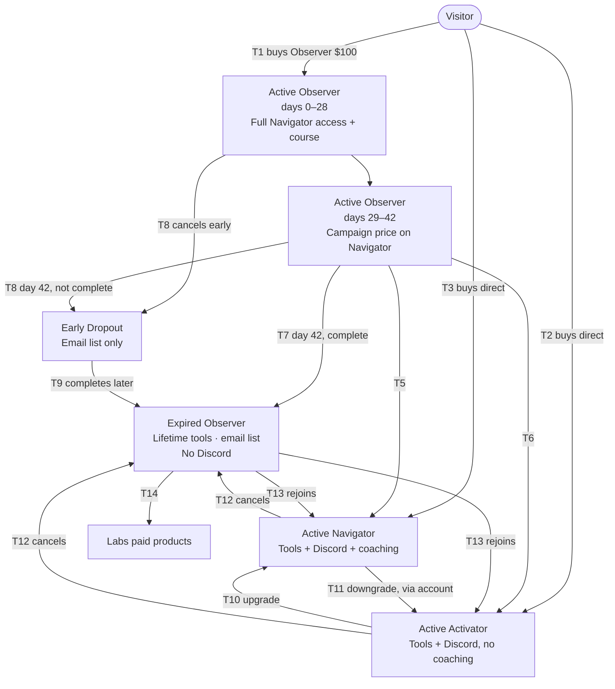

# FatTail Membership Lifecycle Law v1.0

**Project:** FatTail (fattail.ai)
**Author:** Coach
**As of:** 2026-09-26
**Status:** Seated — decisions in section 2 are Coach's; advisor leans adopted are marked and overridable
**Supersedes:** none. Split out of Pricing Cards Plugin Specification v1.0 §2, §3, §9, §10, §16, §17 per Advisor review 2026-09-26-Advisor-Pricing-Cards-Plugin-Spec-v1.0 ("split the packet").

This document is the source of truth for membership states and transitions. The pricing cards plugin (Spec v1.1) renders these states; it never defines them. WooCommerce Subscriptions holds the truth; WooCord mirrors it to Discord; ActiveCampaign and FatTail Labs consume it.

---

## 1. Tiers

| Tier | Billing | Includes | Job |
| --- | --- | --- | --- |
| Observer | Single $100 payment, six-week term, no renewal | Everything Navigator gets for six weeks, plus the six-week course; completion earns the tools floor | On-ramp |
| Activator | Monthly or annual | Tools, Discord; no coaching | Anchor |
| Navigator | Monthly or annual | Tools, Discord, coaching | Full membership |

All three tiers are buyable by a cold visitor (Decision 2). Observer is the recommended entry, not the only one.

---

## 2. Seated decisions

These were asked and answered by Coach on 2026-09-26. Nothing elsewhere in this document or in Spec v1.1 may contradict them.

| # | Question | Decision |
| --- | --- | --- |
| D1 | What completes the Observer term and earns the floor? | **Both** conditions: 42 days elapsed since subscription start **and** the six-week curriculum marked complete. |
| D2 | Is the public table Observer-only, or are all three tiers buyable cold? | **All three buyable cold** (Grok option B). Visitor → Activator and Visitor → Navigator are real transitions. |
| D3 | Early Observer dropout (cancel before completion) | **Email list only.** No tools, no Discord. |
| D4 | Paid-tier cancel (Navigator or Activator) | **Every cancel lands on Expired Observer** — tools floor, email list, no Discord — whether or not the member ever completed the Observer course. No "earned it" flag. |
| D5 | Pending-cancel, on-hold, failed-payment subscriptions | **All behave as pending-cancel:** the member keeps their tier until the paid period runs out, then follows D4. No grace prompt, no fourth card state. |
| D6 | Campaign window | **Starts week 5. Hard stop at day 42**, including for Expired Observers. Win-back is a separately dated sale, never a standing Observer coupon. |

Advisor leans adopted with rationale (Coach may override any of these by name):

| # | Lean adopted | Rationale |
| --- | --- | --- |
| L1 (16.1) | Media pop-up on the featured card only | Other cards do not need a lightbox |
| L2 (16.2) | Expired Observer sees Observer as a compact "Completed" card, no CTA | The floor is already earned; hiding it reads as a repurchase table |
| L3 (16.3) | Active Navigator does not see Activator | Downgrade is an account/billing action, not a pricing-card job |
| L4 (16.6) | Comparison row shows coaching and coaching-adjacent items only | Coaching is the whole Activator/Navigator difference; tools and Discord are shared |

---

## 3. Completion predicate (D1)

One expression, evaluated server-side by whichever system grants the floor:

```
observer_complete =
    (today - observer_subscription_start) >= 42 days
    AND curriculum_complete(user) == true
```

- `observer_subscription_start` is the WooCommerce Subscriptions start date of the Observer product.
- `curriculum_complete` is written by the course system when the last required module is marked done. Which system owns that flag is open question O1.
- Term week, for display only: `observer_week = min(6, floor(days_elapsed / 7) + 1)`. This is a calendar week of the Observer term. It is never called a trial week in copy or in code comments.
- The campaign clock (D6) uses days elapsed only. Curriculum completion does not extend or shorten it.
- A member at day 42+ who has **not** completed the curriculum is not `observer_complete`. Their Observer subscription still ends at day 42; they are treated as an early dropout (D3) until the curriculum flag flips, at which point they become Expired Observer. Open question O2 asks whether course access survives day 42 to allow that.

---

## 4. States

| State | Definition | Tools | Discord | Coaching | Email list |
| --- | --- | --- | --- | --- | --- |
| Visitor | No account, or account with no mapped subscription ever | No | No | No | If opted in |
| Active Observer | Active Observer subscription, day 0–42 | Yes | Yes (Observer role) | Yes | Yes |
| Early Dropout | Observer cancelled or ended without `observer_complete` | **No** | No | No | Yes |
| Expired Observer | `observer_complete` true and no active paid tier; **or** any Navigator/Activator subscription ended (D4) | **Yes — lifetime floor** | No | No | Yes |
| Active Activator | Active Activator subscription (incl. pending-cancel / on-hold / failed until period end, D5) | Yes | Yes (Activator role) | No | Yes |
| Active Navigator | Active Navigator subscription (same D5 rule) | Yes | Yes (Navigator role) | Yes | Yes |

Precedence when a user has more than one record: Active Navigator > Active Activator > Active Observer > Expired Observer > Early Dropout > Visitor.

---

## 5. Transitions

| # | From → To | Trigger in WooCommerce | WooCord (Discord) | Labs / tools | ActiveCampaign tag |
| --- | --- | --- | --- | --- | --- |
| T1 | Visitor → Active Observer | Observer subscription created | Onboards to Discord; assigns Observer role | Grants tools for term | `observer-active` |
| T2 | Visitor → Active Activator | Activator subscription created | Assigns Activator role | Grants tools | `activator` |
| T3 | Visitor → Active Navigator | Navigator subscription created | Assigns Navigator role | Grants tools | `navigator` |
| T4 | Active Observer → week 5 | None (date math) | None | None | `observer-week5` |
| T5 | Active Observer → Active Navigator | Observer ends / switches; Navigator starts | Role → Navigator | Keeps tools | `navigator`; stop campaign |
| T6 | Active Observer → Active Activator | Observer ends / switches; Activator starts | Role → Activator | Keeps tools | `activator`; stop campaign |
| T7 | Active Observer → Expired Observer | Observer ends at day 42 with `observer_complete` | Removes Discord access | **Writes lifetime floor plan** (slug: O3) | `observer-expired` |
| T8 | Active Observer → Early Dropout | Observer cancelled before completion, or ends at day 42 without completion | Removes Discord access | Revokes tools | `observer-dropout` |
| T9 | Early Dropout → Expired Observer | `curriculum_complete` flips true after the term (if O2 allows) | None | Writes lifetime floor plan | `observer-expired` |
| T10 | Active Activator → Active Navigator | Subscription switch | Role → Navigator | None | `navigator` |
| T11 | Active Navigator → Active Activator | Subscription switch (via account, not pricing cards) | Role → Activator | None | `activator` |
| T12 | Active Navigator / Activator → Expired Observer | Paid subscription ends (cancel, or period end after pending-cancel / failed payment, D4–D5) | Removes Discord access | Writes lifetime floor plan if not already present | `observer-expired` |
| T13 | Expired Observer → Active Navigator / Activator | New subscription | Assigns role | Keeps floor | `navigator` / `activator` |
| T14 | Expired Observer → Labs paid product | Labs purchase | None | Labs plan | Labs-owned |

Pending-cancel, on-hold, and failed-payment (D5) are not transitions. The member stays in their active state until the period ends, then T12 fires.

---

## 6. Lifecycle diagram



Four standing end states: Active Navigator, Active Activator, Expired Observer, Early Dropout. Every path ends in one of them. No dashed nodes remain.

---

## 7. Render matrix

What the pricing cards show per state. Spec v1.1 implements exactly this table.

| State | Observer card | Activator card | Navigator card (featured) | Comparison row | Login line | JSON-LD |
| --- | --- | --- | --- | --- | --- | --- |
| Visitor, logged out | Public, "Start as Observer" | Public, "Join" | Public, "Join" | Yes | Yes | Public |
| Visitor, logged in | Public | Public | Public | Yes | No | Public |
| Active Observer, days 0–28 | "Your plan — week N of 6", no CTA | "Join Activator" (not promoted) | "Continue as Navigator" | Yes | No | Public |
| Active Observer, days 29–42 | "Your plan — week N of 6", no CTA | "Join Activator" (not promoted) | Campaign price, sale badge, countdown to day 42 | Yes | No | Public |
| Early Dropout | Public, "Start as Observer" | Public | Public | Yes | No | Public |
| Expired Observer | Compact "Completed", tools-floor note, no CTA (L2) | "Join" | "Join" (featured); regular price (D6) | Yes | No | Public |
| Active Activator (incl. pending-cancel / on-hold) | Hidden | "Your plan" | "Upgrade" | Yes | No | Public |
| Active Navigator (incl. pending-cancel / on-hold) | Hidden | Hidden (L3) | "Your plan" | No | No | Public |

Test rows for the implementer: day 0, day 27, day 28, day 29, day 42 complete, day 42 not complete, day 43, cancel on day 10, Navigator pending-cancel with 12 days left, Navigator on-hold, Activator direct purchase then cancel.

---

## 8. Open questions (need an owner, not Coach)

- [ ] O1 Which system owns `curriculum_complete` and how does WooCommerce or Labs read it? (Course platform / Labs)
- [ ] O2 Does course access survive day 42 so a late finisher can flip to Expired Observer via T9, or does day 42 end course access? (Coach)
- [ ] O3 Labs plan slug for the lifetime floor, and whether it is the Access Control "alumni" ladder or a new `observer-tools` plan. Who writes `Membership` on T7/T12. (Labs / Identity owner)
- [ ] O4 WooCommerce product type for Observer: a subscription with a 6-week length and no renewal, or a simple product plus a scheduled expiry. WooCord and ActiveCampaign key off the events, so this must be one thing. (Conor)
- [ ] O5 Existing `membership-auto-upgrade` tagging in ActiveCampaign — map section 5 tags onto it rather than double-plumbing. (Conor)

---

## Change log

| Version | Date | Change |
| --- | --- | --- |
| v1.0 | 2026-09-26 | First numbered version. Seats D1–D6; adopts advisor leans L1–L4; adds T2/T3 direct-purchase transitions, completion predicate, state table, render matrix. |
