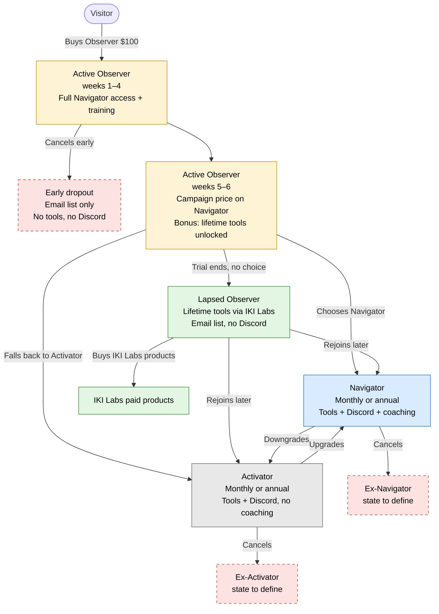

# Pricing Cards Plugin — Specification v1.0

**Project:** FatTail (fattail.ai)
**Author:** Coach
**As of:** 2026-09-26
**Status:** Draft for review
**Supersedes:** none (first numbered version)

---

## 1. Purpose and scope

A self-contained WordPress plugin that renders the FatTail three-tier membership pricing table, replacing the Flatsome pricing-card element, which is not flexible enough.

The plugin is built complete in one pass — no phased delivery. Estimated effort: about one hour to build, one hour to debug.

In scope:

- Three configurable cards (Observer, Activator, Navigator) with a monthly/annual toggle
- Optional sale pricing with badge and expiry
- One featured card with its own color scheme and raised treatment, plus an image/video pop-up
- Full design control through CSS custom properties; hover and motion states
- Visitor-state awareness via WooCommerce Subscriptions (logged-out, non-member, active Observer with trial week, lapsed Observer, active Activator/Navigator)
- Week-five Navigator campaign pricing for Observers
- A/B variant that hides Activator
- Admin with in-place editing on a live preview
- Analytics (impressions, toggles, clicks, click-throughs) stored in a custom table with a dashboard and export
- JSON-LD structured data for search and AI crawlers

Out of scope:

- Checkout itself — each button links to an existing WooCommerce product URL
- Discord role management — handled by the WooCord bot off the subscription lifecycle
- Email sequences — handled in ActiveCampaign (see section 17)

---

## 2. Products and tiers

The three cards are not equals: Observer is a time-boxed on-ramp, Activator is the anchor, Navigator is the featured full membership.

| Tier | Billing | Includes | Role on the page |
| --- | --- | --- | --- |
| Observer | Single $100 payment, six weeks | Everything Navigator gets during the six weeks, plus the six-week training; completing the training earns lifetime tool access | Entry point; no monthly/annual toggle |
| Activator | Monthly or annual | Tools and Discord access; no coaching | Anchor that makes Navigator the obvious value; sells rarely |
| Navigator | Monthly or annual | Full membership: tools, Discord, coaching | Featured card |

Observer messaging leads with lifetime tool access, not "trial": complete the six weeks, keep the tools for life. The card must state the completion condition plainly so nobody who drops out in week two feels misled.

The Activator/Navigator boundary must be visually obvious — coaching is the whole difference. A comparison row across the bottom of the table is the preferred device.

The floor: an Observer who finishes and does not convert keeps the tools (served through FatTail Labs / IKI Labs, where further products are available) and stays on the email list, but loses Discord. Nobody leaves empty-handed, and the cards should say so.

---

## 3. Member lifecycle — all paths from Observer

Every path starts with the $100 Observer purchase and ends in one of four standing states: Navigator, Activator, tools-only (lapsed Observer), or email-list-only (early dropout). WooCommerce is the source of truth for every transition; WooCord mirrors each transition into a Discord role.

How each transition is enforced:

| Transition | What changes in WooCommerce | What WooCord does | What the pricing cards show next |
| --- | --- | --- | --- |
| Visitor → Observer | New Observer subscription (single payment, 6-week term) | Guides the member into Discord, assigns Observer role (coaching access) | "Your plan — week 1 of 6" |
| Observer → week 5 | Nothing; plugin computes week from subscription start | Nothing | Campaign price and countdown on Navigator |
| Observer → Navigator | Observer subscription ends; Navigator subscription starts | Switches role to Navigator | "Your plan" on Navigator |
| Observer → Activator | Observer subscription ends; Activator subscription starts | Switches role to Activator (drops coaching) | "Your plan" on Activator, "Upgrade" on Navigator |
| Observer → lapsed | Observer subscription ends; no new subscription | Switches to lapsed role or removes Discord access | Lapsed-Observer table; tools noted; join buttons |
| Observer → early dropout | Observer subscription cancelled before completion | Removes Discord access | Public table; no lifetime tools (open question 16.9) |
| Activator ↔ Navigator | Subscription switch | Switches role | "Your plan" moves |
| Lapsed → Navigator/Activator | New subscription | Assigns role | "Your plan" |

Dashed nodes are states the spec has not yet defined (see section 16).

---

## 4. Card anatomy and layout

Each card is a flex column with fixed-height bands on top, a flexible features area in the middle, and the button pinned to the bottom, so all three cards match in height and the buttons line up.

| Band | Content | Sizing |
| --- | --- | --- |
| Image | Per-card graphic or thumbnail, with alt text; a position option (above the title, or as card background) and a size property | Fixed height |
| Title | Product name | Fixed height, unaffected by any other element |
| Description | One short line saying what the product is | Fixed height, two-line clamp |
| Price | Current price, billing label, optional struck-through original and sale badge | Fixed height, unaffected by any other element |
| Features | Two-tier list: category heading with items nested under it | Flexible; absorbs remaining space |
| Button | Per-card button text (e.g. "Start Free Trial", "Get Started") and destination URL | Pinned to bottom |

Implementation: CSS grid with shared row heights across the three cards for the fixed bands, then a flex column with `flex: 1` on the features area and the button at the end. Content varies inside its band without shifting anything below it.

Responsive: cards stack on mobile. The featured card lands first in the stacked order. Wide content never scrolls the page sideways.

Accessibility: semantic elements (`article`, headings, `ul`) rather than bare `div`s; the billing toggle is a proper switch with keyboard support and announced state changes; the pop-up is a modal with focus trap, close button, and Escape to dismiss.

---

## 5. Billing toggle and pricing display

One toggle above the table flips Activator and Navigator between monthly and annual; Observer is untouched and shows a fixed "6 weeks" label.

- Both billing states are rendered into the page HTML server-side; JavaScript only flips a class on the container and CSS shows one set and hides the other. No page reload, nothing fabricated at runtime, so crawlers see both prices.
- The toggle swaps, per card: displayed price, billing label, and the button's destination URL.
- Optional annual-savings line under the annual price ("Save $X" or "X% off"), computed server-side from the two prices.
- Toggle state persists in `localStorage` (wrapped in try/catch) so a returning visitor sees the billing period they last chose.
- A currency field (default USD) drives the symbol, formatting, and the JSON-LD `priceCurrency`.
- Toggle changes fire an analytics event (section 13).

---

## 6. Sale pricing and badges

A sale is optional per card and per billing period; when active it shows the original price struck through, the sale price beside it, and a badge with a configurable label.

Per card, per billing period:

| Field | Notes |
| --- | --- |
| Sale price | Optional |
| Sale checkout URL | Optional; used when the sale destination differs (e.g. a coupon-bearing link for a specific promotion) |
| Badge label | Free text, e.g. "Launch Special" |
| Sale end | Two modes: an absolute date/time, or relative to the viewer's subscription start (used by the week-five campaign, section 10) |
| Countdown | Optional; shows time remaining to the sale end |

Rules:

- Badge appears only while a sale is active and disappears with it — no manual takedown.
- The toggle swaps original and sale prices together.
- Badges are for sales only; the featured card gets no "Most Popular" ribbon or badge.
- Expired sales fall back cleanly to the regular price with no layout shift.

---

## 7. Featured card and media pop-up

Exactly one card is flagged featured (Navigator by default); the flag alone switches on a distinct color scheme and a raised treatment, with no ribbon or badge.

Featured treatment:

- Its own background tint, accent color, and border color, set through featured-specific custom properties
- Raised look: larger shadow with an upward offset and a slight scale bump, so it reads as floating above the page without motion
- Base shadow strong enough that the hover lift still registers as a change
- Button style stays consistent across all three cards

Media pop-up:

- Clicking the featured card's image opens a lightbox showing either a larger graphic or a video, per configuration
- Modal with backdrop, close button, Escape to dismiss, focus returned to the card on close
- Video is self-hosted (HTML5 `<video>`), not YouTube, so there is no third-party chrome, related videos, or branding
- Video attributes: `autoplay`, `controls`, `playsinline`, and a poster image; no other overlays
- The video `src` is injected only when the modal opens and removed on close, so nothing loads on page load and playback stops on dismiss
- 16:9 responsive wrapper
- File location: media library or a folder inside the plugin; keep the file compressed since every viewer downloads the same rendition (no adaptive streaming)
- Open question: whether the pop-up is available on the other two cards as well

---

## 8. Styling, hover, motion

All theming lives in CSS custom properties on the table's root element so colors, fonts, and spacing change in one place without touching markup.

Custom properties, at minimum:

- Background, surface, text, muted text, accent, border, shadow
- Font family and sizes for title, description, price, features, button
- Spacing scale and border radius
- Featured: background, accent, border, shadow, scale
- Sale: strikethrough color, badge background and text
- Button: background, text, hover background
- Transition duration and easing

Hover states, so the cards feel active and inviting:

- Card: lift with an increased shadow, border warming toward the accent color, smooth transition
- Featured card: hovers differently since it starts elevated — a larger lift or a stronger glow so the change is visible
- Button: its own hover background and subtle lift
- Image: slight zoom or brightness change on the featured card to hint that it opens

Motion: `@media (prefers-reduced-motion: reduce)` disables transforms and shortens transitions.

---

## 9. Visitor states and WooCommerce Subscriptions integration

The plugin reads the logged-in user's subscription state from WooCommerce Subscriptions and renders a different table for each state; it never writes to WooCommerce.

WooCommerce is the single source of truth. Roles are triggered by subscription type, and the WooCord bot switches Discord roles off the subscription lifecycle, so the cards, roles, and Discord always agree. The plugin adds no new dependency.

Configuration: each card maps to one or more WooCommerce product/variation IDs (Observer product; Activator monthly and annual; Navigator monthly and annual), plus the login/account URL.

| State | Detection | Observer card | Activator card | Navigator card | Extra |
| --- | --- | --- | --- | --- | --- |
| Logged out | No session | Public | Public | Public (featured) | Small line under the table: "Already a member? Log in to see your options", linking to login with a redirect back to this page |
| Logged in, no subscription | User, no active or past mapped subscription | Public | Public | Public (featured) | None |
| Active Observer | Active subscription to the Observer product | "Your plan — week N of 6" (N computed from subscription start date); button disabled or hidden | "Switch" (available but not promoted) | "Continue as Navigator" / "Convert"; from week 5, campaign pricing (section 10) | None |
| Lapsed Observer | Past Observer subscription ended, no active mapped subscription | Hidden, or "Completed" with lifetime tools noted | "Join" | "Join as Navigator" (featured); campaign pricing if the campaign window is still open | Line noting they keep the tools and can rejoin Discord by subscribing |
| Active Activator | Active Activator subscription | Hidden | "Your plan" | "Upgrade" | None |
| Active Navigator | Active Navigator subscription | Hidden | "Downgrade" (or hidden) | "Your plan" | None |

Rules:

- Trial week = floor(days since subscription start ÷ 7) + 1, capped at 6; the start date comes from the WooCommerce Subscriptions record.
- Cancelled, on-hold, or expired subscriptions count as not active; a cancelled-but-not-yet-ended subscription is a decision to make (section 16).
- The JSON-LD (section 14) always describes the public, logged-out version, since crawlers are never logged in.
- Every state-specific rendering is server-side, so no client-side flash between public and personalised content.
- Transitions Observer → Navigator and Observer → Activator are both supported; when a subscription changes, WooCord handles the Discord role, and the cards simply reflect the new state on next load.

---

## 10. Week-five Navigator campaign

From the start of week 5 through the end of week 6, an active Observer sees a special Navigator price with a sale badge and a per-user countdown to the end of their own trial window.

- Trigger: trial week ≥ 5 (section 9). Configurable start week.
- The discount is the same for everybody, so it is a single alternate Navigator checkout URL and price pair (monthly and annual), not per-user coupons. The URL field still accepts a coupon-bearing link for occasional promotions.
- Sale end is relative: subscription start + 42 days. The badge and countdown expire per user automatically.
- Spotlight stays on Navigator. Activator is never promoted in the campaign; it appears only as a fallback after the Navigator pitch.
- A companion campaign page (Navigator-only pitch, with Activator as the fallback further down) reuses the plugin's card rendering via the same shortcode/block with a `variant` argument, so there is one design to maintain.
- The campaign page and the Observer card both state what the member keeps either way (lifetime tools, email list) and what they give up (Discord, coaching), so the framing is clarity, not ultimatum.
- Campaign impressions and clicks carry a `campaign` flag in analytics (section 13).

---

## 11. A/B variants

The plugin can serve a two-card variant with Activator hidden, randomised per visitor and sticky, so the anchor's effect on Navigator conversion can be measured.

- Variants: A = three cards; B = Observer + Navigator only. Layout adapts to two cards (centered, featured card still raised).
- Assignment: random on first visit, stored in a cookie so the visitor sees the same variant on return. Configurable split (default 50/50).
- Override: a query parameter (e.g. `?pc_variant=B`) and an admin setting to force a variant for testing.
- Logged-in members are excluded from the test — they see their state-specific table regardless.
- Every analytics event carries the variant, so impressions, toggles, clicks, and click-throughs split by arm.
- Hypothesis on record: removing Activator tests whether the anchor lifts Navigator conversion, not whether Activator is worth selling on its own.

---

## 12. Admin — in-place editing and live preview

The admin screen is the live table itself: text is edited by clicking on it, styling in a side panel, and the preview updates as you work.

In-place editing (content-editable regions on the rendered preview):

- Title, description, prices (monthly, annual, sale), badge label, feature categories and items, button text
- Add/remove/reorder feature categories and items inline
- Image chosen via the WordPress media picker by clicking the image band
- Video and poster chosen the same way for the featured card

Side panel (things that do not edit in place naturally):

- Global styling: every custom property from section 8, with color pickers and font selectors
- Per card: featured flag, checkout URLs (regular, sale, campaign), sale end mode and value, WooCommerce product/variation IDs, image position and size
- Global: currency, toggle default, annual-savings display, A/B settings, campaign start week, login URL

Preview behaviour:

- The working billing toggle, so both states are checked without leaving the screen
- A visitor-state selector (logged out, non-member, Observer week N, lapsed Observer, Activator, Navigator) and a variant selector, so every rendering is previewable
- Explicit Save; unsaved changes flagged; a Revert to last saved

Storage: one options record (JSON) holding all card and styling settings, versioned so a future schema change can migrate it.

Placement: a Gutenberg block and an equivalent shortcode (`[fattail_pricing variant="campaign"]`) render the table on any page.

---

## 13. Analytics

The plugin records the full funnel — impressions, interactions, and click-throughs — in its own database table, with a dashboard in the admin and CSV export.

Events:

| Event | Fired when | Payload |
| --- | --- | --- |
| `table_view` | Table enters the viewport (IntersectionObserver, once per page load) | page, variant, visitor state |
| `card_view` | A card is at least 50% visible for 1 second | tier, variant, visitor state |
| `toggle` | Billing toggle flipped | from, to, variant |
| `media_open` | Featured pop-up opened | tier, media type |
| `button_click` | Any card button clicked | tier, billing period, sale active, campaign flag, variant, visitor state, destination URL |
| `login_click` | The "Already a member?" line clicked | variant |

Storage and privacy:

- Custom table `wp_fattail_pricing_events`: id, event, tier, billing, variant, visitor_state, campaign, page, session hash, user_id (nullable), timestamp
- Session hash is a salted hash of a first-party cookie, not an IP; no personal data beyond the WordPress user ID for logged-in members
- Events posted via a lightweight REST endpoint with a nonce; `navigator.sendBeacon` on click so the event survives navigation
- Each button also carries `data-tier` and `data-billing` attributes so an external tool (GA4, etc.) can hook the same clicks

Dashboard: date range, funnel by tier (views → clicks), split by variant and visitor state, toggle usage, and a CSV export. Retention setting to purge events older than N days so the table does not grow forever.

---

## 14. Structured data and discoverability

The plugin emits JSON-LD generated server-side from the saved settings, so search engines and AI crawlers read the same prices the page displays and nothing can drift.

- One `Product` per tier with name, description, image, and an `Offer` per billing period: `price`, `priceCurrency`, `billingIncrement` / `billingDuration` where applicable, `url`, and `availability`
- Active sales use `priceValidUntil` with the sale end date
- Always the public, logged-out version, regardless of who is viewing
- Both billing states exist in the initial HTML (section 5); prices are never injected purely by JavaScript
- Semantic markup: `article` per card, real headings, `ul` for features, `button`/`a` for actions, descriptive alt text
- Clear text content: tier names and the coaching distinction spelled out in words, not only implied by layout

---

## 15. Plugin architecture and delivery

A single standalone plugin (`fattail-pricing-cards`) on the fattail.ai WordPress host, independent of Flatsome, so theme updates never touch it.

| Component | Responsibility |
| --- | --- |
| `fattail-pricing-cards.php` | Bootstrap, activation (create events table, default options), deactivation, uninstall hook |
| `includes/class-settings.php` | Options schema, versioning, migration, sanitisation |
| `includes/class-state.php` | Reads WooCommerce Subscriptions for the current user, resolves visitor state and trial week, resolves campaign window |
| `includes/class-renderer.php` | Server-side render of the table for a given state, variant, and settings; emits JSON-LD |
| `includes/class-variants.php` | A/B assignment, cookie, override |
| `includes/class-analytics.php` | REST endpoint, table writes, dashboard queries, export, retention purge |
| `admin/` | Settings screen with in-place editor and live preview |
| `assets/css/pricing.css` | Custom properties, layout, hover, motion, responsive |
| `assets/js/pricing.js` | Toggle, localStorage, modal, IntersectionObserver, event beacons |
| `blocks/` | Gutenberg block registration; shortcode handler |

Assets are enqueued only on pages that render the table. No external dependencies beyond WordPress core and WooCommerce Subscriptions (soft dependency — the plugin degrades to the public table if Subscriptions is inactive).

Uninstall: a setting decides whether the events table and options are dropped on uninstall (default: keep).

---

## 16. Dependencies, caching, edge cases, open questions

The biggest risk is a page cache serving one member's personalised table to someone else; the table must be excluded from full-page caching for logged-in users.

- Caching: mark the page uncacheable for logged-in visitors (send the standard `DONOTCACHEPAGE` constant and no-cache headers), or render the public table cached and swap in the personalised version via a REST call after load. Server-side rendering with cache bypass is preferred (no flash). Verify against whatever page cache the host runs.
- WooCord: owned and maintained in-house, so abandonment is not a risk. Remaining exposure is operational — Discord API changes or a role change silently not firing on a subscription event. Add a monitoring check that alerts when a subscription status change has no matching role update within a set window. Document the manual role-assignment fallback.
- Coupons: if a visitor arrives with a coupon, the card price and checkout price may differ. Accept this; the campaign price is a fixed discount, not a coupon, so the main case is covered.
- Empty states: a disabled card, a card with no image, or an expired sale must not break the layout.
- Video: same rendition for every viewer; keep the file short and compressed. Bandwidth is not a constraint on the host (2 Gbit).
- Data growth: retention purge on the events table (section 13).

Decisions still to make (these need Coach; nothing in this document presumes an answer):

- [ ] 16.1 Media pop-up: featured card only, or available on all three?
- [ ] 16.2 Lapsed Observer card: hide Observer entirely, or show it as "Completed"?
- [ ] 16.3 Active Navigator: show Activator as "Downgrade" or hide it?
- [ ] 16.4 Mapping for on-hold, pending-cancel, and failed-payment subscriptions — member or not?
- [ ] 16.5 Campaign start week: 5 (as discussed) — confirm, and whether the window extends past the trial end for lapsed Observers
- [ ] 16.6 Comparison row content: which features mark the Activator/Navigator boundary
- [ ] 16.7 Uninstall default: keep or drop the events table
- [ ] 16.8 Which page cache the host runs, to confirm the bypass method
- [ ] 16.9 Early Observer dropout (cancels before completing the six weeks): email list only, or some tool access?
- [ ] 16.10 Ex-Navigator and ex-Activator (cancelled paid subscription): treated as lapsed Observer (tools-only) if they ever completed the Observer training, or as a plain non-member?

---

## 17. Hand-off to Conor — ActiveCampaign

The email side needs the same lifecycle states the plugin reads. The process is already understood; nothing exists yet that fires it. Proposed trigger source is WooCommerce subscription events, so there is one source of truth and the plugin only reads state.

| Event | Suggested ActiveCampaign action |
| --- | --- |
| Observer subscription starts | Onboarding sequence, tag `observer-active` |
| Observer reaches week 5 | Navigator campaign sequence, tag `observer-week5` |
| Observer converts to Navigator | Stop campaign, tag `navigator` |
| Observer drops to Activator | Stop campaign, tag `activator` |
| Observer subscription ends without conversion | Tools-only nurture, tag `observer-lapsed` |
| Activator upgrades to Navigator | Tag change |

To confirm with Conor: whether he tags off WooCommerce events already or this is new plumbing, and whether the week-5 trigger fires from WooCommerce (a scheduled action) or from ActiveCampaign's own date-based automation.

---

## Change log

| Version | Date | Change |
| --- | --- | --- |
| v1.0 | 2026-09-26 | First numbered version, from the 2026-09-26 walk-and-talk. Adds section 3 (lifecycle diagram) and open questions 16.9–16.10 relative to the working draft. |
