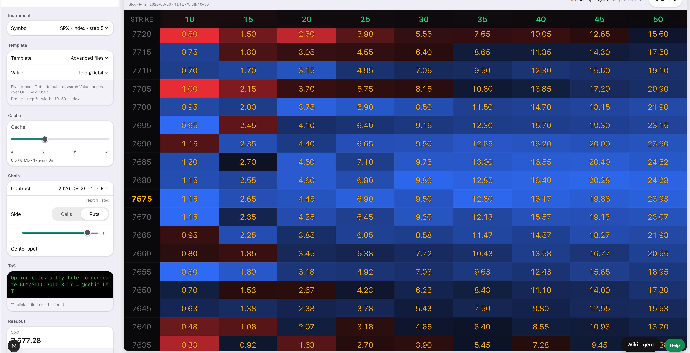
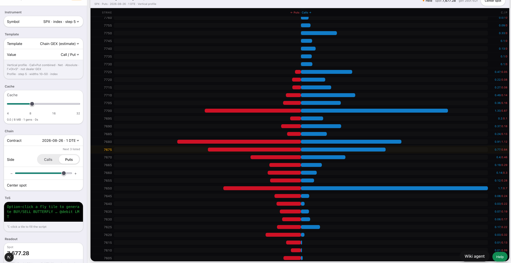
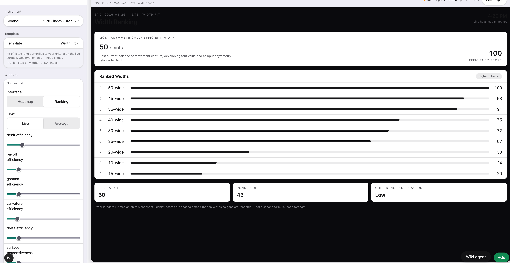

# IKI Factory — Knowledge Product Finder and Custom Filter

**Status:** Design for sharing. Not a Specification. Not BUILD AUTHORITY. No skills registered from this document.  
**Type:** Design.  
**Date:** 2026-08-25  
**Program:** IKI Factory Research lane  
**Parents:** IKI Factory Spec v1.1 · IKI Factory Pipeline Spec v1.0 · PDS v0.2 (view contract, I/K/I hierarchy) · Skill Definition `idea-research` DRAFT v0.1 · `chain-idea-view` · Hotel research finding shape (IF-2)

**How to read this.** The Factory needs a named research skill. This design says what that skill is, who it is for, and how findings are judged — without writing code or filling the registry.

**Coach corrections (same day as first draft):**

1. These knowledge products are **not static heatmaps**. They are **generated**, **live data models**, and **knowledge-based derivatives**. A heatmap may be one presentation of a live model. It is not the product.
2. **There is no limit to the visualizations we could create**, including **multi-DTE live data fed**. The three captures in §2.1 are examples, not a catalog. Advisor language that treated one-expiry heatmap/profile/ranking as the ceiling is corrected in place.
3. **The maps are interactive.** They display information; that information can be **copied**, **downloaded**, or **sent through notification**. They are not pictures you only look at.

Coach’s bound (traders and financial analysts; various ideas; Factory Research) is not removed.

Coach names the spec file and version if this becomes one.

---

## 1. What it is

A **knowledge-product finder** for the IKI Factory: search, extract, filter, and rank findings that can become licensed Information / Knowledge / Intelligence products.

Those products are **generated live models** — versioned transforms that run on held streams (OPF / chain snapshot infrastructure) and emit **knowledge-based derivatives**: visual, data, or both; typically live. **The maps are interactive:** they **display** information, and that information can be **copied**, **downloaded**, or **sent through notification** (PDS exit/action: Analyzer · notification · API signal · other declared target). They are not a frozen chart of yesterday’s chain, and they are not look-only images.

It is **specific**. It is not a general-purpose idea machine, not a YouTube topic hunter, and not a course or SaaS brainstormer.

It is **general enough to express various ideas** — GEX, a fly, a wall, width fit, term structure, “how big a move is priced,” **multi-DTE live surfaces** — as the same kind of card: a **live measurement model** someone would pay to run, derived from data Labs holds, presented honestly, never as a forecast. Coach’s three captures (§2.1) are a worked set, not the set: fly debit surface, chain GEX estimate, width-fit ranking. **Visualizations are unbounded** (PDS §2a: stop putting limitations on the runner). Multi-DTE live-fed models are in.

Two pieces:

| Piece | Job |
|---|---|
| **Idea Finder** | Hunt and extract. Mechanism. |
| **Custom Filter** | Pass / fail / cite-only, then rank. Declarative criterion. |

Judgment stays with Admin: which finding becomes a Spec. The finder does not decide what ships. The filter does not decide what is worth building. Factory law: **a skill is mechanism, never judgment.**

---

## 2. Bound

**Product.** Knowledge products produced by IKI Factory: **generated live data models** and **knowledge-based derivatives** of held Information (the chain / OPF streams). PDS view contract still applies (measurement, presentation, honesty, audience framing, controls, output kind, exit/action). Output kind is visual and/or data; static or live. **Live is the default for a knowledge product.** Static is a delivery mode of the same model (embed, wiki, licensed dump), not a different product class.

A heatmap, chart, ranking, graph, or any later form is a **presentation** of the model. Options Lab heatmaps (GEX, fly, width fit) prove some measurements are already runnable. They are cousins, **not a limit**. PDS §2a: the IKI runner is a generalized template runner — *stop trying to put limitations on it.* Output forms already named: heatmaps, charts, graphs; static and live; visual and/or data; controls; notifications; API signals. **This design adds no closed list of visualizations.** Whatever can be generated from held live streams — including **multi-DTE live data fed** models — is in scope for the finder. Intelligence products may consume Knowledge streams, not only raw OPF (Runner TR6).

**Interactive, not look-only.** Every map is a live surface the member (or a downstream system) can use:

| Act | What it is | Already visible in the worked set |
|---|---|---|
| **Display** | The measurement on the live generation, with honesty (Held, estimate, not a signal) | All three captures |
| **Copy** | Take a cell, a script, a ranked row, a readout off the map | hm1: option-click fly tile → Thinkorswim BUY/SELL BUTTERFLY script |
| **Download** | Export the derivative (data of the generation, image, or both) | Same model, licensed/data delivery — not a screenshot of the product |
| **Notify** | Send the information through notification when a condition the consumer chose is true on the live model | PDS §2a / view-contract exit; a signal is an action on a measurement, never a forecast |

Copy, download, and notify are **exits of the live model**, not separate products. The finder may name which exits a finding needs; it does not invent a forecast to hang a notification on.

**Initial audiences.** Traders and financial analysts.

The larger PDS audience — treasurers, journalists, operators, planners — remains on the symbol-entity maps for later activation. It is not dropped. It is not first-cycle.

Factory F10 seated the options-trader row as the wedge. This design adds **financial analyst** as a first-cycle seat beside the trader. Same model may later ship as two framings; first cycles may emit trader-only.

**What an idea is.** A phrase that can be stated as a **live model**: a measurement of X on Y, continuously (or on each generation) for a trader or an analyst, on a Labs-supported symbol, from streams already held. **Y may be one listed expiry or several listed expiries fed live** (multi-DTE). One DTE in the worked captures is a session, not a product limit.

**What an idea is not.** A YouTube title. A profit system. A forecast. A feed we do not hold. A one-off static heatmap treated as the product. A closed catalog of chart types.

### 2.1 Worked examples (Coach)

Three captures from the live host, same session: **SPX**, **1 DTE**, **Held**, spot **7,677.28**, generation **26017021**. One chain snapshot. Three generated derivatives. Heatmap is a presentation on two of them; the third is a ranking of the same live Width Fit model.

Source files (repo copies): `docs/iki-factory-finder-examples/hm1.png` · `hm2.png` · `hm3.png`.

**hm1 — Advanced flies · Long/Debit**



Live **listed-fly debit model** over the OPF-held chain. Strike × width (10–50) cells are regenerated from the held dual-side snapshot. Copy on the template: fly surface, debit default, research value modes over OPF-held chain. A cell is a **package mark on listed strikes**, not a drawing. Option-click emits a Thinkorswim butterfly script — an exit/action off the live model, not a forecast.

**hm2 — Chain GEX (estimate) · Call/Put**



Live **chain-gamma estimate** (Γ × OI × S²), calls vs puts by listed strike. The template names itself an **estimate** and **not dealer GEX**. That honesty is part of the product. Cache holds generations so Live vs stored gens can be inspected. Same host, same snapshot as hm1; different model, different derivative.

**hm3 — Width Fit · Ranking**



Same Width Fit **model**, **Ranking** interface (Heatmap | Ranking). Live vs Average. Controls (debit, payoff, gamma, curvature, theta, surface responsiveness) re-run the model; they do not paint a static picture. Headline: most asymmetrically efficient width on this snapshot (50-wide, score 100), runner-up 45, confidence/separation Low. Template copy: fit of listed long butterflies to criteria on the **live surface**; **observation only — not a signal**. Footnote: order is Width Fit median on this snapshot; display scores are spaced so gaps are readable — **not a second formula, not a forecast**.

| Capture | Phrase | Model (generated, live) | Derivative | Presentation |
|---|---|---|---|---|
| hm1 | listed fly debit surface | debit of listed butterflies, strike × width, each generation | Knowledge: package marks on listed strikes | heatmap grid |
| hm2 | chain GEX estimate | Γ × OI × S² by listed strike, call vs put | Knowledge: estimated chain-gamma profile (not dealer GEX) | vertical profile |
| hm3 | width fit | ranked listed widths against live-surface criteria | Knowledge: efficiency ranking of widths | ranking (heatmap is the other face) |

These three are the bound in pictures: **one held chain, live generation, several models, several presentations, named honesty, no forecast.** They are **examples**, not a ceiling. The finder’s job is to find more ideas that can be this kind of product — any visualization we can generate from live held streams, **including multi-DTE live-fed**, not more static heatmaps and not only 1 DTE.

**[advisor, superseded for this design]** `chain-idea-view` currently says multi-exp is an outlook pack and must not be labeled a live mark. Coach’s line here is **multi-DTE live data fed**. That is the product bound. Grounding still uses listed expiries only, OPF-held, no invented strikes. Multi-DTE is live when those listed chains are on the bus, not a frozen term-structure poster.

---

## 3. Lineage (what this remaps)

| Source | What it was | What it becomes here |
|---|---|---|
| `/video-idea-finder` (Icahn hunt) | YouTube: keywords, view/sub ratio, packaging quality | **Idea Finder** — same spine (profile from the card, keywords from the measurement, hunt, accumulate, rank once, emit). Venues and scoring change. |
| Holy Trifecta | Title, thumbnail, intro, congruence | **Custom Filter** — versioned pass/fail rules plus congruence: finding, grounded view, and filter verdict must be the same promise. Not packaging. |
| `chain-idea-view` | Already in repo | **Stage 0 grounding** — bind the phrase to a measurement the live model can compute on held streams (one expiry or multi-DTE live-fed). Presentation is chosen after the model is named and is **not a closed list**. |
| `idea-research` DRAFT v0.1 | Search, extract, assess, mechanism vs claim | This design is that draft, adapted. RS-9 asked whether to adapt the video idea finder; the answer here is yes, inside this bound. |

YouTube packaging (titles, thumbnails, intros, Scriptwriter) stays a content-studio skill if wanted. It does **not** sit on the Factory board.

Icahn (100K views, under 100K subscribers, ≥5:1, mediocre packaging) measures audience hunger. It does **not** rank knowledge-product findings. It may later exist as an optional **demand feeder** that only deposits phrases into Backlog (“traders are searching this”). That feeder is out of first registration unless Coach names it.

---

## 4. Where it sits on the belt

```
Phrase (trader or analyst)
        │  create-backlog or API  (originator set at this door)
        ▼
   Backlog          ready by being here
        │  Gemba or a human pulls
        ▼
   Research
        1. Ground     chain-idea-view → live measurement model / existing runner path or gap / non-claim
        2. Hunt       Idea Finder → extracted source text only
        3. Filter     Custom Filter @ named version → pass, fail, or cite-as-claim
        4. Rank once  attach ≤10 Hotel-shape findings to the item (remainder on parent)
        │  Admin selects  ← judgment
        ▼
   Spec → Build → Staged → Live
```

Exploratory search, if opened later, deposits into **Backlog** through the same door. Originator = the research agent. It does not skip Research and it does not auto-advance to Spec.

Empty registry stays fail-loud until a version is registered. Gemba will not invent findings to fill the lane.

---

## 5. Idea expression

The hunter does not change per product. The **idea language** does the work of variety.

An item is enough to pull if it can fill this. Missing fields are asked once, not invented.

| Field | What it holds | Examples that all fit |
|---|---|---|
| **Phrase** | What was deposited | `GEX` · `put wall` · `width fit` · `implied vs realized` · `how big a move is priced` |
| **Audience** | `trader` or `financial analyst` | 0DTE live map vs what is priced for the quarter |
| **Class** | Information / Knowledge / Intelligence | live quote stream · live net GEX by strike · derivative across generations (still no forecast) |
| **Model** | One sentence: this is a live measurement of X on Y, regenerated from held streams | signed dealer gamma by listed strike, each chain generation |
| **On** | Universe symbol + stream / snapshot shape | SPX dual-side; **one listed expiry or several listed expiries, live-fed**; never a ticker outside `market_symbol_universe` |
| **Output kind** | visual · data · both; live (default) or static delivery of the same model | live profile, licensed data |
| **Exits** | display (always) · copy · download · notify · other declared target | ToS script from a cell; generation CSV; notification on a measurement condition |
| **Non-claim** | What it is not | not a pin forecast, not a trade, not a static picture of one print |

If the phrase cannot be said as a **runnable live model** for those two seats, the filter rejects it. The finder does not stretch a forecast into a picture — and it does **not** refuse a new visualization just because §2.1 did not show that chart.

**In-scope examples (same finder):**

- **Worked (Coach, §2.1):** live listed-fly debit surface; live chain-GEX estimate (not dealer GEX); live Width Fit ranking (same model as a heatmap face). **Not exhaustive.**
- Trader: live net GEX, call/put walls, fly debit grid, width fit, vertical credit, 0DTE pin as a **live profile** (not “it will pin”)
- Analyst: implied move vs history as a running comparison, event premium around a dated print, SPX vs XLF as a live stress read, term structure as a **live multi-DTE** read of **what is priced**
- **Multi-DTE live-fed:** the same class of model across several listed expiries at once (surfaces, profiles, rankings, charts, data, signals) — generated each generation from held chains, not a static term-structure poster
- **Unnamed later visualizations:** the finder does not keep a whitelist of chart types. If it is a live derivative of held streams and honest, it is expressible.
- **Interactive maps:** display, copy, download, notify — same model, different exits. A finding that is only a picture fails the product bound.
- Derivative: a Knowledge stream consumed by a second model (Intelligence) — still mechanism, still no forecast. Width Fit ranking is already a derivative of the live fly surface, not a second chain.

**Out of scope:**

- “Will SPX bounce,” buy the dip, dollar-a-day claims
- Volume-profile bins that are not chain-snapshot fields
- Feeds Labs does not hold
- Packaging (titles, thumbs, intros)
- Treating a static heatmap PNG as the shipped product

---

## 6. Idea Finder

Same four moves every run: **ground → hunt → filter → rank once.**

1. **Profile** comes from the work item (title, description, originator, attachments). No YouTube-subscriber interview unless a demand feeder is later named.
2. **Keywords** come from the grounded measurement, not from clever titles. Spread across mechanism, how-to, comparison, failure/warning, and incumbent product.
3. **Hunt** uses configured venues only. Extract real text (transcript, article body, spec section). A title card is not a finding.
4. **Filter** is a separate named version. The hunter does not score inside itself.
5. **Accumulate, then rank, then emit.** No card at hour one that is rank 8 at hour six. N findings produce N cards. Never padded to 10.
6. **Handoff** is Hotel-shape findings attached to the Research item, plus the Stage 0 **model contract** (measurement, streams, output kind, non-claim). Next seat is Spec, not a packaging skill.

No invention. If extraction failed, there is no finding. Running is distinguishable from stuck.

---

## 7. Custom Filter

A filter is a **registered document**, not a vibe:

- name + version (a material change is a new version)
- ordered rules, each **pass / fail / cite-only**
- combine rule: **all must pass**, unless Coach explicitly sets a floor score
- rank order used **after** pass (never to rescue a fail)
- congruence: finding title, grounded **live model**, and reason describe the same thing

### Factory default (recommended first registration)

A finding must be **all** of:

1. **Expressible** — fits the idea fields in §5 for trader or analyst as a **live model**, not a static picture.
2. **Specific** — a named generated model, not a theme. “Net GEX by listed strike, signed, regenerated each dual-side generation” passes. “GEX is useful” fails. “A GEX heatmap” without the model fails.
3. **Reproducible from streams held** — computable from the Massive entitlement and existing OPF / snapshot infrastructure, as a **running derivative**. A feed not held is a **note**, not a finding.
4. **Mechanism, not claim** — how the structure works may pass. “Fade the edges” / “expect a pin” is **cite-as-claim**, never a finding. Repetition across vendors is not evidence.
5. **Traceable** — URL plus timestamp or section. Extraction failed → no finding.
6. **Honest** — gaps, proxies, and staleness named on the live output. A failure state is an output of the model, not an error page.

Then rank passers, in order:

1. Reproducible from streams already held  
2. Gated behind an expensive incumbent product  
3. Legible for that audience without a course first  
4. Not already a registered **live model** in the Runner / template registry (heatmap rows count as existing models, not as the only kind)

Two framings of the same model (trader vs analyst) are two findings if both audiences are in play. First cycles may emit trader-only; analyst framing is allowed, not required, until Coach asks for it.

### Congruence (kept from Trifecta, remapped)

| Trifecta | Factory analog |
|---|---|
| Title | Finding `title` (noun phrase) |
| Thumbnail | Grounded **model**: what the live derivative computes, and one presentation of it |
| Intro | `reason` + `sources` |
| Mismatched vibe kills the click | Mismatched finding / model / filter kills the card |

If the hunt found a popular “$1k/day GEX” video and the grounding is “live net GEX by strike,” the filter cites the claim and does **not** emit a finding named after the payout.

### Optional presets (not first registration)

| Preset | Use | First cycle |
|---|---|---|
| **Factory default** (§7) | Knowledge-product findings | Yes |
| **Coach-attached** | Extra constraints on one Idea (symbol, output kind, exclude vendor dashboards), **on top of** Factory default | Yes, when written on the item |
| **Icahn** | YouTube demand feeder into Backlog only | No, unless Coach names it |

---

## 8. Output shape

Hotel research finding shape (IF-2), extended with provenance from the `idea-research` draft:

| Field | Law |
|---|---|
| `title` | What was found. Noun phrase. No “will make money.” |
| `rank` | Integer 1…n as produced. Do not invent ranks to fill 10. |
| `reason` | Why this rank, from sources. Process / evidence. No advice (“buy”, “you should”). |
| `sources` | Evidence refs (URLs, doc paths, quotes). Empty sources → not usable. |
| `source_type` | `mechanism` or `claim-cited` |
| `measurement` | Carried from grounding — the live model, not a screenshot |
| `model_gap` | Existing Runner / template path, or what is missing to generate this derivative |
| `data_required` | Streams / fields needed, and whether the entitlement covers them |
| `output_kind` | visual · data · both; live (default) or static delivery |
| `exits` | display · copy · download · notify · other declared; empty notify is lawful; look-only with no display is not |

Unusable findings are dropped, not padded. Fewer than 10 is a pass. Profit claims, expected return, and Invariant #8 violations in any field make the finding unusable.

---

## 9. Two skills, one judgment seat

| Piece | Kind | Owner |
|---|---|---|
| `chain-idea-view` | Grounding mechanism | Existing skill |
| Idea Finder | Hunt / extract mechanism | New registered skill, when Coach GO’s |
| Custom Filter | Declarative criterion | New registered skill (versioned presets), when Coach GO’s |
| Which finding becomes a Spec | Judgment | Admin |
| What gets built / Live | Boundary | Coach |

Directed vs exploratory: **one finder, two entry modes**, same filter. Exploratory writes Backlog cards. Directed is pulled from an item already in Backlog.

---

## 10. What this does not change

- Factory Spec v1.1 lanes, pull, Hold, Live promotion  
- Empty registry fail-loud until Coach registers a version  
- Research → Spec is Admin-only  
- Invariant #8 / Hotel: no profit claims on any finding field  
- OPF / listed strikes / no invented instruments  
- Woo stub, Wiki, Runner (templates remain stream transforms; this design does not freeze them as heatmaps)  
- PDS hard line: describe what is priced and what happened; never what will happen  
- PDS §2a: generalized runner; no visualization whitelist; maps are **interactive** (display, copy, download, notify); output may be heatmap, chart, graph, data, notification, or API signal — static **and** live; **multi-DTE live-fed is in**  

As-built research window is 24 hours fail-loud. The `idea-research` draft’s R1 (time in lane is not a failure) is still an open ruling versus as-built. This design does not pick it.

---

## 11. Recommended first registration (when Coach GO’s)

- Finder: `idea-finder@1.0`  
- Filter: `custom-filter@factory-default-1.0`  
- Front end: existing `chain-idea-view` (grounds the **model**, not a static heatmap)  
- Emit: Hotel shape, ≤10, no padding; `output_kind` live unless Coach says otherwise  
- Audiences: trader and financial analyst  
- Do not register Icahn into Factory until Coach explicitly wants a YouTube demand feeder  

That is the named production research skill the empty registry has been waiting for. This document does not register it.

---

## 12. Open rulings (Coach, not this design)

1. **Venues** — YouTube and blogs only, or also vendor docs, academic, product pages? Fixed at registration or configurable per run?
2. **Window** — keep 24 h fail-loud as-built, or adopt draft R1 (only no-results is a bound)?
3. **Analyst on every card** — trader-default with analyst as optional second framing, or both framings whenever the measurement supports them?
4. **Icahn preset** — leave in the content-studio skill, or register later as a Backlog feeder?
5. **Paywalled sources** — advisor position: do not read what cannot be legitimately accessed.
6. **Dedup** — Runner / template registry (all live models, not heatmap rows only), or also prior findings and prior Ideas?
7. **Where this lands as law** — promote `Skill-Definition-idea-research-DRAFT` with this remap, a short amendment to Factory Spec v1.1 §6.1, or both?

---

## 13. What this document is not

Not BUILD. Not a spec. Not a GO. Not a registry row.

No Factory code, no skill files, and no research findings are produced from this write-up. If Coach wants it as a Specification next, name the file and whether it amends Factory v1.1 §6.1 or replaces the idea-research DRAFT.
