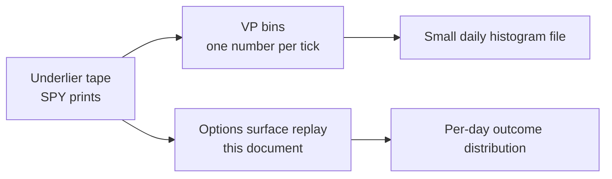
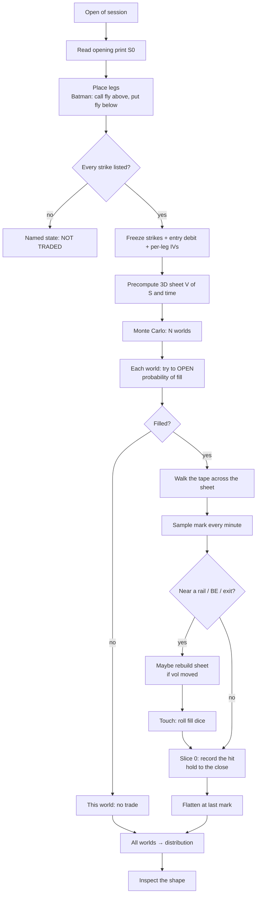
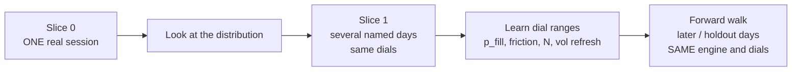

# Options backtest & forward walk — the surface-replay method

**Audience:** anyone who should understand the method without reading product law.  
**Status:** method thesis (2026-08-13). Not shipped. Not a profit claim.  
**Law:** [`Specs/FatTail-Labs-Structure-Surface-Replay-Spec-v0_1.md`](../Specs/FatTail-Labs-Structure-Surface-Replay-Spec-v0_1.md)  
**Build design:** [`Architecture/31-structure-surface-replay.md`](../Architecture/31-structure-surface-replay.md)

This note is a **review of the method** and a picture of how it works.

---

## The question it answers

> If I sit this options structure at the open, and I manage it with my rules, what **range of outcomes** is compatible with that day’s tape — given that fills are not guaranteed?

It does **not** answer “what would I have made?” as a single number. Unobservable queue and spread make that a lie. It answers with a **distribution**.

---

## Review (short)

**The method is reasonable.** It is not perfect. It is about as honest as you can be with:

- an underlier tape (we have years of SPY prints),
- a pricing model you already run live (the 3D ISO / RISK sheet),
- and fills you cannot see after the fact.

What it gets right:

| Point | Why it matters |
|-------|----------------|
| Options P&L is the **tent**, not the index | A Batman is not “price crossed a moving average.” |
| Place the structure **once**, then evaluate a **surface** | You do not need a full options book every minute. |
| Price is **on** that surface all day | Every minute has a mark; hits are contour crossings. |
| Vol changes → **rebuild the sheet** (milliseconds, per-leg IV) | Frozen vol is a first pass; Coach already does this live. |
| Touch ≠ fill | Five touches, maybe two fills — friction is a probability. |
| Therefore **Monte Carlo** | Same tape, many fill worlds. |
| Output is a **distribution**; **shape** matters | Zero-fill spike, barbell, skew — not a ribbon alone. |
| **One day first**, then several days, then dials | Learn the machine before pretending you have a year study. |
| **Forward walk = same engine**, later days | Not a second model and not stub “folds.” |

What it is **not**:

- Not the stub in Strategy Lab today (capital × 0.15). That is theater.
- Not “price tagged an indicator.”
- Not a full OPRA replay of every nearby strike every minute (harder movie; later, if we archive chains).
- Not inventing option prints from SPY last and calling them the market. The **model** is named.

Residual (named, not hidden): where per-leg IV comes from if we have no option tape; six IVs should stay a coherent smile if we can; the **open** is also a fill; real books cluster misses; SPX rails vs SPY tape must stay labeled.

**Verdict:** use this. First proof is **one session + the shape of the cloud**, not a year equity curve.

---

## Two different jobs (do not mix them)



**Volume profile** is dead simple: from the lowest print to the highest, one bin per tick (SPY = 100 bins per point). ~40k numbers, tiny file, append each day. That is **not** a backtest.

**This method** is the options job: a decaying package curve vs the tape.

---

## The picture you already have

**Rails (TradingView-style Batman overlay).** Each day, sit a call fly above the open and a put fly below. Horizontal lines = strikes. Price walks through the rails. That shows **geometry**. It does **not** show what the book was worth when price hit a rail.

**ISO + RISK (3D).** Pink hill = mark *now* (T+0). Cyan tent = payoff at expiration. Yellow dots = the three strikes of one fly. Lower / upper breakevens labeled. That **is** the package value surface \(V(S, \tau)\).

Once the legs are placed, that sheet is known. The day’s tape is a path across it. The missing number on the rails chart is just **height of the sheet** at that \((S, \tau)\).

---

## How one day works



A single, a vertical, and a Batman are the **same machine**. Only the leg list changes. Value is always:

```text
V = sum over legs of  (signed size × 100 × model price of that contract)
```

The 3D sheet is that sum on a grid of spot × remaining time.

---

## What “on the surface” means

The path \((S(t), \tau(t))\) is **on the sheet the entire day**. You do not wait to “find” the surface.

- **Height** at this minute = mark (or mid).
- **Events** = the path **crosses a contour**: expiration breakeven, wing, body, later a target or stop.

Rebuild the sheet when **per-leg vol** changes (milliseconds). Rebuild **faster** when price is approaching an exit. Periodic for truth; adaptive when it matters.

A full RTH day through this loop is **a few seconds** of machine time. That is enough.

---

## Touch is not a fill

When price kisses a contour you do **not** assume you traded.

```text
p_fill = f(spread, mid, liquidity)   e.g. about 2 in 5
draw a random number (seeded)
if below p_fill → filled at bid or ask
else            → miss; wait for the next touch
```

Same tape, different worlds. So one run is not an answer.

**Monte Carlo:** freeze the tape and the sheet; roll the fill coins many times (start ~200). Friction can also **change shape through the day** (tighter open, thinner lunch) — that is a named dial, not hidden noise.

**Output:** a **distribution** for that placement.

| Shape | Reading |
|-------|---------|
| Spike at “no trade” | Often never filled |
| Two lumps | Got in vs missed, or held vs stopped |
| Long left tail | Wings / friction |
| Long right tail | Tent captured |

A band (10th–90th) is only two points on that shape. **Shape is the result.**

On the **first** day we hold to the close (no numeric target/stop yet). Then the P&L cloud is **two-point on purpose**: didn’t get filled vs one end-of-day mark. That is the first thing to look at — especially the no-fill mass — not a broken simulator.

---

## One day → several days → forward walk



1. **One day.** Sit one Batman (or one fly). Dump every Monte Carlo draw. Look at the shape.
2. **Several different days** (trend, chop, gap) with the **same** settings.
3. **Learn** what ranges for the dials are sane. A learned change is a new version of the method, not a silent tweak.
4. **Forward walk:** later sessions that were **not** used to set dials. Same sheet, same fill law, same Monte Carlo. Report holdout **distributions**. This is how you see whether the process travels. It is **not** a second model and **not** the current stub’s three fake folds.

Do not start with a year job. A year of unread clouds teaches nothing.

---

## What the first implementation is

A research command on **one** session, for example SPY 0DTE, listed strikes from a fixture (or a real chain archive), opening print + width to place the Batman:

- Tape from the raw SPY trades we already collected.
- Sheet from the same BSM/CRR engines as live Options Lab.
- No Strategy Lab button yet. No fake P&L tile.

If a strike is not listed → **NOT TRADED**. If there is no tape → **NO TAPE**. If a leg has no IV → named hole. Never invent a debit.

---

## Compared with other ways

| Approach | Honest use |
|----------|------------|
| **This method** | Placed structure + tape + named model + fill uncertainty |
| Indicator cross | Underlier process only |
| Full chain archive every minute | Better **if we have it**; we do not, for years of every strike |
| Stub (capital × constants) | Pipeline checkbox only — do not judge a design |
| Mid fill every touch | Debug only; kills the no-fill story |

If we later archive live option chains, we can **mark** from those prints and still use this sheet for management. That is an upgrade of **data**, not a different philosophy.

---

## How to read a result

Ask:

1. How often did we **not get in**?
2. When we did, where did the day land — tent, wing, or blown through?
3. Does that shape **repeat** on other days of the same type?
4. On **holdout** days (forward walk), is the shape still recognizable?

Do **not** ask “what’s the expected dollar P&L?” as the headline. Process first. The cloud is evidence about **the process**, not a promise.

---

*FatTail Labs · 2026-08-13 · method thesis. Formal law in the Spec; execution in Arch 31.*
