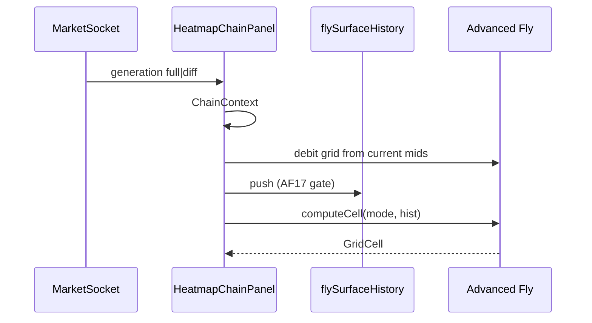

# Options Lab Heatmap — Advanced Fly Full Agent Bench Plan v1.1

**Date:** 2026-08-12  
**Plan revision:** **v1.1.1** (advisor plan-review fold)  
**Canonical filename:** `docs/Options-Lab-Heatmap-Advanced-Fly-Full-Agent-Bench-Plan-v1.1.md`  
**Naming law:** Plan **content revision matches filename** (no “v1.1 content in v1.0 path”).  
`IMPLEMENTATION-PLAN.md` is a **pointer** — update in the same commit as any rename.  
**Owner (orchestration):** Juliet  
**Authority:** Coach (GO / ship)  
**Board:** [`agents/p-options-lab-heatmap/`](../agents/p-options-lab-heatmap/)  
**Governance:** [`agents/bench/doctrine.md`](../agents/bench/doctrine.md) · [`AGENTS.md`](../AGENTS.md)  

**Primary law:**

| Doc | Path |
|-----|------|
| **Advanced Fly Spec v0.2.1** | [`Specs/FatTail-Labs-Options-Lab-Heatmap-Advanced-Fly-Spec-v0_2.md`](../Specs/FatTail-Labs-Options-Lab-Heatmap-Advanced-Fly-Spec-v0_2.md) |
| **Heatmap Templates Spec v0.2** (parent HM1–HM20) | [`Specs/FatTail-Labs-Options-Lab-Heatmap-Templates-Spec-v0_2.md`](../Specs/FatTail-Labs-Options-Lab-Heatmap-Templates-Spec-v0_2.md) |
| **Arch 29** | [`Architecture/29-options-lab-heatmap-templates.md`](../Architecture/29-options-lab-heatmap-templates.md) |
| **OPF Truth · Elegant Failure · DL-309** | [`Specs/FatTail-Labs-Options-Lab-OPF-Truth-and-Elegant-Failure-Doctrine-v1.0.md`](../Specs/FatTail-Labs-Options-Lab-OPF-Truth-and-Elegant-Failure-Doctrine-v1.0.md) |
| **Parent heatmap bench** | [`docs/Options-Lab-Heatmap-Templates-Full-Agent-Bench-Plan-v1.0.md`](./Options-Lab-Heatmap-Templates-Full-Agent-Bench-Plan-v1.0.md) |

**Spec status:** DRAFT v0.2.1 — advisor fold B1–B4 · A1–A8 · N1/N2 complete. **No implementation seed fire until Coach AF0-0 GO.**

**Parents (do not re-litigate):**

| Doc | Role |
|-----|------|
| Market Bus Spec content **v1.0.1** · Arch **28** | One WS/tab · dual-side generation · push/diff · **market-plane session SoR** |
| Options Chain Picker Spec **v1.0.2** | Universe · OC2 · OC6a · modal step · no snap |
| OPF Spec v0.2.1 | Generation plane OPF holds; AF does **not** call package-quote |
| Human Interface Spec v1.0 | HIG · Value dropdown · magnitude+chip credit |
| Proposal `hm-prop.pdf` | Research intent only — **not** code authority |

Specialists execute **only** via seeds. Coordination only through **Coach** or **Juliet**.  
Delta gates: **PASS / FAIL / BLOCKED** with evidence — **never waived**.  
**Coach may overrule** a specialist finding via **DL entry with reasoning** — that is **not** a gate waive.

---

## 0. Locked product decisions

| ID | Decision | Source |
|----|----------|--------|
| **L1** | Replace Symmetric Fly with **Advanced Fly** (one fly matrix) | Coach |
| **L2** | Same geometry + Debit default; research modes are **Value modes** | Coach · Spec |
| **L3** | Data plane = **OPF-held dual-side chain** only (same as sym-fly / gex / ladder) | Coach · AF-DP1–6 |
| **L4** | Pure `HeatmapTemplate` pattern — zero template Massive / zero package-quote | Spec · HM6 |
| **L5** | Client `flySurfaceHistory` + **AF10/AF17** honesty | Spec v0.2.1 |
| **L6** | Credit \(C_{\mathrm{signed}}=-D\); display magnitude + CR chip | Spec §3.4 · N2 |
| **L7** | Slope = descending \(K\), per-point FD; curvature = uniform triples only | Spec §5.1.3 · B1 · N1 |
| **L8** | SRS / spot_sens / time_decay **descoped** unless Coach Accept AF-X2 | OD-AF7 · NX |
| **L9** | Spec hash at GO = whole-file sha1 **in DL** (not in-file) | A7 |

**This plan does not re-open:** Market Bus Redis posture · dual-side HM15–20 identity · GEX law · Analyzer residual · vertical/bw as Advanced Fly.

**Scope honesty:** Ship Wave‑1 Advanced Fly on existing heatmap board. Parent S/V further work is **redirected** here.

---

## 1. Mission

```text
OPF-held dual-side generation
  → Market Bus push/diff → useOptionChainBus
  → ChainContext
  → Advanced Fly template (expand sym-fly)
       + flySurfaceHistory (client ring buffer)
  → Value modes: Debit · Credit · tick % · R:R · Δ · Δ² · vel · accel · slope · curvature · cp_asym
  → HeatmapChainPanel (one fly switcher entry)
```

| Pillar | Spec | Ship meaning |
|--------|------|----------------|
| Geometry | AF2–AF4 · §3 | Same long fly; no snap |
| Base modes | §3.3–3.5 · §5.1 | Debit default; Credit suite display; R:R descriptor |
| History | §6 · AF10–11 · AF17 | Depth N; seam; time honesty |
| Wave‑1 research | §5.1 | Time + spatial + C/P |
| Zero-fetch | AF-DP2 · AT-AF7 | Mode/side switch = no Massive |
| Honesty copy | AF12 · §7.3 | No profit theater |

**First smoke after AF-H + AF-M + AF-U:**  
(1) One fly template in switcher · Debit matches today.  
(2) Credit shows magnitude + CR (not “−0.85”).  
(3) Δ Debit after ≥2 honest generations; null if gap/seam.  
(4) Mode/side switch → zero Massive.  
(5) Slope/curvature null on edges and non-uniform triples.  
(6) `cp_asym` dual-book same generation.

---

## 2. As-built honesty

### 2.1 Keep (do not rebuild)

| Area | Path |
|------|------|
| Dual-side bus · push/diff | Market Bus · `useOptionChainBus` |
| Template registry · types | `web/lib/options-lab/templates/{registry,types}.ts` |
| `symFlyDebit` · matrix · RoC color | `symFly.ts` · `pricing.ts` · `color.ts` |
| Heatmap panel · Value switcher | `HeatmapChainPanel.tsx` |
| Profile `heatmap_default_template: "sym-fly"` | `symbolProfile.ts` |
| GEX · ladder · bw-fly | Separate templates |
| Parent W0 Coach GO | `gate-reports/W0-0-coach-go.md` |

### 2.2 Build (this program)

| Gap | Spec | Phase |
|-----|------|-------|
| AF0 GO · OD-AF1…11 · Spec hash in DL · seeds | Spec §9 | **AF0** |
| `flySurfaceHistory` + push + AF17 reject/seam | §6 · AF17 | **AF-H** |
| Open seam market-plane Live | AF10 | **AF-H** |
| Wave‑1 modes + Credit display + slope/curvature | §3–5 | **AF-M** |
| Value IA · color signed · tooltips | §4 · §7 | **AF-U** |
| AT-AF1…17 evidence | Spec §10 | **AF-K** |
| DL · Arch 29 · close | Spec §11 | **AF-Z** |
| Wave‑2 width_eff / stability | §5.2 | **AF-X** optional |
| SRS composite | §5.3 | **AF-X2** Coach only |

### 2.3 Explicit non-phases

| ID | Out |
|----|-----|
| **NX1** | Second Massive / per-template poll |
| **NX2** | Server matrix SoR / Redis matrix keys |
| **NX3** | Package-quote as heatmap SoR |
| **NX4** | SRS as member trading signal (default descope) |
| **NX5** | spot_sens · time_decay mid-only |
| **NX6** | New structure (vertical/iron/BWB) under fly id |
| **NX7** | Dual sym-fly + adv-fly switcher entries |
| **NX8** | Re-open HM15–20 / GEX / Analyzer residual |
| **NX9** | Edge slope fabricated as zero |

---

## 3. Open decisions (OD-AF*) — Coach Accept/Override at AF0

Spec recommendations (Coach disposes):

| # | Question | Spec recommendation |
|---|----------|---------------------|
| **OD-AF1** | Registry id | Keep **`sym-fly`**; expand modes + label |
| **OD-AF2** | History depth N | **32** |
| **OD-AF3** | Min Δt | **0.5 s** (+ AF17 \(\Delta t \le 0\)) |
| **OD-AF4** | Δ² / accel smoothing | **Raw** default |
| **OD-AF5** | C/P formula | \(D_c - D_p\); cents display OK |
| **OD-AF6** | Width efficiency (Wave‑2) | \(D/w\) |
| **OD-AF7** | SRS | **Descope** |
| **OD-AF8** | Signed color sticky | **25%** |
| **OD-AF9** | Member label | “Advanced flies” **or** “Fly surface” |
| **OD-AF10** | Max gap tick modes | **15 s** |
| **OD-AF11** | \(\lvert D_{t-1}\rvert\) pct floor | Quote tick or **0.05** |

**Already frozen (not OD):** Credit formula · slope FD · curvature uniform triple · Credit magnitude+chip · AF17 · edge invalid.

---

## 4. Roster & seating

| Callsign | Role |
|----------|------|
| **Coach** | AF0-0 GO · OD-AF* · ship/no-ship · AF-X2 |
| **Juliet** | Board · seeds · DAG · parent redirect |
| **India** | Spec integrity · dual-truth · OD table · hash procedure |
| **Charlie** | `symFly` expand · history module · panel · Credit display |
| **Hotel** | Golden formulas · fixtures · C/P framing · velocity clock |
| **Echo** | Value dropdown · labels · signed color · CR chip HIG |
| **Tango** | Copy · research honesty · incomplete/history tooltips |
| **Kilo** | AT-AF1…17 · zero-fetch counter · seam tests |
| **Delta** | Phase gates ternary |
| **Lima** | DL GO + sha1 · Arch 29 as-built |
| **Mike** | Client-only history; no new trust boundary |
| **Foxtrot** | Deploy only if needed (usually N/A) |

| Seat | Rule |
|------|------|
| **S1** | Juliet owns DAG · NX discipline |
| **S2** | India Spec / AF-DP dual-truth |
| **S3** | Charlie templates + history + panel |
| **S4** | Hotel math golden + Hotel copy for cp_asym |
| **S5** | Echo HIG Value + Credit chip |
| **S6** | Tango no profit theater |
| **S7** | Kilo AT-AF* |
| **S8** | Delta all gates |
| **S9** | Lima DL + hash |
| **S10** | Seeds on disk before phase gate |

---

## 5. Sacred invariants (this program)

1. No MSC heatmap code.  
2. **OPF-held dual-side chain only** (DL-309 / AF-DP1).  
3. Pure templates — no fetch in `computeCell` (HM6).  
4. Diff once / mode switch zero-fetch (HM2 · AT-AF7).  
5. Side = view filter only; C/P still dual-book.  
6. No snap (HM8).  
7. Incomplete / dishonest pair → **null**, never invent.  
8. History not a price SoR; live Debit from current generation.  
9. **AF10 + AF17** time honesty (open · reconnect · gap · clock basis).  
10. No profit claims (AF12 · Tango · Hotel).  
11. GEX separate (AF13).  
12. Edge slope never zero (NG9 · AF5).  
13. Credit display = suite magnitude+chip (N2).  
14. Curvature uniform triple only (N1).  
15. Delta ternary; Coach overrule needs DL.  
16. Docs parity at AF-Z.  

---

## 6. Wave metrics (implement map)

### 6.1 Wave 1 — MVP (must ship)

| Mode | Spec | Owner tests |
|------|------|-------------|
| `debit` | §3.3 | AT-AF1 |
| `credit` | §3.4 \(C=-D\); display mag+CR | AT-AF16 |
| `pct_change` | tick; OD-AF11 floor | AT-AF12 |
| `r2r` | §3.5 | AT-AF1 family |
| `d_debit` / `d2_debit` | AF17 honest pair | AT-AF3 · AT-AF17 |
| `velocity` / `acceleration` | points/min; AF16–17 | AT-AF4 |
| `slope` / `curvature` | §5.1.3 | AT-AF5 |
| `cp_asym` | §5.1.4 framing | AT-AF6 · AT-AF11 |

### 6.2 Wave 2 / 3

| Wave | Modes | Phase |
|------|-------|-------|
| 2 | `width_eff` · `stability` | AF-X optional |
| 3 | `srs` · `spot_sens` · `time_decay` | AF-X2 Coach only |

---

## 7. Technical design (implementers)

### 7.1 Expected files

| Path | Action |
|------|--------|
| `web/lib/options-lab/templates/flySurfaceHistory.ts` | **New** — ring buffer · push · seam · AF17 reject |
| `web/lib/options-lab/templates/symFly.ts` | Expand `valueModes` + `computeCell` for Wave‑1 |
| `web/lib/options-lab/templates/types.ts` | Extend `ValueModeId` |
| `web/lib/options-lab/templates/pricing.ts` | Reuse `symFlyDebit`; dual-book helper for C/P |
| `web/lib/options-lab/templates/color.ts` | Signed-mode sticky p95 (AT-AF15) |
| `web/lib/options-lab/templates/registry.ts` | Label per OD-AF9; keep id per OD-AF1 |
| `web/components/options-lab/HeatmapChainPanel.tsx` | History push; session seam; Credit chip UX |
| `web/lib/options-lab/templates/*af*.test.ts` | Hotel/Kilo fixtures |
| Spec / Arch / DL | India · Lima |

### 7.2 History module sketch (normative partition — AF17 · OD-AF3)

```ts
// flySurfaceHistory.ts — client only; no fetch
type DebitGridSnap = {
  asOf: string | null;
  contentHash: string | null;
  receivedAt: number;
  cells: Map<string, number | null>; // key side|K|w → D for *needed* cells (§6.2 Spec)
};

// push(snap): if asOf non-monotonic vs newest → reject or seam (AF17a)
// seam(): clear / discontinuity marker
// pairΔt(a,b): single clock basis only; else null (AF17b)
//
// TWO helpers — do not collapse (P-B2):
//
// tickPairHonest(a,b):  // d_debit · pct_change · d2 first-diff
//   monotonic ∧ single-basis ∧ 0 < Δt ≤ T_max (OD-AF10)
//   // NO 0.5s floor — a 0.3s gap is still an honest tick difference
//
// velocityPairHonest(a,b):  // velocity · acceleration
//   tickPairHonest(a,b) ∧ Δt ≥ 0.5s (OD-AF3 rate-noise floor)
//
// Kilo fixture (required): two generations 0.3s apart → d_debit VALID · velocity INVALID
```

**Law:** OD-AF3’s 0.5 s floor exists because a **rate** over a tiny interval is noise; a **difference** over a tiny interval remains an honest tick. Implementers and Kilo fixtures **must** follow this partition — not a single helper that applies the velocity floor to tick modes.

### 7.3 Sequence



---

## 8. Phase DAG

```text
Critical path (only):

AF0 ──► AF-H ──► AF-M ──► AF-U ──► AF-K ──► AF-Z
                    │         │
                    └─────────┴── (U may overlap late M)

Off critical path (never drawn into K):

AF-M ··· AF-X (optional Wave‑2)     ──► own AF-X1-G only; does NOT gate AF-K
Coach ··· AF-X2 (SRS)               ──► only if OD-AF7 Accept; never convenes otherwise
```

| Phase | Name | Depends | Exit |
|-------|------|---------|------|
| **AF0** | Spec GO · OD · seeds · hash procedure | — | Coach AF0-0 |
| **AF-H** | History + open seam + AF17 | AF0 | AF-H1-G |
| **AF-M** | Wave‑1 metrics + Credit/slope/curvature law | AF-H | AF-M1-G |
| **AF-U** | Value IA · color · copy · CR chip | AF-M (overlap OK) | AF-U1-G |
| **AF-K** | AT-AF1…17 | **AF-U · AF-M · AF-H only** | AF-K1-G |
| **AF-Z** | DL · Arch · close | AF-K | AF-Z1-G · Coach close |
| **AF-X** | Wave‑2 | AF-M (optional) | AF-X1-G — **not** a predecessor of AF-K |
| **AF-X2** | SRS | Coach only | usually never |

**Critical path:** AF0 → AF-H → AF-M → AF-U → AF-K → AF-Z.  
**AF-X / AF-X2 are not on the critical path** — Wave‑2 must never look required for K-G.  
**AF-H blocks** all time-derivative modes. Spatial + C/P can land in AF-M without history but share AF-M1-G.

---

## 9. Phases, seeds, gates

### Phase AF0 — Spec GO + board lock

| Seed | Agent | Intent |
|------|-------|--------|
| **AF0-0** | Coach | Final GO after AF0-G; OD-AF1…11 Accept/Override; Spec sha1 → DL |
| **AF0-1** | India | Confirm Spec **v0.2.1** file path + parents/HM + dual-truth; whole-file sha1 procedure for DL; L6/L7 (Credit · slope/curvature) match Spec; no post-GO formula invent |
| **AF0-2** | Hotel | Sign-off Wave‑1 formulas golden list; C/P framing; velocity units |
| **AF0-3** | Echo | Value dropdown IA; Credit chip; OD-AF9 label; progressive research modes |
| **AF0-4** | Tango | Copy: research surface · history null · gap · no edge/profit theater |
| **AF0-5** | Charlie | Feasibility: expand `symFly` + `flySurfaceHistory` + panel hooks |
| **AF0-6** | Mike | Client-only history; no new secrets/trust boundary |
| **AF0-7** | Delta | AT-AF1…17 ownership matrix; ternary plan |
| **AF0-8** | Juliet | Materialize all AF* seeds on disk; parent S/V redirect note |
| **AF0-9** | Lima | DL draft: GO · OD table · sha1 procedure · Arch 29 amend outline |
| **AF0-G** | Delta | All AF0-* PASS/FAIL; OD table ready; seeds on disk |
| **AF0-0** | Coach | **After** AF0-G |

### Phase AF-H — History + open seam + AF17

| Seed | Agent | Intent |
|------|-------|--------|
| **AF-H1-0** | Charlie · India | `flySurfaceHistory.ts`: push · get · seam · depth N (OD-AF2) |
| **AF-H1-1** | Charlie | Panel: after generation, push debit grid for **needed cells** only (Spec §6.2) — viewSide fly \(K×w\); dual-book cells only when a mode actually requires them (e.g. live `cp_asym` recompute needs both books on **current** generation; Wave‑1 history need not store both sides by default) |
| **AF-H1-2** | Charlie · Hotel | AF17(a): non-monotonic `asOf` reject/seam; single-basis Δt helper |
| **AF-H1-3** | Charlie | AF10 seam on market-plane Held/Closed→Live + symbol/exp/wings |
| **AF-H1-4** | Kilo | Unit tests: depth · seam · Δt≤0 · mixed clock · max-gap tick invalid · **0.3s pair: d_debit VALID / velocity INVALID** (P-B2 fixture) |
| **AF-H1-G** | Delta · Kilo · India | History pure; AF17 proven; no fetch |

### Phase AF-M — Wave‑1 metrics

| Seed | Agent | Intent |
|------|-------|--------|
| **AF-M1-0** | Hotel · Charlie | Extend `ValueModeId` + `computeCell`: d_debit · d2 · velocity · acceleration |
| **AF-M1-1** | Hotel · Charlie | slope / curvature §5.1.3 (uniform triple) |
| **AF-M1-2** | Hotel · Charlie | cp_asym dual-book + Hotel tooltip framing |
| **AF-M1-3** | Charlie | Credit: model −D; display mag+CR chip |
| **AF-M1-4** | Charlie | pct_change tick + OD-AF11 floor; supersede column-neighbor |
| **AF-M1-5** | Kilo | Golden fixtures per mode; invalid paths |
| **AF-M1-6** | Hotel | Document formulas match Spec; no invention |
| **AF-M1-G** | Delta · Hotel · Kilo | Wave‑1 green; zero Massive on mode switch (smoke) |

### Phase AF-U — UI · color · copy

| Seed | Agent | Intent |
|------|-------|--------|
| **AF-U1-0** | Echo · Charlie | Value dropdown Wave‑1; default Debit; HIG |
| **AF-U1-1** | Echo · Charlie | Signed-mode color sticky 25%; AT-AF15 path |
| **AF-U1-2** | Tango · Charlie | Tooltips §7.3 (velocity units · gap · history · cp_asym) |
| **AF-U1-3** | Charlie · Echo | Switcher label OD-AF9; single fly entry; profile id OD-AF1 |
| **AF-U1-G** | Delta · Echo · Tango | Member-usable; Debit regression green |

### Phase AF-X — Optional Wave‑2

| Seed | Agent | Intent |
|------|-------|--------|
| **AF-X1-0** | Hotel · Charlie | `width_eff` if Coach wants Wave‑2 |
| **AF-X1-1** | Charlie · Kilo | `stability` if depth allows |
| **AF-X1-G** | Delta | Ternary; descope on DL without blocking AF-K |

### Phase AF-X2 — SRS (Coach only)

| Seed | Agent | Intent |
|------|-------|--------|
| **AF-X2-0** | Coach · Tango · Hotel | Only if OD-AF7 Accept |
| **AF-X2-G** | Delta | Else **never convene** |

### Phase AF-K — Acceptance pack

| Seed | Agent | Intent |
|------|-------|--------|
| **AF-K1-0** | Kilo | AT-AF1…17 matrix + evidence paths |
| **AF-K1-1** | Kilo · Delta | Mode + side toggle: Massive/HTTP counter flat |
| **AF-K1-2** | Kilo | Open seam + AF17 gap/reconnect fixtures |
| **AF-K1-3** | Kilo | Credit display + curvature uniform triple + edge invalid |
| **AF-K1-G** | Delta · Kilo | Required ATs PASS |

### Phase AF-Z — Deploy + close

| Seed | Agent | Intent |
|------|-------|--------|
| **AF-Z1-0** | Foxtrot | Usually N/A (client-only) |
| **AF-Z1-1** | Lima | DL: GO · OD table · Spec sha1 · replace-sym decision · **parent S/V residual closed/redirected to Advanced Fly plan** (durable, not Juliet-only notes) |
| **AF-Z1-2** | Juliet · Lima | Arch 29 as-built: Advanced Fly supersedes sym-fly surface |
| **AF-Z1-3** | Juliet | Cross-cite parent heatmap plan; point to Lima DL for S/V redirect |
| **AF-Z1-G** | Delta · Coach | Program close; Wave‑2/3 residual noted |

---

## 10. Acceptance matrix (AT-AF* → phase)

| AT | Intent | Gate |
|----|--------|------|
| **AT-AF1** | Debit = golden `symFlyDebit` | AF-M · AF-K |
| **AT-AF2** | Missing wing → invalid | AF-M · AF-K |
| **AT-AF3** | d_debit honest pair only; **0.3s pair VALID** (no velocity floor on tick) | AF-H · AF-M · AF-K |
| **AT-AF4** | velocity single-basis Δt; **0.5s floor**; **0.3s pair INVALID** | AF-M · AF-K |
| **AT-AF5** | slope FD descending K; edge invalid; curvature uniform triple | AF-M · AF-K |
| **AT-AF6** | cp_asym dual-book; no refetch | AF-M · AF-K |
| **AT-AF7** | Mode switch zero new chain traffic | AF-K |
| **AT-AF8** | History depth ≤ N | AF-H · AF-K |
| **AT-AF9** | Seam symbol/exp/wings/session→Live | AF-H · AF-K |
| **AT-AF10** | Default Debit; one fly switcher entry | AF-U · AF-K |
| **AT-AF11** | No profit-claim tooltips; cp_asym framing | AF-U · AF-K |
| **AT-AF12** | pct_change tick + floor | AF-M · AF-K |
| **AT-AF13** | Parent no-snap / zero-fetch non-regression | AF-K |
| **AT-AF14** | Pre-open → Live no continuous velocity without seam | AF-H · AF-K |
| **AT-AF15** | Signed color p95 sticky; S=1 sparse | AF-U · AF-K |
| **AT-AF16** | Credit model −D; display mag+CR | AF-M · AF-U · AF-K |
| **AT-AF17** | Non-monotonic / mixed clock / max-gap tick invalid | AF-H · AF-K |

---

## 11. Cross-program coordination

| Program | Rule |
|---------|------|
| **p-options-lab-heatmap** | Same board; AF is active residual |
| **p-market-bus** | Consume generation only |
| **p-options-chain-picker** | OC6a cent-exact |
| **p-options-pricing-foundation** | Same dual-side plane; **no** package-quote in AF |
| **p-options-lab-analyzer** | ToS handoff only; session posture SoR shared for AF10 |
| **GEX template** | Complementary; do not merge |

**Forbidden:** Template Massive · server matrix SoR · dual fly switcher · SRS as edge · zero edge slope.

---

## 12. Risk register

| Risk | Sev | Mitigation |
|------|-----|------------|
| Second-derivative noise | Med | Sticky color · null short Δt · OD-AF4 raw first |
| Pre-open / reconnect dishonest Δ | High | AF10 · AF17 · AT-AF14/17 |
| Credit sign UX confusion | Med | N2 mag+chip · AT-AF16 |
| Non-uniform curvature | Med | N1 uniform triple · AT-AF5 |
| Profile id break | Med | OD-AF1 keep `sym-fly` |
| Scope creep SRS | High | OD-AF7 · AF-X2 Coach |
| Parent S/V double work | Low | Redirect to this plan |

---

## 13. Board layout

```text
agents/p-options-lab-heatmap/
  CHARTER.md
  ORCHESTRATOR.md
  IMPLEMENTATION-PLAN.md     → this plan + Spec
  seeds/
    AF0-*.md
    AF-H1-*.md
    AF-M1-*.md
    AF-U1-*.md
    AF-K1-*.md
    AF-Z1-*.md
    [optional AF-X*]
  gate-reports/
    AF0-G.md · AF-H1-G.md · AF-M1-G.md · AF-U1-G.md · AF-K1-G.md · AF-Z1-G.md
```

**Canonical plan path:**  
`docs/Options-Lab-Heatmap-Advanced-Fly-Full-Agent-Bench-Plan-v1.1.md`

**Supersedes:** `docs/Options-Lab-Heatmap-Advanced-Fly-Full-Agent-Bench-Plan-v1.0.md` (renamed — no content-revision-in-wrong-filename)

---

## 14. Suggested sequence

```text
AF0 (Spec GO + OD-AF1…11 + DL sha1)
  → AF-H (history · AF17 · open seam)
  → AF-M (Wave‑1 metrics · Credit · slope/curvature)
  → AF-U (UI · color · copy)     # overlap late M OK
  → AF-K (AT-AF1…17)             # does NOT wait on AF-X
  → AF-Z (close · Lima DL: S/V redirect)
  [AF-X Wave‑2 optional — off critical path]
  [AF-X2 SRS only Coach Accept]
```

**Critical path:** AF0 → AF-H → AF-M → AF-U → AF-K → AF-Z.

**First Juliet actions after Coach wants board live:**  
1. Materialize AF0 seeds from §9.  
2. Sit AF0-1…AF0-9.  
3. **AF0-G** → then Coach **AF0-0** (gate informs GO).  
4. Unblock AF-H1-0.

---

## 15. Advisor plan-review disposition (v1.1 → v1.1.1)

| ID | Class | Disposition |
|----|-------|-------------|
| **P-B1** | Blocking | Renamed canonical file to `…-v1.1.md`; naming law in header; no content-rev-in-v1.0-path |
| **P-B2** | Blocking | §7.2 two helpers (tick vs velocity); AT-AF3/4 + AF-H1-4 fixture 0.3s tick-valid / vel-invalid |
| **P-A1** | Advisory | §8 DAG: AF-X not arrowed into AF-K; table + sequence state off critical path |
| **P-A2** | Advisory | AF-Z1-1 Lima DL line for parent S/V redirect |
| **P-A3** | Advisory | Spec v0.2.1 is product law; India AF0-1 verifies hash/parents at AF0 |
| **P-A4** | Advisory | AF-H1-1 “needed cells” wording (Spec §6.2); not default both-sides history |

---

## 16. Document control

| Version | Date | Notes |
|---------|------|--------|
| **v1.0** | 2026-08-12 | Initial program plan (pre-advisor Spec fold); filename retired |
| **v1.1** | 2026-08-12 | Align Spec **v0.2.1**; full seed/gate matrix |
| **v1.1.1** | 2026-08-12 | Plan-review fold: P-B1 rename · P-B2 tick/velocity helpers · DAG · DL redirect · needed-cells |

**One-line program law:**  
**One OPF-held dual-side chain; Advanced Fly is Symmetric Fly with honest Value modes and client generation history — pure template, never a second data path, never a profit claim; prove with AT-AF*, never with waived gates.**
