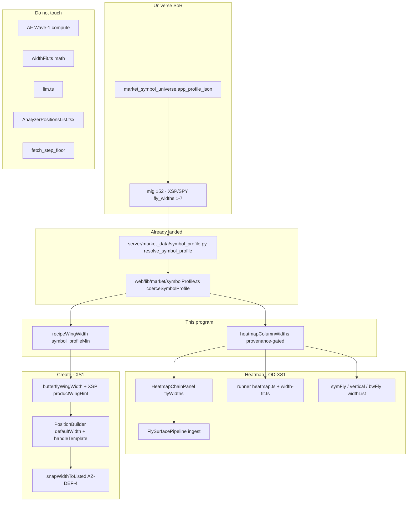
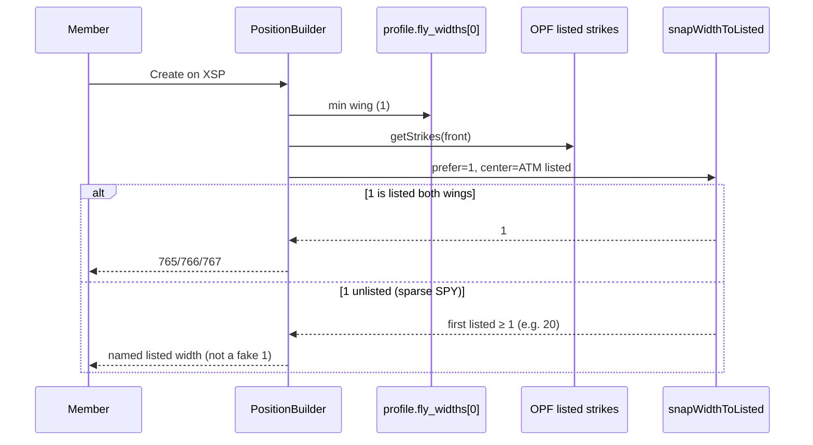
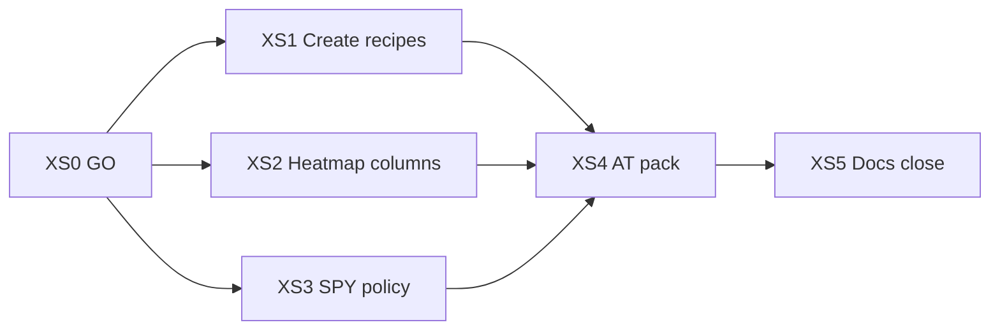

# Options Lab — XSP / SPY Scale Refactor (post WIDTH-1)

**Document type:** Dual identity — Grok design document **and** FatTail Labs Full Agent Bench Plan  
**Date:** 2026-09-13  
**Status:** **SUPERSEDED** by [`docs/Options-Lab-XSP-SPY-Scale-Full-Agent-Bench-Plan-v1.2.md`](./Options-Lab-XSP-SPY-Scale-Full-Agent-Bench-Plan-v1.2.md). Do **not** stamp `XS0-0` against this file.  
**Plan revision:** **v1.1**  
**Author:** Juliet (orchestration) / design-doc-writer  
**Authority:** Coach (GO / ship)  
**Canonical land path:** `docs/Options-Lab-XSP-SPY-Scale-Full-Agent-Bench-Plan-v1.1.md`  
**Parent:** v1.0 (2026-09-12). Advisor fold: Claude review 2026-09-13 — **Amend, not Stop.** B1–B4 disposed below. A1 and A3 raised as ODs (Coach take or leave).  
**This file is plan-only.** Do not implement, commit, deploy, bump a Spec, or edit `AnalyzerPositionsList.tsx`.

### Advisor fold (Claude 2026-09-13) — required for v1.1

| ID | Finding | v1.1 disposition |
|----|---------|------------------|
| **B1** | Overlay gate `max ≤ 7` makes the constant authoritative and the database advisory | Gate on **`profile.source === "market_symbol_universe"`** and **`fly_width_mode === "fixed_points"`**. Empty/invalid overlay **fails loud**. Constant is kind-default / offline fallback only |
| **B2** | AT-XS7 is byte-identical to the fallback (LIM E15 class) | **AT-XS7c** interior overlay `[1,2,3]` with universe `source` → `[1,2,3]`. **AT-XS7d** `[1..8]` universe overlay is **not** clamped to 7 |
| **B3** | QQQ and IWM labelled non-regression while carrying the same $1-grid / 10…50 defect, worse on IWM | **Deferred defects**, not known-good. Named follow-on **XS-ETF**. This packet does not move them |
| **B4** | L12 licensed runner (constant) ≠ panel (database) | **OD-XS10**, not a plan lock. Juliet rec: pass the **resolved list** on `ChainContext.columnWidths`. Runner must not independently call the helper with symbol-only |
| **A1** | L11b applies hint=1 to nine templates without per-template judgment | **OD-XS9**. This packet: butterfly + `labCreateOpenDefault` only. Remaining eight stay until Coach Accepts |
| **A2** | Dead `min < 10` clause | Moot. Value gate removed (B1) |
| **A3** | `axisSpot` `SPX \|\| XSP → 6000` is stale on **both** arms (SPX ~7655) | OD-XS7 notes both arms. This packet XSP only; SPX fallback is a named deferred defect |

**W0 artifact (proposed):** [`agents/go/XS0-W0.md`](../../agents/go/XS0-W0.md) — Delta reads **that file**, not chat (**DL-328**).  
**Board (Juliet recommendation · OD-XS4):** [`agents/p-options-lab-xsp-spy-scale/`](../../agents/p-options-lab-xsp-spy-scale/) — **new**. Do **not** reopen closed Width Fit WF1–WF5.  
**Governance:** [`agents/bench/doctrine.md`](../../agents/bench/doctrine.md) · [`AGENTS.md`](../../AGENTS.md)

**Machine:** Coach’s MacBook (dev). Next `:3000` · FastAPI `:4000`. **Do not stop them.** Nothing deploys unless Coach names MiniTwo. Never `git add -A`.

**WIDTH-1 prerequisite (done — do not re-plan):** commit `a27f187` `fix(options-lab): XSP and SPY fly ladders are 1–7 points` on this MacBook only (`main` **ahead 1** of `origin/main` `2dc4007`). **DL-699.**

---

**Primary law:**

| Doc | Path | Status |
|-----|------|--------|
| Analyzer Spec **v0.2.1** | [`Specs/FatTail-Labs-Options-Lab-Analyzer-Spec-v0_2.md`](../../Specs/FatTail-Labs-Options-Lab-Analyzer-Spec-v0_2.md) | **AZ-DEF-4** listed min wing from profile — never invent unlisted arithmetic width |
| Create / Edit Dialog Spec **v0.13** | [`Specs/FatTail-Labs-Options-Lab-Create-Edit-Position-Dialog-Spec-v0_13.md`](../../Specs/FatTail-Labs-Options-Lab-Create-Edit-Position-Dialog-Spec-v0_13.md) | **AT-DLG-22:** Centre / Width / structure-level Expiration **struck** (Coach 2026-09-12). Do not restore a Width picker unless Coach reverses this |
| Advanced Fly Spec **v0.2.1** (content **v0.2.3**) | [`Specs/FatTail-Labs-Options-Lab-Heatmap-Advanced-Fly-Spec-v0_2.md`](../../Specs/FatTail-Labs-Options-Lab-Heatmap-Advanced-Fly-Spec-v0_2.md) | §3.2 columns **10…50 × 5** for every variant · **DL-435**. Reconnecting XSP/SPY **requires a new DL** |
| Width Fit Spec **v0.1.1** | [`Specs/FatTail-Labs-Options-Lab-Heatmap-Width-Fit-Spec-v0_1.md`](../../Specs/FatTail-Labs-Options-Lab-Heatmap-Width-Fit-Spec-v0_1.md) | **BUILD AUTHORITY** · **DL-525**. Geometry = Advanced Fly columns. Closed WF1–WF5 · **DL-526** |
| Heatmap Templates Spec **v0.2.4** | [`Specs/FatTail-Labs-Options-Lab-Heatmap-Templates-Spec-v0_2.md`](../../Specs/FatTail-Labs-Options-Lab-Heatmap-Templates-Spec-v0_2.md) | HM1–HM20 · dual-side · pure templates |
| OPF Truth · **DL-309** | [`Specs/FatTail-Labs-Options-Lab-OPF-Truth-and-Elegant-Failure-Doctrine-v1.1.md`](../../Specs/FatTail-Labs-Options-Lab-OPF-Truth-and-Elegant-Failure-Doctrine-v1.1.md) | OPF-held dual-side chain is sole instrument truth |
| Human Interface Spec v1.0 | [`Specs/FatTail-Labs-Human-Interface-Spec-v1.0.md`](../../Specs/FatTail-Labs-Human-Interface-Spec-v1.0.md) | HIG · ≥44 pt |
| Arch **28** / **29** | Market Bus · Heatmap templates | Do not add per-widget Massive |
| **DL-435** | Heatmap Advanced Fly columns 10…50 by 5 | **In force for SPX-class until a new DL** |
| **DL-699** | XSP/SPY profile `fixed_points` `[1..7]`; Create offline `defaultWidth` = 1 | **Landed** `a27f187`. Explicitly **does not** reconnect heatmap |
| Spread probe | [`docs/evidence/quant-spread-probe-XSP-2026-09-04.txt`](../../docs/evidence/quant-spread-probe-XSP-2026-09-04.txt) | 20+ OTM XSP: puts **95.8%** bid-null, calls **100%** bid-null |

Specialists execute **only** via seeds. Coordination only through **Coach** or **Juliet**.  
Delta gates: **PASS / FAIL / BLOCKED** with evidence — **never waived**.  
**Coach may overrule** a specialist finding via **DL entry with reasoning** — that is **not** a gate waive.

**No spec version bump unless Coach names it (OD-XS5).** Silent default is still a **DL that amends AF §3.2 for XSP/SPY** plus one changelog row in the existing Spec file, without changing the version header. A lying §3.2 is not authorized.

**DL-539 / doctrine §15:** LIM and Quant Lab fill-friction are the **active programs** today (`AGENTS.md`). This plan is a **candidate third tree**. It does not fire until Coach stamps `XS0-W0` **and** either (a) reassigns the AGENTS.md active-program line **in PR 1 / the GO commit** (Juliet rec, QFRIC B1 pattern) **or** (b) records three successive OKs on the token. One “create a build plan” is not three OKs and is not a GO. XS5 does not introduce the tree.

---

## Overview

WIDTH-1 (`a27f187`, **DL-699**) overlayed XSP and SPY `app_profile_json` so `fly_width_mode = "fixed_points"` and `fly_widths = [1, 2, 3, 4, 5, 6, 7]`, and wired Position Builder Create’s **offline** `defaultWidth()` to return **1** for those two symbols. SPX Create still seeds **20-wide**. Heatmap Advanced Fly / Width Fit columns were **explicitly left** on **DL-435** `HEATMAP_FLY_WIDTHS = [10, 15, …, 50]`.

That split is now the product defect. A member who opens XSP Create (RTH, dense $1 grid) sees a fillable 1-wide fly (evidence `01-xsp-1-wide.png`, 765/766/767 at spot ~765.70). The same member who opens Heatmap Advanced Fly or Width Fit on XSP still sees **10…50** columns — every column’s wing sits in the 95.8–100% bid-null region of the 2026-09-04 probe. Create **butterfly / `labCreateOpenDefault`** still hardcode `DEFAULT_CREATE_WING_WIDTH` (20) for every symbol, so `handleTemplate` re-seeds 20 on XSP. `productWingHint("XSP")` is separately 20 (non-butterfly Lab recipes); **`productWingHint("SPY")` is already 5**, not 20. SPY Create **prefers** 1 but `snapWidthToListed(1)` on a sparse off-market listed chain snapped to **20-wide** (744/764/784) because AZ-DEF-4 forbids inventing an unlisted 1-wide.

This program reconnects the **remaining consumers** of fly scale — heatmap column lists, Create/recipe seeds, and any other XSP/SPY-as-mini-SPX hardcodes in the Options Lab fly path — to the **1–7 profile** (or the **minimum listed** wing), without moving SPX/NDX/RUT/VIX/QQQ/IWM, without touching `fetch_step_floor`, without editing `AnalyzerPositionsList.tsx`, and without reopening Advanced Fly Wave-1 or Width Fit math.

---

## Background & Motivation

### Why a 20-wide XSP fly is undoable

XSP is a **mini-SPX** in settlement (`kind = index`) and a **$1 product** in strike grid (`strike_step = 1.0`, migration 119). Migration 119 seeded `app_profile_json` by **kind**, so every index inherited the SPX ladder `[20, 25, 30, 35, 40, 45, 50]`. Relative to spot (~765), a 20-wide XSP fly is **2.6% of spot** — the same relative structure as a **200-wide SPX** fly, four times SPX’s widest heatmap column.

Coach: *“a 20 wide fly in XSP is undoable.”*

Spread probe 2026-09-04 (`docs/evidence/quant-spread-probe-XSP-2026-09-04.txt`, also QFRIC evidence):

| Side | OTM band | n | bid-null |
|------|----------|---|----------|
| P | 20-inf | 6,192 | **95.8%** |
| C | 20-inf | 6,195 | **100%** |
| P | 0–2 | 12,898 | 2.2% |
| C | 0–2 | 12,898 | 4.7% |

Every column on the old XSP heatmap ladder has a wing with no bid. Learner capacity: presenting that as the default teaches the member a structure they cannot fill.

### WIDTH-1 as-built (do not re-litigate)

Commit `a27f187db22b5a7b3756531dafbef4b3c431c8b4` (2026-09-12, this MacBook, **not pushed**).

| File | What landed |
|------|-------------|
| `migrations/152_xsp_spy_fly_widths.sql` | NULL rows get a **kind-shaped `JSON_OBJECT`** then `JSON_SET` the two keys. Existing `app_profile_json` objects are **JSON_SET only** (no replace). **Does not** touch `fetch_step_floor` |
| `web/components/options-lab/PositionBuilder.tsx` `defaultWidth()` | XSP/SPY → **1**; SPX/RUT → 20; NDX/NQ* → 50. Create seed uses `defaultWidth(symbol, profileMinWing)` so Create actually consumes `profile.fly_widths[0]` |
| `Architecture/00-decision-log.md` | **DL-699** |
| Evidence | `agents/p-options-lab-heatmap-width-fit/gate-reports/width1/{01-xsp-1-wide,02-spy-1-wide,03-spx-20-wide}.png` |

Resolved JSON after migrate (DL-699):

- **XSP:** `fly_width_mode: "fixed_points"`, `fly_widths: [1..7]`, kept `fetch_step_floor: 5.0` (inert: `chain_ladder.py` applies the floor only when `not is_index`).
- **SPY:** same 1–7, kept `fly_width_count: 8`, `fetch_step_floor: 2.5`.
- **SPX** unchanged `msc_spx` 20…50. **VIX** (other index) unchanged 20…50. **QQQ/IWM** still `step_multiples`.

Create evidence:

- XSP **1-wide** 765/766/767 at spot ~765.70.
- SPY profile 1–7 but seed **snapped to 20-wide** 744/764/784 on sparse off-market listed chain (`snapWidthToListed(1)` → 20 because first symmetric listed fly was 20).
- SPX **20-wide** 7635/7655/7675 unchanged.
- Heatmap columns still DL-435 `HEATMAP_FLY_WIDTHS` 10…50 by 5.

Untracked leftover (XS4 owns and lands it): `web/e2e/width1-xsp-spy.spec.ts`. Today `OUT` is `agents/p-options-lab-heatmap-width-fit/gate-reports/width1` and the title asserts “SPY seed 1-wide” without asserting width. **Do not land that path.** Re-home `OUT` to `agents/p-options-lab-xsp-spy-scale/gate-reports/xs4/` and assert listed honesty for SPY.

### Pain remaining

1. Heatmap Advanced Fly / Width Fit / runner paint still call `heatmapFlyWidths()` which **discards** step/count and returns `[10…50]`.
2. Create **recipes** still treat XSP as SPX-20 on two **different** paths (do not conflate them):
   - **Butterfly / `labCreateOpenDefault`:** hardcode `DEFAULT_CREATE_WING_WIDTH` (20) for **every** symbol, including XSP and SPY. This is the 20-wide Create-open leak.
   - **`productWingHint`:** `SPX || XSP → 20`; SPY **falls through to 5** (not 20); NDX/NQ* → 50; RUT → 20; else 5. Vertical / bwb / condor / iron_fly / etc. use this hint. XSP non-butterfly Lab recipes are 20; SPY non-butterfly recipes are already 5.
3. Switching Strategy in the dialog with Lab defaults active re-seeds via `labDefaultForStrategy` — butterfly 20 on XSP/SPY; other templates follow the hint.
4. SPY off-hours listed snap vs 1-wide intent is unresolved product law (AZ-DEF-4 vs WIDTH-1 desire).
5. `kindDefaultProfile("XSP", "index")` on the client still returns MSC_SPX 20…50. `useOptionsLab()` **always** returns a coerced profile (`web/lib/optionsLabContext.tsx` L100–115), so a helper that “falls back when `fly_widths` is empty” **never runs** on the panel. XSP offline would paint 20…50; SPY etf would paint step-multiples 1…8.

---

## Goals & Non-Goals

### Goals

1. XSP Create (RTH, dense listed $1 grid) seeds a **1-wide adjacent listed** butterfly; walking legs stays inside **1…7** when those widths are listed.
2. SPY Create follows **Coach’s OD-XS2** (default rec: listed-only snap; prefer 1; honest 20 when 1 is unlisted; named state, not a lying 1-wide).
3. Non-regression for **SPX / NDX / RUT / VIX** (index / SPX-class): Create recipes that are 20 today stay 20 (NDX butterfly stays 20, not 50 — JR2); `defaultWidth` NDX/NQ stays 50 (WIDTH-1 Keep); heatmap columns stay `HEATMAP_FLY_WIDTHS` 10…50 (DL-435 remainder). **QQQ and IWM are not in this sentence** — they are **deferred defects** (B3), not known-good.
4. Heatmap Advanced Fly **and** Width Fit columns on **XSP and SPY** consume the **universe overlay** (`source === "market_symbol_universe"` ∧ `fixed_points`), never kind-default MSC_SPX. Heatmap **SPX / NDX / RUT / VIX stays 10…50** (DL-435 remainder).
5. Butterfly / `labCreateOpenDefault` stop returning 20 for XSP/SPY via a **butterfly-only** resolver (not via `productWingHint`). Remaining Lab templates are **OD-XS9** (silent: leave `productWingHint("XSP")` at 20). **iron_condor multiplier stays `Math.max(w, w*2)`.** SPY non-butterfly recipes stay at today’s hint (5).
6. Characterization: tsc, targeted pytest (profile 1–7 **and** live migrate-152 evidence), Playwright shots, no `AnalyzerPositionsList` edits, no MiniTwo.
7. **If OD-XS1 (a):** a new DL records the **scoped** DL-435 reversal (XSP/SPY heatmap only) **in the same PR as the helper**, and AF Spec §3.2 is amended by that DL + a changelog row **without** a version bump unless Coach names a bump (OD-XS5). **If OD-XS1 (b):** do not file that DL and **do not touch AF §3.2**. Silent overwrite of DL-435 is a FAIL.

### Non-goals (explicit)

| ID | Out |
|----|-----|
| **NX1** | Re-plan or re-do WIDTH-1 (`a27f187`, migration 152, `defaultWidth`) |
| **NX2** | Touch `fetch_step_floor` (XSP 5.0 / SPY 2.5 stay). Denser Massive fetch is a later Coach-named packet |
| **NX3** | Arithmetic 1-wide on an unlisted grid (violates **AZ-DEF-4** / OPF Truth) unless Coach Override OD-XS2 (b) |
| **NX4** | Restore Create dialog Width / Centre / Expiration pickers (**AT-DLG-22** / Dialog Spec v0.8+). **L3 LOCKED** — not an OD |
| **NX5** | Move SPX/NDX/RUT/VIX heatmap off 10…50 this program. **Do not “fix” QQQ/IWM heatmap this program either** — they are **XS-ETF**, a named follow-on, not silent scope |
| **NX6** | Reopen `p-options-lab-heatmap` AF0–AF-Z. Do not implement leftover **AF-X** |
| **NX7** | Reopen Width Fit math (WF1–WF5 closed). Do not change `computeCell` / stability penalty / weights |
| **NX8** | Edit `web/components/options-lab/AnalyzerPositionsList.tsx` (card DOM byte-identical except TosPadlockGlyph, already landed) |
| **NX9** | MiniTwo / DudeTwo / production. Do not stop `:3000` / `:4000` |
| **NX10** | Spec **version bump** unless Coach names it (OD-XS5). Changelog row without bump is in scope |
| **NX11** | QFRIC / `TICK_BY_BOOK` / Quant Lab files (DL-679 isolation) |
| **NX12** | LIM compute, registry, or `lim.ts` (DL-652). LIM tests that **fixture** `HEATMAP_FLY_WIDTHS` stay on the SPX-class constant |
| **NX13** | Market Bus Redis, extra WebSockets, per-widget Massive |
| **NX14** | Rewrite stored user Create presets in localStorage |
| **NX15** | Change `kind_defaults("index")` globally (would hit VIX/SPX/NDX/RUT) |
| **NX16** | Add `symbol` to `useOptionChainBus` return / stamp generation symbol on the bus (Market-bus sibling). Ingest skip is a **panel ref**, not a bus change |
| **NX17** | Change `iron_condor` `Math.max(w, w*2)` multiplier |

---

## 0. Product / architecture law (in scope)

| Cluster | Ship meaning |
|---------|----------------|
| **Profile is scale SoR** | Universe overlay (`source: "market_symbol_universe"`) is the width list. Kind-default (`source: "client_kind_default"`) is **not** the overlay. Kind is a **settlement** label, not a scale discriminator (**DL-699**). The helper constant is **offline / kind-default fallback only**, never a clamp on a live overlay |
| **AZ-DEF-4** | Butterfly opens at **minimum listed wing** from symbol profile — never invent unlisted arithmetic width |
| **AZ-DEF-9** | Empty Create default template = butterfly |
| **DL-435 remainder** | SPX-class heatmap columns stay **10…50 by 5** until Coach expands |
| **DL-435 scoped reverse** | XSP/SPY heatmap columns may consume profile 1–7 **only** via a **new DL** (OD-XS1) |
| **AT-DLG-22** | No Width picker in Create dialog. Walk 1→7 via per-leg strike steppers on the listed grid |
| **HM6 / HM8** | Pure templates; unlisted \(K \pm w\) → invalid cell, never snap |
| **OPF / DL-309** | Dual-side chain the OPF holds is the only instrument universe |
| **DL-539** | Do not drift LIM / QFRIC / frozen trees. This board is GO-gated |

**Design invariant:** *XSP and SPY fly scale is the **universe** overlay list (today `[1..7]`; tomorrow whatever admin writes under `fixed_points`), or the minimum OPF-listed symmetric wing. Kind-default MSC_SPX must not paint. SPX / NDX / RUT / VIX heatmap remains DL-435 `[10…50]`. QQQ / IWM heatmap `[10…50]` is a **named deferred defect** (XS-ETF), not law. Create never presents an unlisted arithmetic width as a finished butterfly. Panel and runner consume **one** resolved width list.*

---

## 1. Mission

```text
Universe profile (XSP/SPY: fixed_points 1–7)
  → one column-width resolver (heatmap) + one recipe-width resolver (Create)
       heatmap: XSP/SPY → universe overlay (today 1–7) ; SPX/NDX/RUT/VIX → HEATMAP_FLY_WIDTHS
       QQQ/IWM heatmap 10…50 is XS-ETF (deferred defect, not this mission)
       Create:  prefer profile[0] (=1) → snapWidthToListed (AZ-DEF-4)
  → Advanced Fly / Width Fit / runner paint consume the resolver
  → labDefaultForStrategy / labCreateOpenDefault / handleTemplate consume the recipe
  → AT pack: XSP 1-wide listed · SPY per OD-XS2 · SPX 20 · heatmap SPX 10…50
```

| Pillar | Law | Ship meaning |
|--------|-----|----------------|
| Profile overlay | DL-699 · mig 152 | Already landed — Keep |
| Create seed | AZ-DEF-4 · `defaultWidth` | WIDTH-1 landed for Create **open**; recipes still 20 |
| Heatmap columns | OD-XS1 · new DL | XSP/SPY 1–7; SPX-class 10…50 |
| Listed honesty | AZ-DEF-4 · HM8 | Prefer 1; if unlisted, snap up (or named state) — never invent |
| Learner capacity | Tango · probe | Do not default an unfillable 20-wide XSP fly |
| Isolation | DL-539 · DL-652 · DL-679 | No LIM file, no QFRIC file, no AnalyzerPositionsList |

**First smoke after XS1 + XS2:**  
(1) XSP Create → 1-wide listed butterfly.  
(2) Strategy switch (Lab defaults) on XSP butterfly still 1-wide, not 20.  
(3) SPX Create still 20-wide.  
(4) Heatmap Advanced Fly on XSP: columns **1,2,3,4,5,6,7**.  
(5) Heatmap Advanced Fly on SPX: columns **10,15,…,50**.  
(6) Width Fit footer \(n\) is per those columns.  
(7) Card list DOM untouched.

---

## 2. As-built honesty (Keep / Build / Gap)

### 2.1 Keep (do not rebuild)

| Area | Path / fact |
|------|-------------|
| WIDTH-1 profile overlay | `migrations/152_xsp_spy_fly_widths.sql` · **DL-699** · `a27f187` |
| Create open `defaultWidth` | `PositionBuilder.tsx` L188–195: XSP/SPY → 1 |
| Listed snap | `listedStrikes.ts` `listedWingChoices` / `snapWidthToListed` |
| Listed structure placement | `listedStructure.ts` — arithmetic is intent; placement is grid |
| Heatmap SPX-class constant | `symFly.ts` `HEATMAP_FLY_WIDTHS` `[10…50]` — **keep the constant** |
| Width Fit math | `widthFit.ts` raw components + `assignColors` penalty — **byte-identical** |
| Advanced Fly Wave-1 modes | debit/credit/greeks/slope/curvature — **byte-identical on SPX fixture** |
| Dual-side bus | `useOptionChainBus` · Arch 28 |
| Dialog Width removal | AT-DLG-22 — **keep absent** |
| `fetch_step_floor` | XSP 5.0 inert; SPY 2.5 equity floor — **untouched** |
| SPX/RUT/NDX/VIX profiles | migration 119 kind defaults as landed (heatmap 10…50 is **DL-435 remainder**, intentional for this packet) |
| QQQ / IWM `$1` strike + heatmap 10…50 | **As-built deferred defect**, not Keep-as-correct. Migration 119 `strike_step = 1.0` for `XSP, SPY, QQQ, IWM`. Heatmap still DL-435 `[10…50]`. IWM ~240 spot → 50-wide is **>20% of the underlying**. Named follow-on **XS-ETF**. Do not label this non-regression |
| Card list | `AnalyzerPositionsList.tsx` — **do not open** |
| Parent boards | AF Wave-1 closed · WF1–WF5 closed · LIM active elsewhere · QFRIC isolated |

### 2.2 Build (this program)

| Gap | Evidence | Phase |
|-----|----------|--------|
| Heatmap columns ignore profile | `heatmapFlyWidths()` voids step/count; `HeatmapChainPanel.tsx` L784–785 `useMemo(() => heatmapFlyWidths(), [])` — **no symbol, no profile, empty deps** | **XS2** |
| Runner paint ignores profile | `web/lib/runner/templates/heatmap.ts` L28 `fixedPoints: heatmapFlyWidths()`; `width-fit.ts` L33/42 | **XS2** |
| `widthList` fallthrough | `symFly.ts` L66–76: `fixed_points` honors `params.fixedPoints`, else calls `heatmapFlyWidths()`. Panel never passes profile points | **XS2** |
| Width Fit template fallback | `widthFitTemplate.ts` L21–26: empty `fixedPoints` → `heatmapFlyWidths()` | **XS2** |
| Pipeline cap coupling | `flySurfacePipeline.ts` L39–40 `FLY_MAX_WIDTHS = HEATMAP_FLY_WIDTHS.length` (9). ingest `.slice(0, FLY_MAX_WIDTHS)` | **XS2** (cap stays ≥9; do not shrink to 7) |
| Vertical / bw-fly widthList | `vertical.ts` L73–77, `bwFly.ts` L41–50 — same `heatmapFlyWidths` fallthrough | **XS2** (same resolver; SPX-class unchanged) |
| `productWingHint("XSP")` = 20 | `builderCreateDefault.ts` L91–96: `if (s === "SPX" \|\| s === "XSP") return 20`. **SPY is not in that branch** — SPY hint is already **5** | **XS1** (XSP → 1; SPY hint stays 5) |
| Butterfly recipe = 20 all symbols | L141–152 `wingWidth: DEFAULT_CREATE_WING_WIDTH`; L250–260 `labCreateOpenDefault` — **this** is why tests assert SPY 20 | **XS1** (`butterflyWingWidth`: XSP\|SPY → 1 else 20) |
| Tests assert 20 for XSP/SPY/NDX/QQQ/IWM/AAPL/RUT | `builderCreateDefault.test.ts` L65–75 | **XS1** (split XSP/SPY → 1; **keep** the 20 loop for every other symbol) |
| `handleTemplate` Lab path | `PositionBuilder.tsx` L1310–1338 uses `lab.wingWidth` then `snapWidthToListed` — re-seeds **20** on XSP butterfly | **XS1** |
| `DEFAULT_CREATE_WING_WIDTH` fallbacks | PositionBuilder L575, 756, 1061, 1314, 1381, 1521, 1533 — SPX-class 20 constant; must not win over butterfly resolver for XSP/SPY | **XS1** |
| `defaultDiagonalWidth("XSP")` = 15 | PositionBuilder L307–311 — mini-SPX (15 on XSP ≈ 150 on SPX). **SPY already returns 5** (`else 5`) | **XS1** (OD-XS7: XSP only) |
| Client kind default vs helper | `useOptionsLab` always coerces (`optionsLabContext.tsx` L100–115). XSP index → MSC_SPX `[20…50]` with `source: "client_kind_default"`; SPY etf → step-multiples `[1..8]`, same source. Live API rows carry `source: "market_symbol_universe"` (`symbol_profile.py:183`) | **XS2** provenance gate (B1) |
| No pytest for XSP/SPY profile | `server/tests/test_symbol_profile.py` covers SPX msc + TSLA step only | **XS4** |
| Untracked e2e | `web/e2e/width1-xsp-spy.spec.ts` | **XS4** owns and lands |
| `flyWidthsFromProfile` unused | Defined in `symbolProfile.ts` L119–141; **zero heatmap callers**. Blind use on SPX would drop columns 10 and 15 (profile is 20…50) — **do not** call it for all symbols | **XS2** (symbol-scoped helper instead) |
| Heatmap already has `profile` | `HeatmapChainPanel.tsx` L318–319 `useOptionsLab()` — uses `default_wings` / side / template, **not** `fly_widths` | **XS2** |
| axisSpot XSP = 6000 | `OpfRiskAnalyzer.tsx` L1518–1520 empty-shell fallback treats XSP as SPX. Spot ~765 vs 6000 | **OD-XS7** (Juliet rec: small XS1 seed) |

### 2.3 Gap map (verified inventory — XSP/SPY treated as mini-SPX)

**In scope (fly scale):**

| Location | Today | Target |
|----------|-------|--------|
| `productWingHint` | XSP → **20**; SPY → **5** (fallthrough); NDX → 50; RUT/SPX → 20 | **OD-XS9 silent: leave XSP at 20 this packet.** Used as `w` by vertical / bwb / condor / iron_fly / calendar / diagonal / straddle / strangle / single. Changing it to 1 without per-template judgment is A1. **iron_condor** keeps `Math.max(w, w*2)` |
| `labDefaultForStrategy("butterfly")` | `DEFAULT_CREATE_WING_WIDTH` 20 **all symbols** (ignores the hint) | `butterflyWingWidth(symbol)`: XSP\|SPY → 1 else **20**. Do **not** call `productWingHint` (that would make NDX butterfly 50 — JR2) |
| `labCreateOpenDefault` | 20 all symbols | same as `butterflyWingWidth` |
| `builderCreateDefault.test.ts` | asserts 20 for SPX, XSP, SPY, QQQ, IWM, AAPL, NDX, RUT | XSP/SPY butterfly → 1; **keep** 20 for SPX, RUT, NDX, QQQ, IWM, AAPL. XSP templates with `wingWidth: w` → 1; XSP iron_condor → **2** |
| `HeatmapChainPanel` `flyWidths` | `heatmapFlyWidths()` constant | `heatmapColumnWidths({ symbol, profile })` with overlay gate |
| Runner heatmap / width-fit | `heatmapFlyWidths()` | **OD-XS10 (a):** consume `ctx.columnWidths` (the list the panel already resolved). Do **not** add `profile` to `ChainContext`. Do **not** call `heatmapColumnWidths({ symbol })` as a second SoR |
| `symFly.widthList` / `vertical.widthList` / `bwFly.widthList` | fallthrough to 10…50 | honor `params.fixedPoints` from panel; fallback helper uses `ctx.symbol` |
| `widthFitTemplate.resolveColumns` | empty points → 10…50 | helper |
| `PositionBuilder.defaultDiagonalWidth` | XSP → 15; SPY already **5** | OD-XS7 rec: XSP → 1. **SPY diagonal is out** unless Coach expands |
| `kindDefaultProfile` XSP offline | MSC_SPX 20…50, `source: "client_kind_default"` | do not change kind defaults; helper **rejects** any profile whose `source` is not `market_symbol_universe` |

**Related, default out unless OD-XS7 Accept:**

| Location | Note |
|----------|------|
| `OpfRiskAnalyzer.tsx` L1518–1520 `if (s === "SPX" \|\| s === "XSP") return 6000` | Empty-shell axis only (before first mark). **Both arms are stale** (A3): XSP spot ~765 vs 6000; SPX spot ~7655 vs 6000 (~20% low). OD-XS7 this packet: **XSP only**. SPX fallback is a named deferred defect, not silently “fixed” and not labelled fine |
| `shapeFromBuilderState` fallback 20 | Snapshot helper; OK as SPX-class default |

**Out (not fly-width scale — do not touch):**

| Location | Why |
|----------|-----|
| `web/lib/options-lab/tickSize.ts` `XSP: 0.01` | Correct OCC tick |
| `web/lib/options-lab/whatIfClocks.ts` `INDEX_PM` includes XSP | Session class, not scale |
| `server/quant/friction.py` `TICK_BY_BOOK = {"XSP": 0.01}` | **QFRIC** isolation (O-R5) |
| `server/routes/chain_ladder.py` XSP step guess 1.0 | Correct; `fetch_step_floor` inert for index |
| `server/market_data/vp_eligibility.py` XSP → SPY series | VP tape proxy, not fly width |
| `MonteCarloLab.tsx` `MULT = 100` | Contract multiplier, correct |
| Strategy-lab-proto / MSC risk-graph | Not this repo’s Options Lab product path |
| LIM / GEX templates | Not fly-width columns |

### 2.4 Explicit non-phases

See Non-goals NX1–NX15. **XS-W (Width picker) is never drawn on this board.** AT-DLG-22 / Dialog Spec v0.13 already struck Width / Centre / structure Expiration. Coach may reopen that on the Dialog board; this program does not.

---

## 3. Locked decisions + open decisions (OD-XS*)

**L* below are PROVISIONAL until XS0-0.** Coach disposes ODs on `XS0-W0.md`.

| ID | Decision | Source | State |
|----|----------|--------|--------|
| **L0** | WIDTH-1 (`a27f187` · DL-699 · mig 152) is **done**. This program does not re-edit those diffs except XS1 `handleTemplate` / recipe call sites in `PositionBuilder.tsx` | Coach · this plan | PROVISIONAL |
| **L1** | Heatmap XSP/SPY columns = **universe overlay** when `source === "market_symbol_universe"` **and** `fly_width_mode === "fixed_points"` **and** `fly_widths.length > 0`. Kind-default (`client_kind_default`) must **not** paint, even if someone stuffed a 1–7 list into it. Empty universe overlay **fails loud** (no constant substitute). Offline / kind-default fallback is `XSP_SPY_FLY_WIDTHS`. Heatmap SPX / NDX / RUT / VIX stays `HEATMAP_FLY_WIDTHS` 10…50 | OD-XS1 rec (a) · **B1** | PROVISIONAL |
| **L2** | Create prefer `fly_widths[0]` then **listed snap** (AZ-DEF-4). Never arithmetic unlisted 1-wide | OD-XS2 rec (a) | PROVISIONAL |
| **L3** | No Create Width picker. AT-DLG-22 / Dialog Spec v0.13 already struck Width / Centre / structure Expiration. **This board never draws XS-W.** Coach may reopen Dialog; that is not an OD on this token | Standing (Dialog law) | **LOCKED** |
| **L4** | New board `p-options-lab-xsp-spy-scale` · token `XS0-W0` · seeds `XS0-*` | OD-XS4 rec | PROVISIONAL |
| **L5** | No Spec **version bump** unless Coach names it. Silent OD-XS5 still requires (1) a **DL that amends AF Spec §3.2 for XSP/SPY only** and (2) India to record that amendment in the existing Spec **changelog table** without changing the version header. A lying §3.2 is not authorized | OD-XS5 rec + doctrine parity | PROVISIONAL |
| **L6** | Keep `a27f187` local until this program’s Create/heatmap PRs are ready to push together, **or** push as PR 0 if Coach wants WIDTH-1 on origin now | OD-XS6 rec: keep local | PROVISIONAL |
| **L7** | `HEATMAP_FLY_WIDTHS` constant **unchanged**. New helper `heatmapColumnWidths`. Do not mutate the constant (LIM/AF fixtures) | Juliet | Plan lock |
| **L8** | `FLY_MAX_WIDTHS` remains a **cap ≥ 9**, not a required column count. 7 XSP columns must not slice SPX to 7 | Juliet | Plan lock |
| **L9** | **SPX / NDX / RUT / VIX** heatmap stay 10…50 this packet (DL-435 remainder). Create 20 where today 20 (JR2). **QQQ / IWM heatmap 10…50 is a deferred defect (XS-ETF), not a non-regression Keep.** This packet must not *change* them and must not *bless* them | **B3** | PROVISIONAL |
| **L10** | `AnalyzerPositionsList.tsx` is frozen | Standing constraint | LOCKED (standing) |
| **L11** | Butterfly uses `butterflyWingWidth` (XSP\|SPY → 1 else 20), **never** `productWingHint`. **iron_condor multiplier unchanged.** Remaining XSP Lab templates are **OD-XS9**, not a plan lock | Juliet · **A1** | Plan lock |
| **L12** | **Withdrawn as a plan lock (B4).** Runner vs panel width SoR is **OD-XS10**. Silent rec: one resolved list on `ChainContext.columnWidths`. No `profile` on `ChainContext`. No symbol-only helper call in the runner | Claude B4 | see OD-XS10 |
| **L13** | AGENTS.md active-program line + reassignment DL land at **XS0-0 / PR 1**, before the first product edit. XS5 does pointer honesty only | OD-XS0 · QFRIC B1 | Plan lock |
| **L14** | **If OD-XS1 (a):** scoped DL-435 reverse (XSP/SPY heatmap only; SPX-class remainder 10…50) appends to `00-decision-log.md` **in the same PR as the helper** (PR 3). **If OD-XS1 (b): do not file that DL and do not amend AF §3.2.** XS5 does residual / Arch 29 only | Doctrine: reversals are new DLs, never silent | Plan lock |

### OD table — Coach Accept / Override at XS0-0

| # | Question | Juliet recommendation | If Coach silent at GO |
|---|---------|----------------------|------------------------|
| **OD-XS0** | Active-program line (`AGENTS.md` · DL-539) | **Reassignment DL** naming this board alongside LIM/QFRIC (QFRIC B1 pattern). Lands in **PR 1 / XS0-0**, before any product edit. Three-OK log unused if reassigned | **BLOCKED** — do not fire XS1 |
| **OD-XS1** | Heatmap XSP/SPY columns | **(a)** overlay `fly_widths` 1–7 + new DL reversing DL-435 **for XSP/SPY only** (DL in **PR 3**, same as the helper). (b) keep DL-435 10…50 on heatmap forever | **(a)** |
| **OD-XS2** | SPY off-market snap 1 → 20 | **(a)** listed-only (honest 20 when 1 unlisted; Tango copy). (b) arithmetic 1-wide (violates AZ-DEF-4). (c) denser fetch / `fetch_step_floor` (NX2 — new packet). (d) documented off-hours exception only | **(a)** |
| **OD-XS4** | New board vs extend `p-options-lab-heatmap-width-fit` | **New** `p-options-lab-xsp-spy-scale`. WF board is **closed** (WF5-G · DL-526). WIDTH-1 shots may stay where they are as historical evidence; new gates live on the new board | **New board** |
| **OD-XS5** | Spec **version bump** vs DL + changelog row | **No version bump.** Required tick: DL amends AF §3.2 for XSP/SPY only **and** India writes one changelog row in the existing AF Spec file **without** changing the version header. Override: Coach names a versioned bump | **DL + changelog row, no bump** |
| **OD-XS6** | Push `a27f187` now (PR 0) vs hold until this program | **Hold local** until XS1+XS2 are reviewable together, unless Coach wants WIDTH-1 on origin immediately | **Hold** |
| **OD-XS7** | `defaultDiagonalWidth(XSP)=15` and `axisSpot` `SPX \|\| XSP → 6000` | **In scope, XSP only.** SPY diagonal already 5; SPY axisSpot already 100 — out. **A3:** the SPX arm is also stale (~7655 vs 6000). Do not “fix” SPX this packet; name it as a deferred defect on the token | **XSP only**; SPX `axisSpot` deferred |
| **OD-XS8** | Vertical / bw-fly heatmap columns on XSP/SPY | **Same resolver** as Advanced Fly (one column list per symbol). Do not leave vertical on 10…50 while flies are 1–7 | **Same resolver** |
| **OD-XS9** | XSP Lab templates besides butterfly (vertical, bwb, condor, iron_fly, calendar, diagonal, straddle, strangle, single — and iron_condor via `2×` hint) | **(a)** Butterfly-only this packet; leave `productWingHint("XSP")` at 20; Hotel seats a later packet. **(b)** `productWingHint("XSP")` → 1 for all `wingWidth: w` templates (v1.0 L11b). A 1-wide XSP strangle is nearly a straddle | **(a)** butterfly-only (**A1**) |
| **OD-XS10** | Runner vs panel width SoR after XS2 | **(a)** Pass the **resolved list** as optional `ChainContext.columnWidths`. Panel sets it from `heatmapColumnWidths({ symbol, profile })`. Runner / pipeline consume that list. If XSP/SPY and the list is missing, **fail loud** (empty cols) — do not call the helper with symbol-only. **(b)** Share one call site that always receives `{ symbol, profile }`. **(c)** Descope runner from XS2 **and** leave the **panel** on the constant too until `ChainContext` can carry the list (no two answers). A knowing divergence needs a **DL with Coach’s name**, not a plan lock | **(a)** one list (**B4**) |

**OD-XS3 withdrawn.** Width picker is **L3 LOCKED** (AT-DLG-22). Not a scale OD. Do not put it on the token as an open question.

Juliet recs (dispose on the same stamp):

| Rec | Default if Coach silent |
|-----|-------------------------|
| **JR1** | Do not call `flyWidthsFromProfile` for all symbols (would change SPX heatmap 10…50 → 20…50) |
| **JR2** | Do not change NDX/QQQ/IWM/AAPL/RUT/SPX butterfly recipes (today 20 via `DEFAULT_CREATE_WING_WIDTH`). Butterfly uses `butterflyWingWidth`, **never** `productWingHint` |
| **JR3** | Do not migrate localStorage user presets |
| **JR4** | Fold `web/e2e/width1-xsp-spy.spec.ts` into XS4; re-home `OUT` to this board’s `gate-reports/xs4/`; assert SPY **prefer=1** and **listed snap honesty**, not a hard `width===1` if the chain is sparse |
| **JR5** | Hotel owns listed-vs-arithmetic; Sheldon is **not** seated (probe already on disk). Hotel also seats **OD-XS9** |
| **JR6** | **OD-XS9 (a):** do **not** change `productWingHint("XSP")` this packet. SPY hint stays 5. Do not “fix” SPY vertical 5 → 1 |
| **JR7** | Provenance gate (B1): accept XSP/SPY overlay only when `source === "market_symbol_universe"` **and** `fly_width_mode === "fixed_points"` **and** `fly_widths` is a non-empty finite list. Kind-default → `XSP_SPY_FLY_WIDTHS`. Universe + empty list → **fail loud**, no substitute. Do **not** clamp `max ≤ 7` |
| **JR8** | Lima flags **XS-ETF** (QQQ / IWM $1-strike heatmap still 10…50) in `Architecture/flagged-ideas.md` at XS0-9. Not this board’s implementation |

---

## 4. Roster & seating

| Callsign | Role this program |
|----------|-------------------|
| **Coach** | XS0-0 GO · OD-XS* · AGENTS.md reassignment · ship/no-ship |
| **Juliet** | Board · seeds · DAG · WF/AF/LIM/QFRIC isolation |
| **India** | AZ-DEF-4 · DL-435 scoped reverse · no silent spec bump · DL-539 tree freeze · L* provisional until stamp |
| **Charlie** | Recipe resolver + heatmap helper + call sites |
| **Hotel** | Listed vs arithmetic (OD-XS2); fillability vs 20-wide XSP; no invented strikes; **OD-XS9** remaining Lab templates |
| **Echo** | Heatmap 7-col vs 9-col layout; no Width picker; HIG ≥44 pt |
| **Tango** | Off-hours SPY honesty copy; no “best width / optimizer”; learner capacity |
| **Kilo** | AT-XS* · pytest profile · Playwright · e2e fold · grep remaining `XSP.*20` |
| **Delta** | Ternary gates with evidence |
| **Lima** | DL GO at XS0-0 · scoped DL-435 reverse **in PR 3** · Arch 29 at XS5 · AGENTS.md **in PR 1** |
| **Mike** | Client-only; no new trust boundary (XS0 note) |
| **Foxtrot** | N/A unless Coach names MiniTwo |

**Not seated:** Bravo, November, Romeo, Papa, Sierra, Gemba, Golf, Sheldon (unless Coach seats Sheldon to re-read the probe), Alpha except a **pytest-only** seed if Kilo does not own `test_symbol_profile.py`.

| Seat | Rule |
|------|------|
| **S1** | Juliet owns DAG · NX discipline · no WF/AF reopen |
| **S2** | India law / DL-435 / AZ-DEF-4 / DL-539 |
| **S3** | Charlie two resolvers + call sites |
| **S4** | Hotel listed honesty |
| **S5** | Echo 7-col heatmap; no dialog Width |
| **S6** | Tango observation-only |
| **S7** | Kilo AT-XS* |
| **S8** | Delta all gates |
| **S9** | Lima DL + hash of **this plan** at GO (no Spec sha1 unless OD-XS5 Override) |
| **S10** | Seeds on disk before XS0-G. **XS0-0 is not stamped until those seed files exist** |

---

## 5. Sacred invariants (this program)

1. **No MSC** heatmap/code.  
2. **OPF-held dual-side chain only** (DL-309).  
3. **AZ-DEF-4:** never invent an unlisted arithmetic wing and present it as a finished butterfly.  
4. **DL-435** remains law for **SPX-class** heatmap columns until a **new DL** scopes a reverse.  
5. **Do not mutate** `HEATMAP_FLY_WIDTHS`. Add a helper. LIM/AF fixtures keep 10…50.  
6. **HM8:** heatmap cells with unlisted \(K \pm w\) are **invalid**, not snapped.  
7. **HM6:** mode switch = zero Massive. Column-list change on symbol change may ingest the **already-held** generation; it must not fetch.  
8. **AT-DLG-22:** no Width / Centre / structure Expiration controls.  
9. **`AnalyzerPositionsList.tsx` is not in the diff.**  
10. **`fetch_step_floor` is not in the diff.**  
11. **Other symbols do not move** (SPX 20 Create / 10…50 heatmap; NDX 50 `defaultWidth`; VIX/QQQ/IWM profiles).  
12. **No LIM file, no QFRIC file, no OPF core, no store/builder except listed Create recipes.**  
13. **Delta ternary;** Coach overrule needs DL.  
14. **Docs parity at XS5.** No Spec bump unless OD-XS5 Override.  
15. **Do not stop** dev servers. **Do not deploy.**  
16. **Never `git add -A`.** Exclude Sessions, `package-lock.json`, unrelated specs.

---

## Proposed Design

### Architecture



**Two resolvers, not one.** Heatmap columns and Create seed width are different jobs (matrix vs one structure) but must agree that XSP/SPY live on `[1..7]` / listed min, and SPX-class heatmap stays `[10…50]`.

### Heatmap column resolver (XS2)

Keep:

```46:64:web/lib/options-lab/templates/symFly.ts
export const HEATMAP_FLY_WIDTHS = [
  10, 15, 20, 25, 30, 35, 40, 45, 50,
] as const;
export function heatmapFlyWidths(
  _strikeStep?: number | null,
  _count?: number,
): number[] {
  void _strikeStep;
  void _count;
  return [...HEATMAP_FLY_WIDTHS];
}
```

Add a **new module** (do not dump into `symFly.ts` — that file owns Wave-1):

`web/lib/options-lab/templates/heatmapColumnWidths.ts`

```ts
/** DL-435 remainder — SPX-class Advanced Fly columns. Do not mutate. */
export { HEATMAP_FLY_WIDTHS, heatmapFlyWidths } from "./symFly";

/**
 * Offline / kind-default fallback for XSP and SPY only.
 * Never a clamp on a live universe overlay (B1).
 */
export const XSP_SPY_FLY_WIDTHS = [1, 2, 3, 4, 5, 6, 7] as const;

type WidthProfile = {
  source?: string;
  fly_width_mode?: string;
  fly_widths?: number[];
} | null | undefined;

function universeFixedPoints(profile: WidthProfile): number[] | null {
  if (!profile) return null;
  if (profile.source !== "market_symbol_universe") return null;
  if (profile.fly_width_mode !== "fixed_points") return null;
  const w = (profile.fly_widths || []).filter(
    (n) => Number.isFinite(n) && n > 0,
  );
  return w.length ? w : []; // empty = fail loud, not fallback
}

export function heatmapColumnWidths(opts: {
  symbol?: string | null;
  profile?: WidthProfile;
}): number[] {
  const s = (opts.symbol || "").toUpperCase();
  if (s === "XSP" || s === "SPY") {
    const overlay = universeFixedPoints(opts.profile);
    if (overlay === null) return [...XSP_SPY_FLY_WIDTHS]; // kind-default / offline
    if (overlay.length === 0) return []; // fail loud — do not substitute
    return overlay; // database is SoR, including [1,2,3] or [1..8]
  }
  return [...HEATMAP_FLY_WIDTHS];
}
```

`useOptionsLab()` **always** returns a coerced profile (`web/lib/optionsLabContext.tsx` L100–115). `coerceSymbolProfile` spreads `raw` over `kindDefaultProfile`, so a live API row keeps `source: "market_symbol_universe"` (`symbol_profile.py:183`; client type `SymbolAppProfile.source`). Offline / missing row keeps `source: "client_kind_default"` (`symbolProfile.ts:55, 76`). **Gate on provenance, not on values.** LIM34: never fall back to another symbol's scale; never silently clamp a live overlay to a constant.

Empty universe overlay (`fixed_points` + no widths) **fails loud**: return `[]`, panel paints no columns (HM7), do not log-and-substitute `[1..7]`. That result must *look wrong*.

**Required unit ATs for the helper (not optional):**

- `{ symbol: "XSP", profile: coerceSymbolProfile(null, "XSP", "index") }` → `[1..7]`, **not** `[20…50]` (kind-default fallback)
- `{ symbol: "SPY", profile: coerceSymbolProfile(null, "SPY", "etf") }` → `[1..7]`, **not** `[1..8]`
- **AT-XS7c (B2 — LIM E15):** `{ symbol: "XSP", profile: { source: "market_symbol_universe", fly_width_mode: "fixed_points", fly_widths: [1, 2, 3] } }` → **`[1, 2, 3]`**. Fails if the helper ignores `profile`.
- **AT-XS7d (B1):** same source + `[1,2,3,4,5,6,7,8]` → **`[1..8]`**, **not** clamped to 7
- **AT-XS7e:** live (or fixture) coerced universe XSP row keeps `source === "market_symbol_universe"`. Delta FAIL if Next strips `source`
- `{ symbol: "NDX" | "RUT" | "VIX" | "SPX" }` → `[10…50]` (DL-435 remainder)
- `{ symbol: "QQQ" | "IWM" | "AAPL" }` → `[10…50]` **this packet** — **deferred-defect freeze**, not known-good (B3 / AT-XS8b)

**Why not `flyWidthsFromProfile` for all symbols:** that helper returns SPX profile `[20…50]`, which would **drop heatmap columns 10 and 15** on SPX and reverse DL-435 for the flagship product. JR1.

**HeatmapChainPanel** (has `symbol` + `profile` today):

```ts
const flyWidths = useMemo(
  () => heatmapColumnWidths({ symbol, profile }),
  [symbol, profile?.fly_widths, profile?.fly_width_mode],
);
```

Replace L784–785 empty-deps `heatmapFlyWidths()`.

**Ingest key / symbol race (required):** today ingestKey is `hash|side|mode|widths`. After XS2, `flyWidths` changes with `symbol` on the same render as `setSymbol`, while `bus.hash` / `bus.contracts` can still be the **previous** product (`HeatmapChainPanel` ingest effect intentionally omits `chainCtx` from deps).

**As-built constraint (do not invent `generation.symbol`):**

- `liveChainCtx.symbol` is copied from the **panel** `symbol` (`HeatmapChainPanel.tsx` L629–639), not from the generation.
- `useOptionChainBus` **does not return `symbol`** (L445–460: `hash`, `contracts`, `spot`, …). Comparing `chainCtx.symbol !== symbol` is always false.
- **Do not** add `symbol` to the bus return this program (Market-bus sibling — NX). File map does **not** include `web/lib/market/useOptionChainBus.ts`.

**Implementable gate in `HeatmapChainPanel` only:**

```ts
// written ONLY after pipeline.ingest actually runs
const lastIngestRef = useRef<{ hash: string; symbol: string } | null>(null);

// inside the ingest effect, before ingest:
const last = lastIngestRef.current;
if (
  last &&
  symbol !== last.symbol &&
  bus.hash === last.hash
) {
  // panel symbol moved; generation hash has not — leftover contracts
  return; // skip ingest; do not paint new widths onto the old book
}
// after successful ingest:
lastIngestRef.current = { hash: bus.hash, symbol };
```

- Include **`symbol`** in `ingestKey` (`hash|symbol|side|mode|widths`) so a later hash-stable re-entry still keys the new product once hash moves.
- **Do not render** `flyPaint` when `lastIngestRef.symbol !== panel.symbol` (hide stale SPX 10…50 columns under the XSP chrome, and the reverse). Empty / prior-symbol paint is not a 1–7 overlay on leftover SPX contracts.
- When `bus.hash` changes (new generation for the new symbol), ingest with the new widths and write the ref.
- AT-XS15: after XSP↔SPX switch, no 10-wide column label on XSP, no 1-wide label on SPX.

**Runner (OD-XS10 — one list, not two SoRs):** `ChainContext` lives at `web/lib/options-lab/templates/types.ts` L29–39 (there is **no** `web/lib/runner/templates/types.ts`). Do **not** add `profile` to `ChainContext` (TRSB sibling). Do **not** license a second answer.

Silent rec **(a)**: add optional `columnWidths?: number[]` to `ChainContext`. Panel sets it from `heatmapColumnWidths({ symbol, profile })` when it builds `liveChainCtx`. Runner `paintCurrentHeatmap` / width-fit ingest:

```ts
const widths = ctx.columnWidths;
if (!widths || !widths.length) {
  // XSP/SPY: fail loud (empty tiles). SPX-class: HEATMAP_FLY_WIDTHS is still law.
  if (ctx.symbol === "XSP" || ctx.symbol === "SPY") {
    return emptyTiles(ctx); // no heatmapFlyWidths(), no symbol-only helper
  }
  return paintWith(HEATMAP_FLY_WIDTHS);
}
return paintWith(widths);
```

`params.fixedPoints` on the panel path is that same list. **`widthList` fallthrough** may use `ctx.columnWidths` if present, else `heatmapColumnWidths({ symbol: ctx.symbol, profile: undefined })` which for XSP/SPY is the **kind-default constant** — acceptable only when the caller had no universe profile (runner tests / fixtures). Production panel always passes the list.

If Coach Override **(c)**: descope **both** panel and runner from reconnecting until the list can travel — do not ship panel 1–7 and runner 10–50. If Coach wants a knowing split, that is a **new DL with Coach’s name**, not a plan lock.

**`FLY_MAX_WIDTHS`:** keep as cap (`Math.max(HEATMAP_FLY_WIDTHS.length, XSP_SPY_FLY_WIDTHS.length)` = 9). ingest already `.slice(0, FLY_MAX_WIDTHS)`. 7 XSP columns pass through. Do **not** set cap = 7.

**Width Fit:** `assignColors` is per-column / per-widthPts (L363–385). 7 columns → 7 footer cells. No math change. `min_valid_n` default 5 still applies; XSP dense $1 grid near ATM should have \(n \ge 5\) on 1–3 wide; wide columns (6–7) may legitimately go low-\(n\) — existing WF2 honesty.

**HM8:** cells at \(K \pm 1\) on a sparse SPY chain are **invalid** if unlisted. That is correct, not a bug.

### Create recipe resolver (XS1)

Today:

```91:97:web/lib/options-lab/builderCreateDefault.ts
function productWingHint(symbol: string): number {
  const s = (symbol || "").toUpperCase();
  if (s === "NDX" || s.startsWith("NQ")) return 50;
  if (s === "RUT") return 20;
  if (s === "SPX" || s === "XSP") return 20;
  return 5;
}
```

Butterfly **ignores** even that hint:

```141:152:web/lib/options-lab/builderCreateDefault.ts
    case "butterfly":
      return {
        ...
        wingWidth: DEFAULT_CREATE_WING_WIDTH, // 20 — all symbols
```

`labCreateOpenDefault` (L250–260) writes `wingWidth: DEFAULT_CREATE_WING_WIDTH` again.

**Do not route butterfly through `productWingHint`.** That function is NDX/NQ* → 50, RUT → 20, SPX/XSP → 20, **else 5**. Wiring butterfly to it would change NDX butterfly 20 → **50** and QQQ/IWM/AAPL butterfly 20 → **5**, which JR2 forbids.

**Change — two functions:**

1. **`butterflyWingWidth(symbol)`** (new, file-private or exported for tests):

   ```ts
   function butterflyWingWidth(symbol: string): number {
     const s = (symbol || "").toUpperCase();
     if (s === "XSP" || s === "SPY") return 1;
     return DEFAULT_CREATE_WING_WIDTH; // 20 — SPX, NDX, RUT, QQQ, IWM, AAPL, …
   }
   ```

   Butterfly `labDefaultForStrategy` and `labCreateOpenDefault` use **only** this. Keep `DEFAULT_CREATE_WING_WIDTH = 20` as the SPX-class named constant.

2. **`productWingHint` is OD-XS9.** Silent **(a):** **do not change it this packet.** XSP stays 20; SPY stays 5; NDX/NQ* stay 50; RUT/SPX stay 20. A 1-wide XSP strangle is nearly a straddle; a 2-wide iron condor is a very narrow range — Hotel, not arithmetic. If Coach Accepts **(b)**, `XSP` → 1 and AT-XS2b ships; **`iron_condor` still keeps** `Math.max(w, w * 2)` (with `w = 1` that is **2**). Do **not** change the multiplier this packet either way. Do not change SPY non-butterfly recipes (JR6).

- Blurb: stop saying “20-wide butterfly” as universal copy (Tango: “ATM call butterfly — profile minimum listed wing”).

`PositionBuilder.handleTemplate` (L1310–1338) already snaps `lab.wingWidth`. Once butterfly recipe is 1, XSP Lab strategy-switch to butterfly seeds 1 then `snapWidthToListed`. XSP switch to vertical stays at today’s hint (**20**) unless OD-XS9 (b). **Delta FAIL** if this packet also edits dialog chrome, Tos padlock, or `defaultWidth` (WIDTH-1 Keep).

**Allowed `PositionBuilder.tsx` / `OpfRiskAnalyzer.tsx` functions (GO token must name these):**

- `handleTemplate` Lab branch (recipe width only)
- `defaultDiagonalWidth` — **XSP 15 → 1 only** if OD-XS7 Accept; do not touch SPY
- `axisSpot` fallback — **XSP 6000 → ~spot-class (e.g. 600)** if OD-XS7 Accept; do not add a SPY special case

If the Dialog board GO is still open, **sequence XS1 behind that board’s current packet** (padlock evidence is already in-flight on this machine). Do not race `handleTemplate`.

Create **open** path (L902–930) already uses `defaultWidth(symbol, profileMinWing)` — Keep. XS1 only stops `handleTemplate` + recipes from undoing it.

`resolveCreateSeed` is **imported** in `PositionBuilder.tsx` L112 and **never called** (Create open hardcodes butterfly + `defaultWidth`). Out of this program (AZ-DEF-9 butterfly default vs user presets is Dialog/Builder law, not scale). Do not wire it “while we’re here.”

### SPY listed snap (OD-XS2)

```221:237:web/lib/options-lab/listedStrikes.ts
export function snapWidthToListed(prefer, center, listed): number | null {
  const choices = listedWingChoices(center, listed, 60);
  if (prefer > 0 && choices.includes(normalizeStrike(prefer))) return prefer;
  const atOrAbove = choices.find((c) => c >= prefer);
  ...
}
```

On a sparse off-market SPY chain, first symmetric listed fly was **20**. WIDTH-1 evidence `02-spy-1-wide.png` is therefore **honest 20**, not a failed seed. Rec (a): keep this function; teach it in copy (“nearest listed wing; 1-wide when the chain lists it”). Rec (c) denser fetch is **NX2**.

Kilo SPY AT: assert `prefer === 1` and `placed ∈ listedWingChoices`; **do not** hard-fail `placed === 1` off-hours.

### Sequence — Create seed



### Sequence — Heatmap ingest

```mermaid
sequenceDiagram
  participant H as HeatmapChainPanel
  participant R as heatmapColumnWidths
  participant B as OptionChainBus
  participant P as FlySurfacePipeline
  H->>R: symbol=XSP, universe source + fixed_points
  R-->>H: [1,2,3,4,5,6,7]
  alt lastIngest.symbol ≠ panel.symbol AND bus.hash unchanged
    H--xP: skip ingest; hide flyPaint (AT-XS15)
    Note over H: no generation.symbol on the bus — hash/symbol ref only
  else bus.hash changed
    B-->>H: new generation hash
    H->>P: ingest(ctx, mode, flyWidths)
    H->>H: lastIngestRef = { hash, symbol }
    Note over P: FLY_MAX_WIDTHS cap=9, 7 cols pass
    P-->>H: paint 7 columns
  end
  Note over H: zero Massive (HM6)
```

---

## API / Interface Changes

**No new HTTP endpoints. No query-param changes.** Universe profile JSON already returns `fly_widths` / `fly_width_mode` via existing attach (`symbol_profile.attach_profiles`).

**Client interfaces (new / changed):**

| Symbol | Action |
|--------|--------|
| `heatmapColumnWidths({ symbol, profile })` | **New** — universe overlay when `source === "market_symbol_universe"` ∧ `fixed_points`; else XSP/SPY constant / SPX-class constant |
| `heatmapFlyWidths()` | **Unchanged** — DL-435 SPX-class list (tests keep asserting 10…50) |
| `HEATMAP_FLY_WIDTHS` | **Unchanged** constant |
| `XSP_SPY_FLY_WIDTHS` | **New** constant `[1..7]` — **fallback only**, not a clamp |
| `ChainContext.columnWidths?` | **New optional** (OD-XS10 a) — resolved list; not `profile` |
| `butterflyWingWidth(symbol)` | **New** — XSP\|SPY → 1 else 20. Butterfly and `labCreateOpenDefault` **only** |
| `productWingHint(symbol)` | **Unchanged this packet** unless OD-XS9 (b). SPY stays **5** |
| `labDefaultForStrategy("butterfly", "XSP").wingWidth` | 1 (was 20) |
| `labCreateOpenDefault("XSP").wingWidth` | 1 (was 20) |
| `HeatmapChainPanel` `flyWidths` | depends on `symbol` + provenance-gated `profile` (`source` + `fixed_points`) |
| Ingest key | `hash|symbol|side|mode|widths`. Skip when `panel.symbol` changed and `bus.hash` has not (`lastIngestRef` written only on ingest). **No** `useOptionChainBus` change |
| `FLY_MAX_WIDTHS` | still 9 (cap) |

**Before / after (Create recipe):**

| Call | Before | After |
|------|--------|-------|
| `labCreateOpenDefault("XSP")` | `{ wingWidth: 20 }` | `{ wingWidth: 1 }` |
| `labCreateOpenDefault("SPY")` | 20 | 1 |
| `labCreateOpenDefault("SPX")` | 20 | 20 |
| `labDefaultForStrategy("butterfly", "NDX")` | 20 | **20** (JR2 — do not “fix”) |
| `labDefaultForStrategy("butterfly", "QQQ" \| "IWM" \| "AAPL" \| "RUT")` | 20 | **20** (keep the test loop) |
| `productWingHint("XSP")` | 20 | **20** unless OD-XS9 (b) |
| `productWingHint("SPY")` | **5** | **5** (unchanged) |
| `labDefaultForStrategy("vertical", "XSP").wingWidth` | 20 | **20** unless OD-XS9 (b) |
| `labDefaultForStrategy("vertical", "SPY").wingWidth` | 5 | **5** (JR6) |
| `labDefaultForStrategy("iron_fly", "XSP").wingWidth` | 20 | **20** unless OD-XS9 (b) |
| `labDefaultForStrategy("iron_condor", "XSP").wingWidth` | `Math.max(20, 40)` = 40 | **40** unless OD-XS9 (b); if (b), **2** (`Math.max(1, 2)` — keep the 2× formula) |
| `labDefaultForStrategy("straddle" \| "strangle" \| "single", "XSP").wingWidth` | 20 | **20** unless OD-XS9 (b) |

**Before / after (heatmap):**

| Call | Before | After |
|------|--------|-------|
| `heatmapFlyWidths()` | `[10…50]` | `[10…50]` (unchanged) |
| `heatmapColumnWidths({ symbol: "XSP", universe overlay 1–7 })` | n/a | `[1..7]` |
| `heatmapColumnWidths({ symbol: "XSP", universe overlay [1,2,3] })` | n/a | **`[1,2,3]`** (AT-XS7c — not the constant) |
| `heatmapColumnWidths({ symbol: "XSP", universe overlay [1..8] })` | n/a | **`[1..8]`** (AT-XS7d — not clamped) |
| `heatmapColumnWidths({ symbol: "XSP", coerced index default })` | n/a | `[1..7]` (**not** 20…50) |
| `heatmapColumnWidths({ symbol: "SPY", coerced etf default })` | n/a | `[1..7]` (**not** 1…8) |
| `heatmapColumnWidths({ symbol: "QQQ" \| "IWM" })` | `[10…50]` | `[10…50]` **deferred-defect freeze** (B3) |
| `heatmapColumnWidths({ symbol: "SPX" \| "NDX" \| "RUT" \| "VIX" \| "QQQ" \| "IWM" \| "AAPL" })` | n/a | `[10…50]` |
| `HeatmapChainPanel` on XSP | 9 cols 10…50 | 7 cols 1…7 |
| `HeatmapChainPanel` on SPX | 9 cols 10…50 | 9 cols 10…50 |

---

## Data Model Changes

**None this program.** Migration 152 already JSON_SETs the two keys. No new table, no new column. NULL rows were kind-shaped `JSON_OBJECT` then JSON_SET; existing objects JSON_SET only.

**Characterization — two layers (AT-XS12):**

1. **Inline overlay** (keep): add `server/tests/test_symbol_profile.py` cases that pass dicts into `resolve_symbol_profile`:
   - XSP overlay `fixed_points` `[1..7]` → those widths; `fetch_step_floor` remains 5.0; sibling keys survive.
   - SPY overlay same; `fetch_step_floor` remains 2.5; `fly_width_count` 8 may remain (inert when mode is `fixed_points`).
   - SPX unchanged 20…50.
   - VIX (index without overlay) still kind default 20…50.
   These **do not** prove StudioTwo ran `migrate.py` 152.

2. **Live migrate-152 evidence (required at XS4, not optional):** one of:
   - SQL-file characterization: `migrations/152_xsp_spy_fly_widths.sql` still JSON_SETs XSP/SPY `fixed_points` `[1..7]` and does not write `fetch_step_floor`, **plus** a one-shot `SELECT symbol, JSON_EXTRACT(app_profile_json, '$.fly_width_mode'), JSON_EXTRACT(app_profile_json, '$.fly_widths'), JSON_EXTRACT(app_profile_json, '$.fetch_step_floor') FROM market_symbol_universe WHERE symbol IN ('XSP','SPY','SPX','VIX')` on this MacBook’s `labs` DB, filed in `gate-reports/xs4/profile-live.json`, **or**
   - Documented XS4 smoke: “migrate 152 applied on this MacBook” with `migrate.py --dry-run` showing 152 applied and the same SELECT.

   Inline tests green + live XSP still `msc_spx` 20…50 = **XS4-G FAIL**.

**Offline client:** do **not** change `kind_defaults("index")` / `kindDefaultProfile`. The heatmap overlay gate rejects MSC_SPX / step-multiples for XSP/SPY. Changing kind defaults would move VIX.

**localStorage:** `ft_options_lab_builder_create_default_v2` user presets are **not** migrated (JR3). A member who saved a 20-wide XSP butterfly keeps it until they reset to Lab defaults.

---

## 6. Technical design (implementers) — expected files

| Path | Action |
|------|--------|
| `web/lib/options-lab/templates/heatmapColumnWidths.ts` | **New** helper + `XSP_SPY_FLY_WIDTHS` |
| `web/lib/options-lab/templates/heatmapColumnWidths.test.ts` | AT-XS-H1…H4 |
| `web/lib/options-lab/templates/symFly.ts` | `widthList` fallthrough → helper; **do not** change `HEATMAP_FLY_WIDTHS` / `heatmapFlyWidths` body |
| `web/lib/options-lab/templates/vertical.ts` | `widthList` fallthrough → helper (OD-XS8) |
| `web/lib/options-lab/templates/bwFly.ts` | same |
| `web/lib/options-lab/templates/widthFitTemplate.ts` | empty `fixedPoints` fallback → helper |
| `web/lib/options-lab/templates/flySurfacePipeline.ts` | cap comment; keep `FLY_MAX_WIDTHS >= 9` |
| `web/components/options-lab/HeatmapChainPanel.tsx` | `flyWidths` from helper + deps |
| `web/lib/runner/templates/heatmap.ts` | `heatmapColumnWidths({ symbol: ctx.symbol })` |
| `web/lib/runner/templates/width-fit.ts` | same |
| `web/lib/options-lab/builderCreateDefault.ts` | `butterflyWingWidth`; `productWingHint("XSP")` → 1; butterfly / `labCreateOpenDefault` use `butterflyWingWidth` **only** |
| `web/lib/options-lab/builderCreateDefault.test.ts` | XSP/SPY butterfly 1; **keep** 20 loop for SPX/NDX/RUT/QQQ/IWM/AAPL; XSP vertical/iron_fly/straddle/strangle/single 1; XSP iron_condor **2**; SPY vertical stays 5 |
| `web/components/options-lab/PositionBuilder.tsx` | `handleTemplate` Lab branch only; `defaultDiagonalWidth` XSP if OD-XS7; **do not** touch `defaultWidth`, dialog chrome, Tos padlock |
| `web/components/options-lab/OpfRiskAnalyzer.tsx` | `axisSpot` XSP fallback only if OD-XS7 — **not** the card list |
| `server/tests/test_symbol_profile.py` | XSP/SPY overlay cases (inline) |
| `web/e2e/width1-xsp-spy.spec.ts` | Own; `OUT` → `agents/p-options-lab-xsp-spy-scale/gate-reports/xs4/`; SPY listed honesty; land |
| `web/lib/options-lab/templates/advancedFly.structure.test.ts` | **Keep** asserting `heatmapFlyWidths()` is 10…50 |
| `Architecture/00-decision-log.md` | Scoped DL-435 reverse **in PR 3**; GO DL in PR 1 |
| `AGENTS.md` | Active-program line **in PR 1** |
| AF Spec changelog table | One row, **no version bump**, unless OD-XS5 Override names a bump — India XS2/XS5 |

**Do not:** `AnalyzerPositionsList.tsx`, `widthFit.ts` math, `lim.ts`, `migrations/152_*` (already landed), `migrations/119_*`, `fetch_step_floor`, QFRIC files, Sessions, `package-lock.json`.

---

## 7. Phase DAG

```text
Critical path:

XS0 ──► XS1 (Create recipes) ──► XS4 ──► XS5
    └──► XS2 (Heatmap columns) ─┘
    └──► XS3 (SPY listed-snap) ─┘

XS1, XS2, XS3 are **siblings after XS0-0**. Heatmap columns do not need Create recipes.

Off path (never drawn):

XS-W  Width picker          — L3 LOCKED; Dialog board only
WF-*  Width Fit math        — closed
AF-*  Advanced Fly Wave-1   — closed
LIM*  Heatmap LIM           — sibling, do not touch
QFRIC Quant fill-friction   — sibling, do not touch
```



| Phase | Name | Depends | Exit |
|-------|------|---------|------|
| **XS0** | Board · OD-XS* · seeds **on disk** · AGENTS reassignment **in this phase** · plan hash | — | Coach **XS0-0** on `agents/go/XS0-W0.md` **after** seeds exist (S10) |
| **XS1** | Create / recipe scale + OD-XS7 XSP fallbacks | XS0-0 | **XS1-G** |
| **XS2** | Heatmap column resolver + call sites + **scoped DL-435 reverse in the same PR** | XS0-0 · OD-XS1 (a) | **XS2-G** |
| **XS3** | SPY listed-snap policy (Hotel + Tango + Kilo fixture) | XS0-0 · OD-XS2 | **XS3-G** (may be docs+fixture only) |
| **XS4** | AT-XS* · pytest · live migrate-152 evidence · Playwright · e2e fold | XS1 · XS2 (if OD-XS1 a) · XS3 | **XS4-G** |
| **XS5** | Arch 29 · AF changelog row · pointer honesty · close | XS4 | **XS5-G** · Coach close |
| **XS-W** | Width picker | — | **never this board** (L3) |

**XS0-G + XS0-0 block all code.** Charlie may run XS1 and XS2 in parallel after GO (separate PRs). Juliet seeds both; no “wait for XS1-G” on XS2.

If OD-XS1 = (b) keep DL-435 on heatmap: **descope PR 3 / XS2** (Delta records descoped on DL, not a waive). **PR 5 / XS4 must not require heatmap 1–7 shots or AT-XS7/9/10** — Create ATs still ship.

---

## 8. Phases, seeds, gates

Seeds live under `agents/p-options-lab-xsp-spy-scale/seeds/`.  
Gates live under `agents/p-options-lab-xsp-spy-scale/gate-reports/`.  
Evidence shots: `gate-reports/xs1/`, `xs2/`, `xs4/`.  
WIDTH-1 historical shots stay at `agents/p-options-lab-heatmap-width-fit/gate-reports/width1/` (do not move unless Lima wants a pointer file).

Seed naming: `XS0-{n}-{agent}-{slug}.md` · `XS1-{n}-…` · gates `XS0-G.md` … `XS5-G.md`.

### Phase XS0 — Spec/plan GO + board lock

| Seed | Agent | Intent |
|------|-------|--------|
| **XS0-1** | India | AZ-DEF-4 stands; DL-435 scoped reverse needs new DL **in PR 3**; L5 changelog-row-not-bump; DL-539 tree list; L3 Width picker locked; `AnalyzerPositionsList` freeze; **B1** provenance not value gate; **B3** QQQ/IWM not non-regression; **B4** no second SoR without a Coach DL |
| **XS0-2** | Hotel | Listed vs arithmetic golden; probe 20+ bid-null; OD-XS2 rec (a); HM8 invalid cells on sparse SPY heatmap 1-wide columns; **OD-XS9** butterfly-only vs all-template 1-wide (A1) |
| **XS0-3** | Echo | 7-col heatmap vs 9-col; no Width picker (L3); Create walk via leg steppers is the HIG path |
| **XS0-4** | Tango | SPY off-hours honesty phrase; no “best/optimizer”; blurb change in `labDefaultForStrategy` butterfly |
| **XS0-5** | Charlie | Feasibility: `butterflyWingWidth` vs `productWingHint`; **provenance** gate (B1); `columnWidths` on ChainContext (B4); ingestKey+symbol; `FLY_MAX_WIDTHS` cap; do not call `flyWidthsFromProfile` globally |
| **XS0-6** | Mike | Client-only; no new endpoints/secrets |
| **XS0-7** | Delta | AT-XS ownership matrix; gate names XS0-G … XS5-G only; Dialog overlap FAIL rules |
| **XS0-8** | Juliet | Board on disk; **pasteable seed files**; isolation note on WF / AF / LIM / QFRIC / Dialog boards |
| **XS0-9** | Lima | **PR 1:** GO DL + AGENTS.md reassignment (not outline). Draft scoped DL-435 reverse text for PR 3 |
| **XS0-G** | Delta | All XS0-* PASS/FAIL; OD table ready; **seed files exist on disk**; **no product code** |
| **XS0-0** | Coach | Stamp `agents/go/XS0-W0.md` **only after** seeds exist (S10). OD-XS0, XS1, XS2, XS4–**XS10**. JR1–8. Plan sha1 → DL. AGENTS.md line **in the GO commit / PR 1**. **v1.1**, not v1.0 |

### Phase XS1 — Create / recipe scale

| Seed | Agent | Intent |
|------|-------|--------|
| **XS1-0** | Charlie | `butterflyWingWidth` (XSP\|SPY → 1 else 20); butterfly + `labCreateOpenDefault` use it **only**; **do not** change `productWingHint` unless OD-XS9 (b); `handleTemplate` Lab branch; tests split |
| **XS1-1** | Charlie · Hotel | OD-XS7 **XSP only**: `defaultDiagonalWidth` 15 → 1; `axisSpot` XSP 6000 → ~spot-class. Do not touch SPY diagonal (already 5). **Do not** “fix” the SPX arm of `axisSpot` this packet (A3 — named deferred) |
| **XS1-2** | Kilo | `builderCreateDefault.test.ts`: XSP/SPY butterfly 1; **keep** 20 for SPX/NDX/RUT/QQQ/IWM/AAPL; unless OD-XS9 (b), XSP vertical/straddle **still 20**; SPY vertical 5; grep `defaultWidth` NDX/NQ* → 50 untouched |
| **XS1-3** | Tango | Butterfly blurb no longer claims universal 20-wide |
| **XS1-G** | Delta · Kilo · Hotel | XSP butterfly 1; SPY butterfly 1; SPX/NDX/QQQ butterfly 20; `productWingHint("XSP")` still 20 unless OD-XS9 (b); **diff does not include** `defaultWidth`, Tos padlock, dialog chrome |

### Phase XS2 — Heatmap columns

| Seed | Agent | Intent |
|------|-------|--------|
| **XS2-0** | Charlie | New `heatmapColumnWidths.ts` with **provenance** gate (B1); wire panel; **OD-XS10 (a):** `ChainContext.columnWidths` + runner consumes the list (fail loud if XSP/SPY list missing); widthList honors `params.fixedPoints` / `ctx.columnWidths`; ingestKey includes symbol; **`lastIngestRef` skip** — do not touch `useOptionChainBus.ts` |
| **XS2-1** | Charlie · Lima | `FLY_MAX_WIDTHS` cap ≥ 9; ingest 7 cols; SPX still 9. **Same PR:** append scoped DL-435 reverse to `Architecture/00-decision-log.md` |
| **XS2-2** | Kilo | AT-XS7 / **7b / 7c / 7d / 7e** / 8 / 8b; coerced-index XSP still `[1..7]`; **7c fails if profile is dropped**; `advancedFly.structure.test.ts` still 10…50 for `heatmapFlyWidths()`; LIM fixtures still use the constant |
| **XS2-3** | Echo | Visual 7-col XSP vs 9-col SPX; footer Width Fit \(n\) |
| **XS2-G** | Delta · Echo · Kilo · Lima | XSP heatmap follows **universe overlay** (today 1–7; AT-XS7c proves live); SPX/NDX/RUT/VIX 10–50 (remainder); QQQ/IWM 10–50 **deferred-defect freeze**; runner cols **===** panel cols (AT-XS7f); DL-435 reverse **in the diff**; no LIM/WF math diff |

### Phase XS3 — SPY listed-snap policy

| Seed | Agent | Intent |
|------|-------|--------|
| **XS3-0** | Hotel | Fixture: dense $1 grid → snap 1; sparse 20-grid → snap 20; never invent 1 |
| **XS3-1** | Tango | Member-facing phrase for unlisted prefer (dialog structure notice and/or heatmap invalid cells) |
| **XS3-2** | Kilo | `listedWingChoices.test.ts` add XSP $1 + sparse SPY cases |
| **XS3-G** | Delta · Hotel · Tango | OD-XS2 (a) evidenced. If Coach Override (b)/(c)/(d), stop and re-seed — do not implement denser fetch in this phase |

### Phase XS4 — Acceptance pack

| Seed | Agent | Intent |
|------|-------|--------|
| **XS4-0** | Kilo | AT-XS1…16 + 8b/2b/**7c/7d/7e/7f**/12b on disk with command evidence. **XS2-G cannot PASS without AT-XS7c** |
| **XS4-1** | Kilo | Playwright: XSP Create 1-wide; SPX 20-wide; XSP heatmap cols 1–7 (skip if OD-XS1 b); SPX heatmap cols 10…50; SPY listed honesty. Land `web/e2e/width1-xsp-spy.spec.ts` with `OUT=agents/p-options-lab-xsp-spy-scale/gate-reports/xs4/` — **not** the WF path |
| **XS4-2** | Kilo | `npx tsc --noEmit` (web) · pytest overlay cases · **live migrate-152 SELECT** · grep leftovers including NDX/RUT/VIX/QQQ/IWM |
| **XS4-G** | Delta | Full AT pack PASS. Diff does **not** include `AnalyzerPositionsList.tsx`. If OD-XS1 (b), heatmap 1–7 ATs are descoped on DL |

### Phase XS5 — Docs close

| Seed | Agent | Intent |
|------|-------|--------|
| **XS5-0** | Lima | Arch 29 as-built row · AGENTS pointer honesty (**line already landed in PR 1**) · GO residual only |
| **XS5-1** | India | **Only if OD-XS1 (a):** AF Spec **changelog row** amending §3.2 for XSP/SPY, **no version bump**, unless OD-XS5 Override names a bump. **If OD-XS1 (b): do not touch AF §3.2** (heatmap stayed 10…50). Plan hash still matches GO or new DL |
| **XS5-G** | Delta · Lima | Docs parity. If OD-XS1 (a), AF §3.2 is not left lying. If (b), AF Spec file is **not** in the diff. No silent version bump |

---

## 9. Characterization (XS4-G is this set)

| Id | Assert |
|----|--------|
| **AT-XS1** | `labCreateOpenDefault("XSP").wingWidth === 1` and `"SPY" === 1`; `"SPX" === 20` |
| **AT-XS2** | `labDefaultForStrategy("butterfly", "XSP").wingWidth === 1`; **NDX / RUT / QQQ / IWM / AAPL butterfly still 20** (JR2). Keep the non-XSP/SPY 20 loop |
| **AT-XS2b** | **If OD-XS9 (a):** XSP vertical / straddle / iron_fly / iron_condor **unchanged** from today (hint 20; iron_condor 40). **If OD-XS9 (b):** XSP `wingWidth === 1` for vertical, bwb, condor, iron_fly, calendar, diagonal, straddle, strangle, single; XSP **iron_condor === 2**. SPY **vertical** stays **5**. NDX vertical stays **50** |
| **AT-XS3** | `productWingHint("SPY")` still 5. **If OD-XS9 (a):** `s === "SPX" \|\| s === "XSP"` wing 20 **still present**. **If OD-XS9 (b):** grep: no `s === "SPX" \|\| s === "XSP"` wing 20 |
| **AT-XS4** | Create open XSP (dense listed $1 fixture) places a 1-wide listed butterfly (Playwright; RTH or fixture) |
| **AT-XS5** | Create open SPX still 20-wide (regression shot). RUT Create recipe 20. QQQ/IWM Create butterfly 20 |
| **AT-XS5b** | WIDTH-1 Keep: **grep** `PositionBuilder.tsx` still contains `NDX` / `NQ*` → 50 inside `defaultWidth`, and the XS1 diff **does not touch** `defaultWidth`. Live NDX Create uses `profile.fly_widths[0]` (msc_spx **20**), not the offline 50 fallback — do not assert Create-open NDX is 50 |
| **AT-XS6** | `handleTemplate("butterfly")` with Lab defaults on XSP does **not** re-seed 20 |
| **AT-XS7** | `heatmapColumnWidths({ symbol: "XSP", profile: { source: "market_symbol_universe", fly_width_mode: "fixed_points", fly_widths: [1..7] } })` → `[1..7]`. **Not sufficient alone** (byte-identical to fallback — B2) |
| **AT-XS7b** | Coerced kind-default: `heatmapColumnWidths({ symbol: "XSP", profile: coerceSymbolProfile(null, "XSP", "index") })` → `[1..7]`, **not** `[20…50]`. SPY coerced etf → `[1..7]`, **not** `[1..8]`. Assert `source === "client_kind_default"` |
| **AT-XS7c** | **LIM E15 / B2.** `{ symbol: "XSP", profile: { source: "market_symbol_universe", fly_width_mode: "fixed_points", fly_widths: [1, 2, 3] } }` → **`[1, 2, 3]`**. Kilo cannot certify XS2 if this is skipped. A suite that ignores `profile` fails here |
| **AT-XS7d** | `{ source: "market_symbol_universe", fly_width_mode: "fixed_points", fly_widths: [1,2,3,4,5,6,7,8] }` → **`[1..8]`**, not clamped to 7 (B1) |
| **AT-XS7e** | Coerce of a universe-shaped XSP payload **preserves** `source === "market_symbol_universe"`. Fixture or live SELECT. Delta FAIL if the member API strips `source` |
| **AT-XS7f** | After XS2, runner `cols[].widthPts` for XSP **equals** panel `flyWidths` (same list, OD-XS10). Fail if runner painted `HEATMAP_FLY_WIDTHS` while the panel painted overlay |
| **AT-XS8** | `heatmapColumnWidths({ symbol: "SPX" })` → `[10,15,…,50]`; `heatmapFlyWidths()` still `[10…50]` |
| **AT-XS8b** | `heatmapColumnWidths({ symbol })` for **NDX, RUT, VIX** → `[10…50]` (DL-435 remainder, known-good this packet). For **QQQ, IWM, AAPL** → `[10…50]` as **deferred-defect freeze** (B3): this packet must not change them and must not call that known-good. Lima flags XS-ETF |
| **AT-XS9** | HeatmapChainPanel XSP columns labeled 1…7; SPX 10…50 (Playwright). **Descoped if OD-XS1 (b)** |
| **AT-XS10** | Width Fit on XSP uses the same 7 columns; `assignColors` footer length 7; SPX footer 9. **No** `widthFit.ts` formula change. **Descoped if OD-XS1 (b)** |
| **AT-XS11** | SPY sparse fixture: `snapWidthToListed(1, …)` returns first listed ≥ 1 (e.g. 20); never returns unlisted 1. Dense $1 fixture returns 1 |
| **AT-XS12** | Inline `resolve_symbol_profile` XSP/SPY overlay 1–7; `fetch_step_floor` unchanged; SPX/VIX unchanged |
| **AT-XS12b** | Live migrate-152 evidence on this MacBook: XSP/SPY rows are `fixed_points` `[1..7]` and `fetch_step_floor` unchanged (SELECT or migrate dry-run + SELECT in `gate-reports/xs4/`) |
| **AT-XS13** | `FLY_MAX_WIDTHS >= 9`; SPX ingest still has a 50-wide column |
| **AT-XS14** | Diff excludes `AnalyzerPositionsList.tsx`, LIM sources, QFRIC sources, `migrations/152_*` (already landed), `defaultWidth` (WIDTH-1 Keep) |
| **AT-XS15** | Mode/value switch still zero extra Massive (HM6). IngestKey is `hash|symbol|side|mode|widths`. `lastIngestRef { hash, symbol }` written **only** when ingest runs. **Skip** when `panel.symbol` changed and `bus.hash` has not; do not render `flyPaint` for the other symbol. After XSP↔SPX switch: **no** 10-wide column label on XSP, **no** 1-wide label on SPX. **No** `useOptionChainBus.ts` in the diff |
| **AT-XS16** | AT-DLG-22 still holds: no Width control in Create dialog |

Hotel / India: no second pricer; no snap on heatmap cells; no silent zero.

Copy of this table at GO: `agents/p-options-lab-xsp-spy-scale/characterization-list.md`.

---

## Alternatives Considered

### Alternative A — Call `flyWidthsFromProfile` for every heatmap symbol

**Idea:** Heatmap always uses the universe profile list. One function, no symbol special case.

**Trade-off:** SPX profile is `msc_spx` `[20…50]`. Heatmap today is DL-435 `[10…50]`. This **drops 10- and 15-wide SPX columns** and reverses DL-435 for the flagship product. QQQ/IWM would become step-multiples 1…8 (DL-435 explicitly rejected step-multiples that started at 5).  

**Reject** unless Coach expands OD-XS1 to “all symbols consume profile” (a different program). JR1.

### Alternative B — Change `heatmapFlyWidths()` in place to return profile lists

**Idea:** One function, update the existing helper.

**Trade-off:** `advancedFly.structure.test.ts` L290–298, LIM `lim.c2.test.ts` / `lim.zeroFetch.test.ts`, Width Fit tests all assert `heatmapFlyWidths() === HEATMAP_FLY_WIDTHS`. Changing the function silently breaks the DL-435 characterization or forces every fixture to pass a symbol. Call sites without symbol (`HeatmapChainPanel` today!) would still be wrong.

**Reject.** Keep `heatmapFlyWidths()` as the SPX-class function; add `heatmapColumnWidths`.

### Alternative C — Arithmetic 1-wide even if unlisted (OD-XS2 b)

**Idea:** Honor WIDTH-1 intent on sparse SPY by writing 744/745/746 whether or not listed.

**Trade-off:** Violates AZ-DEF-4, PB6, OC6a, OPF Truth. Elegant-failure doctrine: never invent strikes. Severity **high** (capital-adjacent).

**Reject** unless Coach Override with a DL. Default (a) listed-only.

### Alternative D — Extend the closed Width Fit board

**Idea:** Put XS* seeds on `p-options-lab-heatmap-width-fit` because WIDTH-1 shots already live there.

**Trade-off:** WF5-G **PASS**, **DL-526** closed the product. Doctrine: do not reopen closed boards; this work is not Width Fit math. Create recipes are Dialog/Builder, not WF. Isolation from LIM/AF is cleaner on a new board.

**Reject** as default (OD-XS4 rec = new board). Coach may Override.

### Alternative E — Restore a Create Width picker

**Idea:** Member walks 1→7 with a dedicated control (WIDTH-1 e2e wanted this and was blocked).

**Trade-off:** Dialog Spec v0.8+ / **AT-DLG-22**: Coach struck Width/Centre/Expiration as things the Spec added that he did not ask for. Restoring it is a Dialog-board reopen and a §12 risk.

**Rejected as L3 LOCKED.** Not an OD on this token. Walk via per-leg strike steppers. Coach may reopen Dialog; this board never draws XS-W.

### Alternative F — Value gate `min < 10 && max ≤ 7` (v1.0)

**Idea:** Accept overlay lists only when they already look like `[1..7]`, so kind-default MSC_SPX cannot paint.

**Trade-off:** Makes `XSP_SPY_FLY_WIDTHS` authoritative and the database advisory. Admin `[1..8]` is silently replaced. AT-XS7 cannot detect it (LIM E15). Contradicts “Profile is scale SoR.”

**Reject (B1).** Gate on `source === "market_symbol_universe"` ∧ `fixed_points`. Fail loud on empty overlay.

---

## Security & Privacy Considerations

| Topic | Assessment |
|-------|------------|
| Auth | No change. Member session already required for Options Lab |
| New endpoints | **None** |
| Secrets | **None**. Profile is not a secret |
| Trust boundary | Client-only column/recipe math over OPF-held chain (Mike XS0-6) |
| localStorage | User Create presets **not** rewritten (JR3) — no silent mutation of member data |
| Data handling | `app_profile_json` already on `market_symbol_universe`; no PII |
| Threat | Displaying unfillable 20-wide XSP as default is a **member-capital UX** issue (Hotel), not an auth issue |

---

## Observability

| Signal | How |
|--------|-----|
| Characterization | AT-XS1…16 + 2b/5b/**7c/7d/7e/7f**/8b/12b command output in `gate-reports/` |
| Playwright | `agents/p-options-lab-xsp-spy-scale/gate-reports/xs4/{xsp-create-1,spy-create,spx-create-20,xsp-heatmap-1-7,spx-heatmap-10-50}.png` |
| Typecheck | `cd web && npx tsc --noEmit` |
| Pytest | `cd server && .venv/bin/python -m pytest tests/test_symbol_profile.py -q` |
| Leftover hardcodes | `rg 'SPX.*XSP.*20|XSP.*return 20|heatmapFlyWidths\\(\\)' web/lib web/components` at XS4-G, including NDX/RUT/VIX/QQQ/IWM |
| Logging | No new log lines required. Do not add debug `console.log` |
| Metrics / alerts | None. Client column list is not a SLI |
| Heatmap ingest | Existing pipeline stats (`debitValid`, `recomputeCount`) remain; 7 vs 9 cols visible in paint.cols |

---

## Rollout Plan

| Stage | Action |
|-------|--------|
| Flag | **None.** This is a scale bugfix, not a gated experiment. A flag that left XSP on 10…50 would keep shipping the defect |
| Dev | Coach MacBook `:3000` / `:4000`. Do not stop servers |
| Staging / MiniTwo | **Out** unless Coach names production |
| Push | OD-XS6: hold `a27f187` until XS1+XS2 are reviewable, then push ordered PRs (see PR Plan). Never `git add -A` |
| Rollback | Revert the heatmap helper call sites (SPX-class constant still on disk). Profile JSON_SET (mig 152) is **already** in WIDTH-1 — rolling back this program does **not** roll back 1–7 profile. Create recipes revert independently |
| Migration | None this program. 152 is landed |

---

## 10. Out of this program

- WIDTH-1 re-work  
- `fetch_step_floor` / denser Massive windows  
- AF0–AF-Z reopen · AF-X implementation  
- Width Fit formula / stability / weights  
- LIM compute / registry / LIM7  
- QFRIC / `TICK_BY_BOOK` / Quant Lab  
- AnalyzerPositionsList  
- Dialog Width picker  
- MiniTwo deploy  
- Spec bump unless OD-XS5 Override  
- Global `kind_defaults("index")` change  
- User preset migration  
- Sessions / GSC / IKI (parked)  
- **XS-ETF** (QQQ / IWM $1-strike heatmap still 10…50) — flagged at XS0-9, not implemented here  
- SPX `axisSpot` 6000 (A3) — named deferred, not this packet

---

## Definition of Done

All of the following, with evidence, before Coach close:

1. XSP Create (dense listed $1) → **1-wide adjacent listed** butterfly. Shot.  
2. SPY Create → prefer 1; placed width is **listed** (OD-XS2). Shot + fixture.  
3. SPX Create → **20-wide**. Shot. NDX/RUT/QQQ/IWM/AAPL butterfly recipes still 20. `defaultWidth` NDX/NQ* → 50 **grep** still present (live NDX Create is profile 20).  
4. Heatmap Advanced Fly **and** Width Fit on XSP/SPY → **universe overlay** columns (today 1–7 if OD-XS1 a). Shot. **AT-XS7c PASS** (interior overlay ≠ constant).  
5. Heatmap **SPX / NDX / RUT / VIX** → columns **10…50** (DL-435 remainder). **QQQ / IWM / AAPL** still 10…50 this packet as **deferred-defect freeze** (AT-XS8b; Playwright SPX). XS-ETF flagged.  
6. `labDefaultForStrategy("butterfly")` / `labCreateOpenDefault` XSP/SPY **1**, SPX **20**. Remaining XSP templates **unchanged** unless OD-XS9 (b). SPY vertical **5**.  
7. `npx tsc --noEmit` green on touched web.  
8. Inline pytest overlay cases **and** live migrate-152 evidence (AT-XS12b).  
9. Playwright AT-XS4/5/9 (9 descoped if OD-XS1 b).  
10. Diff **excludes** `AnalyzerPositionsList.tsx` and `defaultWidth`.  
11. Scoped DL-435 reverse is **in the heatmap PR** (PR 3), not deferred to XS5.  
12. AGENTS.md active-program line landed at **XS0-0 / PR 1**.  
13. No MiniTwo. Dev servers still up.  
14. `web/e2e/width1-xsp-spy.spec.ts` **tracked**, `OUT` on this board’s `gate-reports/xs4/`, passing under OD-XS2.  
15. **If OD-XS1 (a):** AF Spec changelog row amends §3.2 for XSP/SPY with **no version bump** unless OD-XS5 Override. **If OD-XS1 (b):** AF Spec file is not in the XS5 diff.  
16. XS4-G **PASS** · XS5-G **PASS**.

---

## Risks

| Risk | Sev | Mitigation |
|------|-----|------------|
| Silent DL-435 overwrite (all symbols / mutate constant / DL filed after merge) | **High** | L7 · L14 · JR1 · AT-XS8/8b · DL **in PR 3** |
| Kind-default MSC_SPX painted as XSP heatmap | **High** | Provenance gate (`source`) · AT-XS7b · JR7 |
| Overlay gate clamps live `[1..8]` to `[1..7]` (B1) | **High** | No `max ≤ 7` test · AT-XS7d · database is SoR |
| Helper ignores `profile`; ATs still green (B2 / LIM E15) | **High** | **AT-XS7c** interior `[1,2,3]` · Kilo cannot certify XS2 without it |
| QQQ/IWM 10…50 labelled non-regression (B3) | **High** | L9 · XS-ETF flagged idea · AT-XS8b freeze wording · IWM 50-wide is >20% of spot |
| Panel overlay ≠ runner constant (B4) | **High** | OD-XS10 (a) `columnWidths` · AT-XS7f · fail loud if list missing on XSP/SPY |
| Butterfly routed through `productWingHint` (NDX 20→50) | **High** | `butterflyWingWidth` · JR2 · AT-XS2 |
| AZ-DEF-4 vs arithmetic 1-wide | **High** | OD-XS2 (a) · Hotel XS3 · no unlisted legs |
| Off-market sparse SPY looks like a “failed” 1-wide | **Med** | Tango copy · e2e asserts listed honesty not `width===1` |
| `FLY_MAX_WIDTHS = 9` coupling; shrinking cap drops SPX 50 | **Med** | L8 · AT-XS13 · keep cap ≥ 9 |
| Width Fit aggregates keyed by column index, not widthPts | **Med** | `widthFit.ts` uses `cols[i].widthPts` (L559) — verify AT-XS10; do not change formulas |
| Vertical/bw-fly left on 10…50 while flies go 1–7 | **Med** | OD-XS8 same resolver |
| `handleTemplate` re-seeds 20 after Create open 1 | **High** | XS1 `butterflyWingWidth` · AT-XS6 |
| Symbol-switch paints 1–7 on leftover SPX generation | **Med** | `lastIngestRef { hash, symbol }` written only on ingest; skip when panel.symbol changed and bus.hash has not; hide `flyPaint` for the other symbol · AT-XS15 · **no** bus `symbol` |
| Third active program vs DL-539 | **High** | OD-XS0 reassignment **in PR 1**; India blocks XS1 without stamp |
| Dialog packet clobbers `handleTemplate` | **Med** | GO names exact functions · sequence behind Dialog if that GO is open · Delta FAIL on chrome/padlock/`defaultWidth` |
| AF §3.2 left saying every variant is 10…50 after OD-XS1 (a) | **High** | L5 · OD-XS5 changelog row · India XS5-1 |
| AF §3.2 changelog after OD-XS1 (b) (heatmap still 10…50) | **High** | L14 · XS5-1 skip · PR 6 omits AF Spec |
| Inline pytest green while live DB never ran 152 | **Med** | AT-XS12b live SELECT |
| Dialog Width picker regresses AT-DLG-22 | **High** | L3 · AT-XS16 |
| Card list accidental edit | **High** | Frozen file · AT-XS14 · Delta FAIL if present |
| LIM tests break if constant mutates | **Med** | Do not mutate `HEATMAP_FLY_WIDTHS` |
| Push `a27f187` alone leaves heatmap still 10…50 on origin | **Low** | OD-XS6 hold until XS2 |
| Empty-shell `axisSpot` 6000 on XSP **and** SPX (A3) | **Low** | OD-XS7 XSP only this packet; SPX arm named deferred, not blessed |
| Dev server stop / MiniTwo | **High** | Standing constraint |

---

## Sibling-board coordination

| Board | Relation | Rule |
|-------|----------|------|
| `p-options-lab-heatmap-width-fit` | Closed WF1–WF5 · WIDTH-1 shots live here | **Do not reopen.** Historical `gate-reports/width1/` stays. New gates on the new board |
| `p-options-lab-heatmap` | AF0–AF-Z closed | **Do not reopen.** Do not implement AF-X as this product |
| `p-options-lab-heatmap-lim` | **Active** (DL-651 · DL-652 · LIM7) | **Do not touch LIM files.** Three OKs if a LIM fixture must change because `HEATMAP_FLY_WIDTHS` identity changed — it must **not** change |
| `p-options-lab-create-edit-dialog` | AT-DLG-22 Width struck; padlock evidence already in-flight on this machine | **L3:** do not restore Width picker. GO token names the **only** allowed functions: `handleTemplate` Lab branch, optional `defaultDiagonalWidth` (XSP), optional `axisSpot` (XSP). Delta **FAIL** if the diff touches dialog chrome, Tos padlock, or `defaultWidth`. **Sequence XS1 behind the Dialog board** if that GO is still open |
| `p-options-pricing-foundation` | OPF listed chain | Consume; do not edit OPF |
| `p-market-bus` | Dual-side generations | Consume; no extra socket / Massive. **Do not** add `symbol` to `useOptionChainBus` (NX16) |
| `p-quant-friction` | **Active** QFRIC · same probe file | Isolation: no quant files. Probe is **read-only evidence** |
| `p-options-lab-position-builder` | Parent Builder law | AZ-DEF-4 already law; do not reopen PB packets |
| `p-template-runner-stream-book` | Runner heatmap / width-fit wrap | XS2 may add optional `ChainContext.columnWidths` and pass the panel’s list into `paintCurrentHeatmap`. Do **not** add `profile`. Do not reopen TRSB packets |

Juliet posts a one-line isolation note on the WF, AF, LIM, Dialog, and QFRIC orchestrators at XS0-8 — **no seeds on those boards**.

---

## Coach GO checklist (`agents/go/XS0-W0.md`)

Stamp **one**: GO / Amend / Stop.

Must name:

- [ ] Plan revision **v1.1** and whole-file sha1 — **not v1.0**  
- [ ] WIDTH-1 `a27f187` is prerequisite, not in this GO’s implementation  
- [ ] Seed files exist on disk (`agents/p-options-lab-xsp-spy-scale/seeds/`) — **do not stamp without them** (S10)  
- [ ] OD-XS0, XS1, XS2, XS4–**XS10** Accept or Override (table on the token). **No OD-XS3** — Width picker is L3  
- [ ] JR1–**8**  
- [ ] **OD-XS9** (silent: butterfly-only; `productWingHint("XSP")` stays 20)  
- [ ] **OD-XS10** (silent: `ChainContext.columnWidths`; no runner/panel split)  
- [ ] **L13** AGENTS.md active-program line **in this GO commit / PR 1** (reassignment DL **or** three successive OKs)  
- [ ] **L14** scoped DL-435 reverse lands in **PR 3** **only if OD-XS1 (a)**; if (b), no that DL and no AF §3.2 changelog  
- [ ] **L5 / OD-XS5** required tick: DL amends AF §3.2 for XSP/SPY + changelog row, **no version bump** — or Coach names a bump  
- [ ] Allowed `PositionBuilder` / `OpfRiskAnalyzer` functions listed (handleTemplate Lab branch; optional XSP `defaultDiagonalWidth`; optional XSP `axisSpot`)  
- [ ] Sequence behind Dialog board if that GO is still open  
- [ ] `AnalyzerPositionsList.tsx` frozen  
- [ ] `fetch_step_floor` frozen  
- [ ] `defaultWidth` frozen (WIDTH-1 Keep)  
- [ ] No MiniTwo  
- [ ] Dev servers stay up  
- [ ] New board path + seed prefix `XS0-`  
- [ ] Isolation: LIM, QFRIC, AF-X, WF math, Dialog Width picker  

Delta does **not** treat chat “go” as this stamp.

---

## Document map

| Doc | Role |
|-----|------|
| This plan | Execution law after XS0-0 |
| `agents/go/XS0-W0.md` | Stamp (create at XS0-8/9; Coach ticks) |
| `agents/p-options-lab-xsp-spy-scale/ORCHESTRATOR.md` | Board |
| `agents/p-options-lab-xsp-spy-scale/characterization-list.md` | AT table copy |
| `Architecture/00-decision-log.md` | DL-699 (landed) · **GO + AGENTS reassignment at PR 1** · **scoped DL-435 reverse at PR 3** |
| `Architecture/29-options-lab-heatmap-templates.md` | XS5 as-built row |
| `AGENTS.md` | Active-program line at **PR 1 / XS0-0** (OD-XS0) |
| AF Spec changelog table | One row amending §3.2 for XSP/SPY, **no version bump**, **only if OD-XS1 (a)** |

---

## File touch map (implementation phases)

**XS0 / PR 1**

- `AGENTS.md` (active-program line)  
- `Architecture/00-decision-log.md` (GO + reassignment DL only — not the DL-435 reverse)  
- `agents/p-options-lab-xsp-spy-scale/**` (board, seeds, characterization list)  
- `agents/go/XS0-W0.md`

**XS1**

- `web/lib/options-lab/builderCreateDefault.ts` (`butterflyWingWidth`; `productWingHint` **only if OD-XS9 b**)  
- `web/lib/options-lab/builderCreateDefault.test.ts`  
- `web/lib/options-lab/butterflyDefault.proof.test.ts` (SPX 20 must remain; add XSP 1)  
- `web/components/options-lab/PositionBuilder.tsx` — **only** `handleTemplate` Lab branch; `defaultDiagonalWidth` XSP if OD-XS7 — **not** `defaultWidth`  
- `web/components/options-lab/OpfRiskAnalyzer.tsx` — **only** `axisSpot` XSP fallback if OD-XS7

**XS2 / PR 3**

- `web/lib/options-lab/templates/heatmapColumnWidths.ts` (**new**)  
- `web/lib/options-lab/templates/heatmapColumnWidths.test.ts` (**new** — must include AT-XS7c / 7d)  
- `web/lib/options-lab/templates/types.ts` (`ChainContext.columnWidths?` if OD-XS10 a)  
- `web/lib/options-lab/templates/symFly.ts` (`widthList` fallthrough only)  
- `web/lib/options-lab/templates/vertical.ts`  
- `web/lib/options-lab/templates/bwFly.ts`  
- `web/lib/options-lab/templates/widthFitTemplate.ts`  
- `web/lib/options-lab/templates/flySurfacePipeline.ts` (cap comment / `Math.max`)  
- `web/components/options-lab/HeatmapChainPanel.tsx` (`flyWidths` useMemo + ingestKey + `lastIngestRef` hash/symbol skip). **Not** `useOptionChainBus.ts`  
- `web/lib/runner/templates/heatmap.ts`  
- `web/lib/runner/templates/width-fit.ts`  
- `Architecture/00-decision-log.md` (**scoped DL-435 reverse**)

**XS3**

- `web/lib/options-lab/listedWingChoices.test.ts` (add cases; **do not** change `snapWidthToListed` unless a bug)

**XS4**

- `web/e2e/width1-xsp-spy.spec.ts` (own/land; `OUT` → this board `gate-reports/xs4/`)  
- `server/tests/test_symbol_profile.py`  
- `agents/p-options-lab-xsp-spy-scale/gate-reports/xs4/profile-live.json` (or equivalent migrate-152 evidence)

**XS5**

- `Architecture/29-options-lab-heatmap-templates.md`  
- AF Spec **changelog table only** (no version header change) **if OD-XS1 (a)**; omit if OD-XS1 (b)  
- `AGENTS.md` pointer honesty only (line already in PR 1)

**Never**

- `web/components/options-lab/AnalyzerPositionsList.tsx`  
- `migrations/152_xsp_spy_fly_widths.sql` / `119_symbol_app_profile.sql`  
- `web/lib/options-lab/templates/widthFit.ts` (math)  
- `web/lib/options-lab/templates/lim.ts`  
- `PositionBuilder.tsx` `defaultWidth`  
- Dialog chrome / Tos padlock  
- `web/lib/market/useOptionChainBus.ts` (NX16)  
- `server/quant/**`  
- Spec **version** bump unless OD-XS5 Override names it  
- AF Spec file if OD-XS1 (b)

---

## Open Questions

ODs in §3 are open until XS0-0. **L3 (Width picker) is not an OD.** Repeated here for the Grok design-doc contract:

1. **OD-XS1** — Heatmap XSP/SPY columns: universe overlay vs keep DL-435 10…50 for heatmap only.  
2. **OD-XS2** — SPY off-market listed snap to 20: listed-only vs denser fetch vs arithmetic 1-wide vs off-hours exception.  
3. **OD-XS4** — New board vs extend closed heatmap-width-fit board.  
4. **OD-XS5** — Spec **version bump** vs DL + changelog row (no bump). Silent default is the latter; a lying AF §3.2 is not authorized.  
5. **OD-XS6** — Push `a27f187` as PR 0 now vs keep local until this program ships.  
6. **OD-XS0** — AGENTS.md active-program reassignment vs three successive OKs. Lands in PR 1.  
7. **OD-XS7** — Include XSP `axisSpot` 6000 and XSP `defaultDiagonalWidth` 15 in XS1? (SPY out. **A3:** SPX arm of the same `if` is also stale — deferred, not this packet.)  
8. **OD-XS8** — Vertical / bw-fly share the resolver?  
9. **OD-XS9** — XSP Lab templates besides butterfly: leave hint at 20 (A1 rec) vs `productWingHint("XSP")` → 1.  
10. **OD-XS10** — Runner vs panel width SoR: pass `columnWidths` / share a call site / descope both until the list can travel. A knowing split needs a Coach-named DL.

B1–B4 are **not** open. They are disposed in this revision.

---

## References

- WIDTH-1 commit `a27f187` · **DL-699** · `migrations/152_xsp_spy_fly_widths.sql`  
- **DL-435** · Advanced Fly Spec §3.2 · `HEATMAP_FLY_WIDTHS`  
- **AZ-DEF-4** Analyzer Spec v0.2.1 §4.2  
- Dialog Spec v0.13 · **AT-DLG-22**  
- Width Fit plan v1.1 · **DL-525** · **DL-526** · board closed  
- OPF Truth v1.1 · **DL-309**  
- Spread probe `docs/evidence/quant-spread-probe-XSP-2026-09-04.txt`  
- House format parents: `docs/Options-Lab-Heatmap-Width-Fit-Full-Agent-Bench-Plan-v1.1.md`, `docs/Options-Lab-Position-Builder-Full-Agent-Bench-Plan-v1.0.md`, `docs/Options-Lab-Analyzer-Residual-Full-Agent-Bench-Plan-v1.0.md`  
- Doctrine `agents/bench/doctrine.md` §11–§15 · **DL-539**  
- QFRIC isolation pattern `docs/Quant-Lab-Fill-Friction-Full-Agent-Bench-Plan-v1.1.md`  
- Arch 28 / 29  
- Client profile: `web/lib/market/symbolProfile.ts`  
- Server profile: `server/market_data/symbol_profile.py`  
- Create recipes: `web/lib/options-lab/builderCreateDefault.ts`  
- Listed snap: `web/lib/options-lab/listedStrikes.ts`

---

## Key Decisions

1. **New board + `XS0-W0` token** (OD-XS4 rec). Width Fit is closed; this is scale reconnection, not WF math.  
2. **Two resolvers, not `flyWidthsFromProfile` globally.** Heatmap SPX / NDX / RUT / VIX must remain DL-435 `[10…50]`; XSP/SPY consume the **universe overlay** (`source === "market_symbol_universe"` ∧ `fixed_points`), never kind-default MSC_SPX.  
3. **Do not mutate `HEATMAP_FLY_WIDTHS`.** LIM/AF fixtures stay valid. `XSP_SPY_FLY_WIDTHS` is **fallback only**, never a clamp (B1).  
4. **AZ-DEF-4 listed snap stays.** WIDTH-1’s SPY-20 shot is honest, not a bug, unless Coach Override.  
5. **No Width picker (L3 LOCKED).** AT-DLG-22. Walk 1→7 on listed legs. Not an OD.  
6. **No Spec version bump unless Coach names it.** Silent OD-XS5 still amends AF §3.2 via **DL + changelog row**, **only if OD-XS1 (a)**. If (b), leave AF §3.2 alone.  
7. **WIDTH-1 is done.** Migration 152 and `defaultWidth` are Keep.  
8. **`fetch_step_floor` and `AnalyzerPositionsList.tsx` are frozen.**  
9. **DL-539:** AGENTS.md reassignment lands in **PR 1**, before product code.  
10. **`FLY_MAX_WIDTHS` is a cap ≥ 9**, not a required column count.  
11. **Butterfly uses `butterflyWingWidth` (XSP\|SPY → 1 else 20), never `productWingHint`.** NDX/QQQ/IWM/AAPL/RUT/SPX butterfly stay 20 (JR2). Remaining XSP Lab templates are **OD-XS9** (silent: leave hint at 20) — A1.  
12. **QQQ / IWM heatmap 10…50 is a deferred defect (XS-ETF), not non-regression (B3).** IWM 50-wide is >20% of spot.  
13. **Hold `a27f187` local** (OD-XS6 rec) until heatmap/Create PRs can travel with it.  
14. **Scoped DL-435 reverse is in PR 3** (same as the helper), not XS5.  
15. **XS1 and XS2 are siblings after XS0-0.**  
16. **One width list (B4 / OD-XS10).** Panel resolves; runner consumes `ChainContext.columnWidths`. No `profile` on `ChainContext`. No symbol-only helper call as a second SoR. Interior overlay AT-XS7c is mandatory (B2).  
17. **Ingest skip is a panel `lastIngestRef { hash, symbol }`**, written only when ingest runs. Skip when panel.symbol changed and bus.hash has not. Hide stale `flyPaint`. **No** `useOptionChainBus` change (NX16).  
18. **OD-XS1 (b) skips L14 DL and AF §3.2 changelog.** Heatmap stayed 10…50.

---

## PR Plan

Independently reviewable PRs mapped onto bench phases. **Do not `git add -A`.** Each PR lists only its files.

### PR 0: WIDTH-1 already landed (prerequisite — not this program)

- **Files/components affected:** `migrations/152_xsp_spy_fly_widths.sql`, `web/components/options-lab/PositionBuilder.tsx` (`defaultWidth` only), `Architecture/00-decision-log.md` (DL-699), `agents/p-options-lab-heatmap-width-fit/gate-reports/width1/*.png`
- **Dependencies:** None (commit `a27f187` on this MacBook)
- **Description:** Already merged locally. Push only if Coach Override OD-XS6. Not re-implemented here.

### PR 1: Board, token, AGENTS.md reassignment, GO DL (XS0)

- **Files/components affected:** `agents/p-options-lab-xsp-spy-scale/ORCHESTRATOR.md`, `agents/p-options-lab-xsp-spy-scale/seeds/*`, `agents/p-options-lab-xsp-spy-scale/characterization-list.md`, `agents/go/XS0-W0.md`, `AGENTS.md` (active-program line), `Architecture/00-decision-log.md` (GO + reassignment DL only), `docs/Options-Lab-XSP-SPY-Scale-Full-Agent-Bench-Plan-v1.1.md`
- **Dependencies:** None (docs/governance only; blocked on Coach XS0-0 before code PRs)
- **Description:** Materialize the bench **and** introduce the third tree (DL-539) **before** any product edit. Seed files must exist before the stamp. No product code. Land this **v1.1** plan (v1.0 is SUPERSEDED).

### PR 2: Create / recipe scale (XS1)

- **Files/components affected:** `web/lib/options-lab/builderCreateDefault.ts`, `web/lib/options-lab/builderCreateDefault.test.ts`, `web/lib/options-lab/butterflyDefault.proof.test.ts`, `web/components/options-lab/PositionBuilder.tsx` (`handleTemplate` Lab branch only; `defaultDiagonalWidth` XSP only if OD-XS7), `web/components/options-lab/OpfRiskAnalyzer.tsx` (`axisSpot` XSP fallback only if OD-XS7)
- **Dependencies:** PR 1, XS0-0 GO
- **Description:** `butterflyWingWidth` (XSP|SPY → 1 else 20). **Do not** change `productWingHint` unless OD-XS9 (b). SPX/NDX/QQQ/IWM/AAPL/RUT butterfly stay 20. Sequence behind Dialog board if that GO is open. Delta FAIL on chrome / padlock / `defaultWidth`.

### PR 3: Heatmap column resolver + scoped DL-435 reverse (XS2)

- **Files/components affected:** `web/lib/options-lab/templates/heatmapColumnWidths.ts`, `web/lib/options-lab/templates/heatmapColumnWidths.test.ts`, `web/lib/options-lab/templates/types.ts` (`columnWidths?`), `web/lib/options-lab/templates/symFly.ts` (`widthList` fallthrough), `web/lib/options-lab/templates/vertical.ts`, `web/lib/options-lab/templates/bwFly.ts`, `web/lib/options-lab/templates/widthFitTemplate.ts`, `web/lib/options-lab/templates/flySurfacePipeline.ts`, `web/components/options-lab/HeatmapChainPanel.tsx`, `web/lib/runner/templates/heatmap.ts`, `web/lib/runner/templates/width-fit.ts`, `Architecture/00-decision-log.md` (scoped DL-435 reverse)
- **Dependencies:** PR 1, XS0-0, OD-XS1 (a). **Sibling of PR 2** — does not wait on PR 2. **Descoped entirely if OD-XS1 (b)**
- **Description:** Provenance-gated columns: XSP/SPY universe overlay (today `[1..7]`; AT-XS7c `[1,2,3]`; AT-XS7d `[1..8]` not clamped). Kind-default → constant. SPX/NDX/RUT/VIX `[10…50]`. QQQ/IWM `[10…50]` deferred-defect freeze. Runner consumes `ctx.columnWidths` (AT-XS7f). `heatmapFlyWidths()` identity preserved. Cap ≥ 9. `lastIngestRef` skip. **No** `useOptionChainBus.ts`. **The DL-435 reverse is in this PR**, not PR 6.

### PR 4: SPY listed-snap fixtures (XS3)

- **Files/components affected:** `web/lib/options-lab/listedWingChoices.test.ts`
- **Dependencies:** PR 1, OD-XS2 (a). Sibling of PR 2 and PR 3
- **Description:** Dense $1 → snap 1; sparse → first listed ≥ 1. No production function change unless a real bug is found (then stop and ask).

### PR 5: AT pack, e2e, pytest, live migrate-152 evidence (XS4)

- **Files/components affected:** `web/e2e/width1-xsp-spy.spec.ts`, `server/tests/test_symbol_profile.py`, `agents/p-options-lab-xsp-spy-scale/gate-reports/**`
- **Dependencies:** PR 2, PR 4, and **PR 3 if OD-XS1 (a)**. If OD-XS1 (b), do **not** require heatmap overlay shots or AT-XS7/7c/9/10
- **Description:** Land the untracked e2e with `OUT` on **this** board’s `gate-reports/xs4/` (not WF). Playwright shots. **AT-XS7c must PASS** if PR 3 shipped. Inline pytest overlay + live SELECT that migrate 152 is on the MacBook DB. tsc. Grep leftovers. Gate XS4-G.

### PR 6: Docs close (XS5)

- **Files/components affected:** `Architecture/29-options-lab-heatmap-templates.md`, AF Spec changelog table (one row, **no version bump**, **only if OD-XS1 (a)**; omit the AF Spec file entirely if OD-XS1 (b)), `AGENTS.md` (pointer honesty only)
- **Dependencies:** PR 5 (XS4-G PASS)
- **Description:** Arch 29 as-built. **If OD-XS1 (a):** AF §3.2 changelog row so the spec is not left lying. **If OD-XS1 (b):** do not touch AF §3.2 (heatmap stayed 10…50). **Does not** introduce AGENTS.md third tree (that was PR 1). **Does not** file the DL-435 reverse (that was PR 3, and only if (a)).

---

**End of Options Lab XSP / SPY Scale Refactor Full Agent Bench Plan v1.1 (Draft)**
