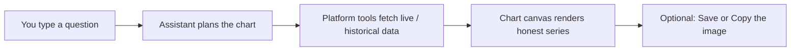
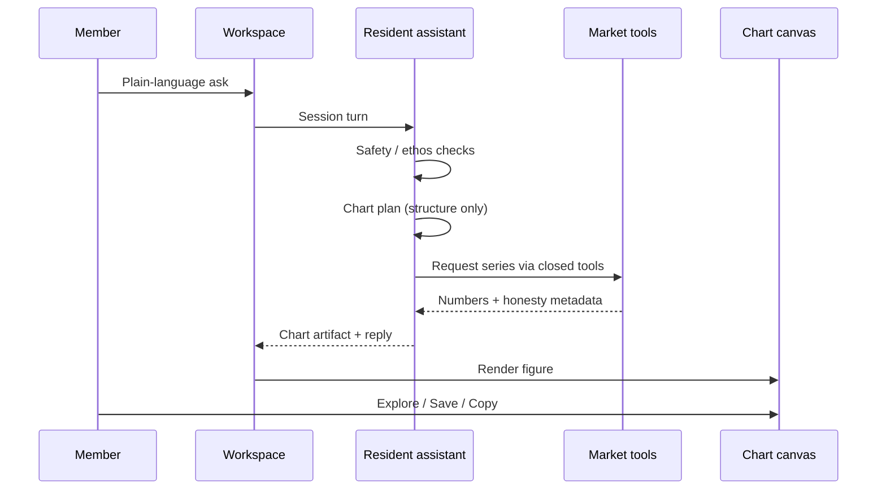

# Visualize AI — Product overview

**Audience:** Members and operators who need a plain-language picture of the product  
**Surface:** Apps → **Visualize AI** (`/app/visualize-ai` on labs.fattail.ai)  
**Spec authority:** `Specs/FatTail-Labs-Visualize-AI-Spec-v0.1.md`

---

## What it is

**Visualize AI** is a member workspace where you ask, in plain language, about the **options-market structure** you trade around—and the platform answers with **real charts**, not invented numbers.

You describe what you want to see (for example SPX, short- and longer-dated VIX, option Greeks, implied volatility, ranges, or correlations). A **resident assistant** turns that request into a structured chart plan. **Platform tools** then fetch the series from market data the member is entitled to see. The chart canvas draws only those tool results.

**North star:** *Ask about the structure around the market—SPX, vol term, Greeks—see it, don’t guess.*



---

## Who can use it

Visualize AI is for **signed-in** members with full Labs tool access:

- **Observer** (paid trial, Navigator-level access during the trial)  
- **Activator**  
- **Navigator**  
- **Administrator**  

Anonymous visitors and free accounts **without** a paid membership do not get the product.

---

## How someone uses it

### 1. Open the app

From the **Apps** hub, open the **Visualize AI** card. You land on a single research-style workspace: honesty notes, a large chart area, and a conversation with the assistant.

### 2. Ask in plain language

In the conversation, type what you want to understand. Examples of the kind of ask (illustrative):

- “Show SPX over the last month with VIX and VIX1D.”  
- “Plot the short vol term—about one day through about thirty days.”  
- “IV smile for SPX around this week’s expiration.”  
- “How do daily range percent and VIX move together lately?”

You do **not** write code, SQL, or pick every series by hand. You talk; the assistant proposes the chart shape.

### 3. Watch the chart update

After each successful turn:

1. The assistant produces a **chart plan** (what to plot—axes, series, window).  
2. **Deterministic tools** pull the numbers: live marks where appropriate, historical bars, vol tenors, option chain fields (Greeks / IV) when available.  
3. The **chart canvas** redraws with those series, title, legend, and as-of timing.

The assistant **never invents** prices, Greeks, IV, or correlation values. If data is missing, proxied, stale, or outside entitlement, the product says so.

### 4. Read the honesty strip

Above the chart, a short honesty strip states facts that matter for trust, for example:

- True index vs **labeled proxy** (e.g. SPY when SPX index feed is not available)  
- **Stale** live marks  
- Series that are **unavailable** or out of plan  

No silent substitution of one series for another.

### 5. Keep talking or export

- **Follow-up questions** refine the same session (new plan → new tool run → new chart).  
- **Save to disk** downloads the current chart as an image (PNG) so you choose where it lands.  
- **Copy to clipboard** puts the chart image on the clipboard for paste into notes, slides, or chat.

If save or copy cannot run (browser permission, context), the UI fails **loudly**—no silent no-op.

---

## Workspace layout

The workspace is **vertical**, not a side-by-side research split as the default.

```text
┌─ Apps › Visualize AI ──────────────── [ New session ] ─┐
│  Honesty strip — proxy / stale / entitlement notes      │
│ ┌─ Chart canvas (primary) ────────────────────────────┐ │
│ │  Title · Save · Copy                                │ │
│ │  Interactive figure · legend · as-of                │ │
│ └─────────────────────────────────────────────────────┘ │
│ ┌─ Conversation ──────────────────────────────────────┐ │
│ │  Your questions · assistant replies · tool chips    │ │
│ │  [ Type a question…                        ] Send   │ │
│ └─────────────────────────────────────────────────────┘ │
└─────────────────────────────────────────────────────────┘
```

| Region | Role |
|--------|------|
| **Honesty strip** | Trust labels for the **current** chart |
| **Chart canvas** | Live interactive visualization of tool-backed series |
| **Conversation** | Dialogue with the resident assistant, starter prompts, composer |

Conversation and canvas scroll independently. Prefer **one chart per turn** on the canvas (the chat keeps history).

---

## Live data and what you can see

Charts are grounded in the same kind of **live and historical market data** Labs already uses for serious process work—not scraped pages and not model-made prices.

| Kind of series | What it means for the member |
|----------------|------------------------------|
| **SPX** | Cash-index underlier literacy; may show a **labeled proxy** if the true index is not entitled |
| **VIX term (~1d–30d)** | Short vol (e.g. VIX1D) through classic VIX (~30d), and mid-tenors when available |
| **Option Greeks** | Delta, gamma, theta, vega when chain data provides them |
| **Implied volatility** | IV by contract / structure when chain data provides it |
| **Daily range %** | How wide the day was relative to price |
| **Correlation** | How two return series move together (Pearson), on demand |

**Live marks and vol reference** feed charts that need current underlier / vol context. **Historical bars** and **option chain snapshots** feed ranges, smiles, heatmaps, and Greeks. Everything numeric goes through the **closed tool catalog**—the browser never talks raw to the data vendor.

---

## Interaction with the agent

### What the assistant is

A **scoped resident AI** for Visualize AI only: chart-oriented, process-literate, and bound to FatTail member ethos (no profit theater, no trade recommendations, no “edge” sales pitch).

### What happens on each turn



| Step | Who | What |
|------|-----|------|
| 1 | You | State the structure question |
| 2 | Platform | Distress and ethos gates on the turn |
| 3 | Assistant | Outputs a **chart plan** (intent), not prices |
| 4 | Tools | Fetch live marks, bars, vol tenors, chain/Greeks, correlation as needed |
| 5 | Platform | Builds a **chart artifact** (series + labels + honesty) |
| 6 | UI | Renders the chart; shows which tools ran |
| 7 | You | Read, follow up, save, or copy |

### What the assistant will not do

- Invent or “estimate” market numbers  
- Recommend trades or claim expected P&L  
- Act as general curriculum chat or free-form open chat for anything  
- Run arbitrary code or unfiltered vendor calls from your browser  

If a tool cannot deliver a series, the chart and reply say so; the model does not fill the gap with made-up data.

---

## How this fits next to Strategy Lab

| Product | Focus |
|---------|--------|
| **Strategy Lab** | Design → Curate → Deploy: bots, process, live marks for **your** strategies |
| **Visualize AI** | Explore and **see** market structure—SPX, vol, Greeks, correlations—through conversation |

They share data infrastructure (marks, vol, correlation, Massive/ChainStore) but different jobs: **operate a strategy stack** vs **visualize the structure you reason about**.

---

## Success, in member terms

You can open Visualize AI, ask a structure question in ordinary language, see a chart built from **platform-fetched** live and historical data, trust the honesty labels, keep refining in conversation, and take the chart with you via **save** or **copy**—without ever relying on the assistant to invent a number.

---

*Product overview for Visualize AI. Implementation detail: Spec v0.1 and Architecture 21–22.*
